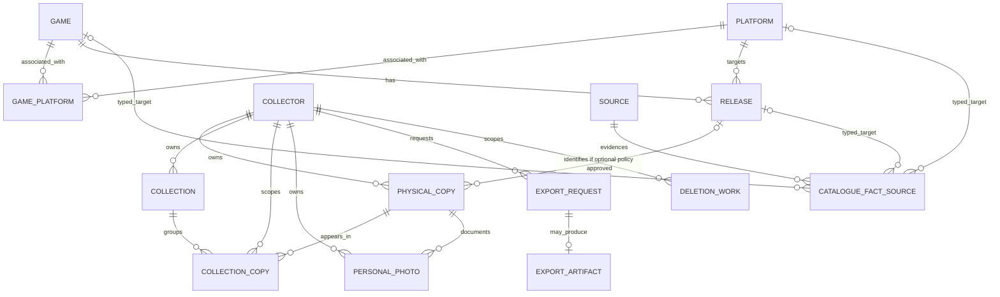
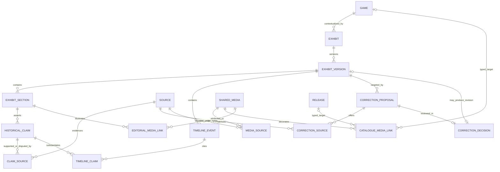

# Provisional domain model

**Status:** Conceptual Gate 1 review model; no schema, migration, deployed API, enum, or approved field policy exists. The field dictionary below makes meanings and candidate constraints explicit, not final storage names/types, required UI fields, or public/export allow-lists. Exact vocabularies and nullability require GC-I-001/002/003 approval.

See the [technical design](overview.md), [ADR-0001](decisions/0001-provisional-technology-and-modular-monolith.md), [technology evaluation](technology-evaluation.md), [MVP](../product/mvp-scope.md), [requirements](../product/requirements.md), [privacy](../security/privacy.md), [catalogue/licensing](../research/catalogue-and-licensing.md), [artwork](../research/artwork-policy.md), and [historical provenance](../research/historical-provenance.md). Canonical GC-I references are draft planning identifiers; no real GitHub issues have been created. NFR-01–NFR-08 are canonical requirements identifiers, not approval claims.

## 1. Identities and core rules

- **Game** is the intellectual work/title, not a platform release or owned object.
- **Platform** is a gaming platform. A Game can appear on several Platforms; the proposed GamePlatform association is derived from or reconciled with release evidence, not a second contradictory source of truth.
- **Release/Edition** identifies a Game on a Platform with edition/version, region, packaging and other sourced distinctions where known. Do not infer identity from a title alone.
- **Physical Copy** is one real item belonging to one collector. Two copies of the same Release have different copy identities and independent attributes/photos/memberships.
- **Collection** groups an owner's copies. Whether one default group is required and whether a copy may join several groups remain open. No collection membership transfers ownership or grants another owner private access.
- **Source** identifies evidence. A typed source link explains which fact/claim the evidence supports or disputes; merely attaching a URL is not verification.
- **Media** distinguishes personal photos, catalogue art, generated interpretation, and community artwork, with separate ownership/rights/lifecycle rules.
- **Exhibit** is structured editorial context: sections, claims, evidence, proposed timeline events, and reviewed version/correction history.
- **Valuation Observation** is a future dated market observation with method/context/provenance. It is never acquisition price.
- **Collector identity** maps verified authentication to an internal owner. Public profiles, achievements and sharing are future decisions, not implied by this identity.

Private notes, acquisition details/price, photos, collection records and memberships stay owner-only by default. Future public collection consent must not also consent to publication of a personal photo. Rights clearance and owner consent are different checks.

## 2. Proposed core ER relationships

The optional Release-to-Copy cardinality illustrates an **unresolved option**, not a decision to allow null release IDs. Under a known-release-only policy it becomes mandatory. In a CatalogueFactSource row exactly one typed target is intended; the diagram's three optional relationships are alternatives, not permission to attach all three. A stable source/fact link strategy needs schema review.

Membership owner equals both collection owner and copy owner; photo owner equals copy owner. Export artifacts inherit the requesting owner. Deletion work preserves a restricted owner association through cleanup; final erasure/tombstone handling needs retention approval. Cardinality does not replace these equality constraints.

## 3. Field dictionary: notation and common metadata

“Required” below means a **proposed invariant** for the applicable entity, unless explicitly conditional. “Optional/unknown” means absence is honest and must not be fabricated. Exact lengths, decimal precision, date representation, enums, field mutability and export/public inclusion are Gate 1 choices. Conceptual fields may become value objects or related tables, not necessarily columns.

| Field concept | Meaning / candidate representation | Constraint and privacy intent |
| --- | --- | --- |
| Entity identity | Stable internal identifier independent of provider/title. | Required; key format unresolved; identity is not authorization. |
| Owner reference | Internal Collector identity on copies, collections, memberships, personal media, exports and deletion work. | Required for private data; derived from verified session and immutable except a separately approved transfer workflow. No transfer is proposed. |
| Created/updated time | Server-controlled record timestamps. | Proposed for mutable records; never client authority or historical event dates. |
| Revision | Concurrency/version marker. | Proposed on mutable private records and published editorial versions; compare atomically, never silently discard another edit. |
| Lifecycle state | Record availability and pending cleanup/review. | Exact vocabulary unresolved; distinguish archive, deletion pending, and erased. |
| Dataset/provenance marker | Seed/import origin, version and permission context. | Proposed for shared catalogue/editorial fixtures; label samples; private records are not public seeds. |
| Fact status | Unknown, collector-reported, unverified, conflicting or verified meaning. | Candidate semantic distinctions, not final enums; tie verification to evidence/reviewer. |

## 4. Field dictionary: catalogue, copies, and groups

| Entity / field concept | Meaning / candidate representation | Requiredness, validation and access |
| --- | --- | --- |
| Collector: identity mapping | Auth provider/namespace plus subject mapped to internal owner. | Required unique mapping in its namespace; no credentials in domain records. Private operational identity. |
| Collector: lifecycle | Active/access-closed/deletion-in-progress concepts. | Proposed; session/recovery/deletion behavior to approve. A public profile is separate future scope. |
| Game: title and alternate titles | Work-level display/search names. | Display title proposed required for usable entry; aliases optional. No title-only uniqueness. |
| Game: descriptive facts | Description, creators/publishers and other catalogue attributes if approved. | Optional, sourced, permission-aware; not collector notes and not invented completeness. |
| Platform: name and identity mapping | Platform display identity and optional source identifiers. | Stable internal ID; source mappings namespaced; normalized naming policy pending. |
| GamePlatform: game/platform references | Catalogue association that a work appears on a platform. | Both required for association; candidate pair uniqueness; derive/reconcile from releases to avoid contradiction. |
| Release: game/platform references | The work and target platform of this edition. | Proposed required on a resolved release; foreign keys. A placeholder/provisional representation is a separate open policy. |
| Release: edition/version/packaging | Source-supported edition distinctions. | Optional/unknown; controlled/free-text mix and mutability unresolved. Do not create distinctions solely from title guesswork. |
| Release: region/language | Where the release applies and language facts if supported. | Optional/unknown; exact vocabulary and multi-region representation pending. Copy-reported mismatch is not a catalogue overwrite. |
| Release: publication date/precision | Release timing supported by a source. | Optional; preserve known year/month/day precision and conflicts instead of arbitrary first-day dates. |
| Provider mapping: provider/namespace/external ID/target | External identity mapped to a typed internal Game, Platform or Release. | Unique within provider namespace; target type explicit. No barcode uniqueness/mapping guarantee or import rights assumed. |
| CatalogueFactSource: target/field/source/location | Fact-level provenance and supporting/conflicting relation. | Typed target plus fact identity and Source required for a link; location/excerpt/review context where lawful and known. |
| PhysicalCopy: release reference | Known edition represented by the real object. | Requiredness unresolved; see unknown-release policy below. Several copies may reference one release. |
| PhysicalCopy: reported release/region metadata | Collector's description of their item where catalogue detail is absent/disputed. | Proposed optional and private; labelled collector-reported, not automatically promoted to shared facts. |
| PhysicalCopy: condition | Owner's assessment of this physical item. | Optional/unknown; exact grades/vocabulary and evidence requirements pending GC-I-001/004. |
| PhysicalCopy: completeness/components | Which components exist and their condition/absence. | Optional/unknown; structured components versus summary choice pending. Unknown is not “missing” or “complete.” |
| PhysicalCopy: acquisition date | When owner acquired this item. | Optional; precision and permitted date ranges to approve; different from release/valuation dates. Private. |
| PhysicalCopy: paid amount/currency | Amount paid in acquisition context, not a current estimate. | Optional pair; non-negative finite exact amount with approved precision and valid currency pairing. Zero differs from unknown. Private. |
| PhysicalCopy: personal notes | Owner-authored context. | Optional, bounded, safely rendered; private and excluded from unapproved public views/logs. |
| PhysicalCopy: ownership status | Owner's current possession/status description. | Optional vocabulary pending; changing it must not silently transfer owner or delete records. |
| PhysicalCopy: selected personal photo preference | Owner's card preference for this copy, distinct from the currently displayed fallback. | Optional; selection must identify a photo belonging to this copy and owner. Availability and authorization are required for active display/access, not retention of the preference. Missing/unavailable/deleted media falls through without silently deleting or overwriting the preference/record; retained representation follows the approved lifecycle. A vote cannot replace it. |
| Collection: name/description/order | Owner's grouping and presentation. | Requiredness/length/order semantics pending; private by default. |
| Collection: visibility intent | Potential future explicit sharing control. | No public field/value policy selected. First slice remains private; future server projection required. |
| CollectionCopy: owner/collection/copy references | Owner-linked membership, not another owned copy. | All required; same-owner equality, unique collection/copy pair; optional grouping order pending. |

### Unknown release: unresolved Gate 1 policy

Compare these options under GC-I-001/002/003 and catalogue spike GC-I-007:

1. **Known release required in first slice:** choose a labelled seed release; expose limitations and defer unmatched items. Simple constraints but may exclude the main collector need; research/product approval required.
2. **Optional release reference:** retain a private individual copy with explicitly unknown release and approved reported metadata. Do not require a made-up Game/Platform; define minimum usable description, search/export and later matching rules.
3. **Separately labelled manual/provisional release creation:** collector proposes an unmatched release through a reviewed reconciliation flow. Decide private versus shared draft visibility and publication authority; it must not pollute verified catalogue search.

No option is approved. A missing seed entry gets an honest no-match state with retry/refinement or recording of the unmet need; no manual creation or fabricated matching data is implied until Gate 1 decides. Never silently insert one global “unknown release” for unrelated objects, manufacture region/edition, or merge collectors' records by an uncertain match. Whichever option is selected must preserve copy identity, owner attributes, memberships and photos during reconciliation; wrong matches need reversible correction and provenance. Unknown field values are still valid on a known release.

## 5. Source, media, and editorial link definitions

All editorial/timeline/correction structures are **proposed** for GC-I-025/026, not implemented. Exact version ownership, claim reuse, link keys and minimum evidence rules need content/schema review. Game-linked exhibits are the initial model; multi-game/platform thematic exhibits remain an open extension rather than an implicit requirement.

Link semantics:

- **CatalogueFactSource**: exactly one typed Game/Platform/Release fact target; source, supporting/disputing relation, passage/location and verification context. Avoid unenforceable generic ID links where typed foreign keys can preserve integrity.
- **ClaimSource**: a specific versioned claim and Source, including evidence location and relation. One source may support many claims; one claim may have several sources, including contradictory ones. A factual claim cannot be published without traceable supporting provenance and human review.
- **TimelineClaim**: event and claim references within the permitted exhibit/version scope. Evidence-backed event date/precision must not contradict the cited claim without explicit disputed presentation.
- **CorrectionSource**: source offered for a correction, not automatic acceptance of it. Correction targets the existing version and optionally a specific section/claim/event; accepted decisions link to the replacement version, declined decisions retain reviewed rationale.
- **MediaSource**: asset source/creator/permission context, not proof of factual history or ownership. Media can lack a conventional publication source while still requiring explicit rights provenance.
- **CatalogueMediaLink**: exactly one Game or Release target plus rights-approved shared media and display role. A personal copy photo cannot become a link of this kind through a fallback.
- **EditorialMediaLink**: section/version plus approved shared media, caption/attribution and permitted use. An editor cannot publish private personal media through this join.
- **CollectionCopy / personal selection**: strictly same owner; selection additionally requires same copy. Public link projections, if later approved, never relax these base constraints.

## 6. Field dictionary: media and editorial evidence

| Entity / field concept | Meaning / candidate representation | Validation, privacy and lifecycle |
| --- | --- | --- |
| PersonalPhoto: owner/copy | Private photo of one actual object. | Required same-owner foreign keys; cannot reference another owner's copy or be a catalogue fallback. |
| PersonalPhoto: object/derivative references | Private storage locations and validated processing results. | Server-assigned; never public API storage keys. Originals/staging/derivatives all in cleanup inventory. |
| PersonalPhoto: type/size/dimensions/checksum | Validation/processing metadata. | Supported formats/limits/decoder/metadata policy pending; do not trust client MIME or dimensions. Checksum is not an authorization token. |
| PersonalPhoto: lifecycle/selection availability | Reserved/staged/validated/ready/rejected/cleanup concepts. | State vocabulary pending; ready means owner-readable, not public approval. Failed replacement or unavailable/deleted media leaves the selected preference intact with a lawful display fallback; retained preference grants no object access. |
| PersonalPhoto: future consent record | Explicit scope, actor/time/version and withdrawal for public use. | Separate from collection sharing and rights clearance; future only. Granularity/retention/revocation open. |
| SharedMedia: category/origin | Catalogue default, generated interpretation or community submission. | Separate from PersonalPhoto; source/category vocabularies pending; not mandatory MVP providers. |
| SharedMedia: creator/source/rights basis/attribution | Why this asset may be stored/displayed. | Required approved rights context before distribution; availability/upload/screening alone not permission. |
| SharedMedia: permission scope and expiry | Display/cache/derivative/export/commercial/territorial/term restrictions. | Proposed rights metadata; revoke distribution when applicable rights lapse; legal review for ambiguity. |
| SharedMedia: review/takedown/version | Human decision and availability history. | Public eligibility depends on current approval and rights; preserve only lawful/minimal audit. Votes confer no rights. |
| Source: title/creator/publisher/type | Identifies actual evidence. | Record known values; never fabricate author or citation; exact source-type vocabulary pending. |
| Source: URL or stable reference | Retrieval/citation identity including offline references. | At least a usable citation locator proposed; URL not always required. Avoid arbitrary server fetching and unsafe links. |
| Source: publication/access date | Source timing and when consulted. | Publication may be unknown; access date where applicable; preserve precision. |
| Source: rights/reliability context | Lawful excerpt/storage/display limits and evidence limitations. | Required review context as applicable; absence of license does not imply public domain. |
| Exhibit/Version: title/game/version/publication state/editor/reviewer | Work-level editorial grouping, accountable review and immutable published revision. | Proposed; authorize editors distinctly from collectors; record review decision and retain prior version links within rights/retention policy. |
| ExhibitSection: version/heading/body/order | Structured narrative belonging to a version. | Bounded safely rendered content; historical factual statements must be represented by source-linked claims. |
| HistoricalClaim: text/classification | Fact, attributed report, interpretation, or disputed meaning. | Exact classifications pending GC-I-003; AI output alone never evidence (GC-AI-001). |
| HistoricalClaim: evidence/review/dispute context | Source links, verification decision, reviewer/time and uncertainty. | Required traceability for factual publication (GC-DATA-001); no unmeasured numeric confidence requirement. |
| TimelineEvent: version/label/date range/precision/display order | Chronological presentation of evidence-backed events. | Proposed; allow uncertain/ranged dates without false precision; linked claims must support displayed assertions. Approve an ordering rule that does not fabricate dates. |
| CorrectionProposal: target/version/proposed change/reason/acknowledgement/review state | Report or editorial proposal, not a direct overwrite. | Typed target within version; evidence where applicable; private submitter information only where necessary. Acknowledgement is not acceptance; exact review states, report access/abuse and reporter-data policy pending. |
| CorrectionDecision: reviewer/outcome/rationale/time/version links | Accountable acceptance/rejection and any replacement version. | Authorized review; original version and decision traceability; exact outcomes and retention pending. |

Catalogue artwork fallback retains the [artwork policy](../research/artwork-policy.md) ordering only for approved available categories. Private collection cards prefer the owner's selected available photo, then approved catalogue fallback, then placeholder. Neither absent media nor votes authorize replacing/publishing a private photo or deleting its selected preference. Retaining an unavailable/deleted selection does not retain readable photo bytes or grant access. Review lifecycle/fallback evidence against the [media evidence policy](../research/artwork-policy.md#delivery-boundaries-and-lifecycle-evidence), claim fields against the [editorial handoff dictionary](../research/historical-provenance.md#build-and-editorial-handoff), and provider/fact provenance against the [catalogue evidence handoff](../research/catalogue-and-licensing.md#required-evidence-handoff).

## 7. Field dictionary: export, deletion, and future-only concepts

| Entity / field concept | Meaning | Proposed constraint / scope |
| --- | --- | --- |
| ExportRequest: owner/scope/format version/snapshot time/state | Owner's portable-record request. | Session-derived owner; format/fields approved separately; consistent owner-only joins. Record export does not promise photo archive. |
| ExportArtifact: request/owner/private location/expiry | Optional generated file if streaming is insufficient. | Same owner as request; reauthorized retrieval; private storage, cancellation/deletion and expiry; exact TTL unresolved. |
| DeletionWork: owner/typed target/progress/retry | Minimal restricted record enabling cleanup and restoration reconciliation. | Same owner as target; prevent cross-owner job payloads; no sensitive content copies. Tombstone/identity detachment and expiry need approval. |
| ValuationObservation: release or approved copy context | Future observation distinct from acquisition fields. | GC-I-038 decision-only; copy-specific observations, if adopted, retain owner scope. |
| ValuationObservation: amount/range/currency/date/method/source | Market evidence, not paid price. | Require dated methodology/provenance and region/condition/completeness context; lower ≤ upper, no false precision. |
| PublicProjection/consent | Future reviewed subset of owner records. | GC-I-029/030; allow-listed server fields and separate photo consent; private notes/price/photo never public by accidental serialization. |
| ModerationSubmission: submitter/content/attestation/state | Future quarantined artwork or contribution. | GC-I-031; owner-linked private submission until review; rights attestation not conclusive proof. |
| ModerationRecord/report: target/decision/reviewer/takedown | Future review and abuse/rights lifecycle. | GC-I-032; explicit moderator authorization, minimal audit, lawful retention; no public/private safety via client-only checks. |

Future public profile, achievements, marketplace/insurance, commercial enforcement, AI generation, native/offline/barcode and licensed catalogue are not first-slice entities/contracts (GC-I-037–044).

## 8. Ownership, integrity, constraints, and indexes

Candidate database design under GC-I-002/012; do not apply exact keys/indexes until approval:

1. Non-null stable primary keys; owner foreign keys on all private entities and requests. Verify owner on reads/lists/counts/search, creates/updates, membership joins, exports and deletes, not just detail pages.
2. CollectionCopy carries owner and enforces `(owner, collection)` and `(owner, copy)` validity through candidate composite foreign keys/unique parent references. Apply equivalent owner/copy checks to photos and owner-bound export/deletion work. Application checks alone are insufficient; persistence/storage need least privilege and tests.
3. Unique collection/copy membership; **no unique owner/release copy constraint**. Same owner may hold several physical copies. Collection multiplicity/default group policy remains open.
4. Source/provider identifiers unique only within provider/namespace. No Game title, release title, barcode, or human platform name assumed globally unique. Reconciliation is reviewed, not silent destructive deduplication.
5. Foreign keys preserve Game/Platform/Release and allowed optional-copy policy. Prevent orphan resolved releases/copies. Catalogue retirement needs references/provenance preserved or a reviewed migration; do not cascade shared catalogue deletion into private copies.
6. Selected photo must identify its own copy/owner. Lifecycle and authorization determine active display/read availability, not whether the preference may be retained. Approve a minimal same-owner/copy tombstone or separate logical preference representation for unavailable/deleted media so no dangling foreign key, object access, or sensitive-byte retention is required. Fallback must not silently clear/overwrite the preference; changing it requires an explicit owner choice or approved copy/account deletion lifecycle. Exact representation and retention remain unresolved.
7. Validate amounts/currency, supported date precision, component/condition/region vocabulary, safe bounded text, evidence links and version targets. Unknown differs from zero/empty/verified; exact encodings are pending.
8. Index candidate query paths: owner plus copy identity/lifecycle and approved list sort/stable ID; owner plus group membership; owner/copy/photo state; Game/Platform/Release references and provider mappings; exhibit/version/claim/source links; owner/state/expiry for exports and cleanup work. Evaluate seed search/full-text separately; never index private notes into public search.
9. Row-level policies, if selected/supported, cover every owner-linked table and nested query. Privileged server paths must still authorize; object storage independently verifies owner. IDs/signed URLs are not substitutes for authorization.
10. Controlled editor/operator role checks protect publication, rights and lifecycle metadata from collector mass assignment. Public projections do not serialize internal full records then rely on UI hiding.

Transactions protect copy plus memberships/revision, photo readiness/selection, export snapshot registration, deletion marking/cleanup intent, and publication/correction version links. Compare revisions and recheck lifecycle/owner at mutation time to avoid check-then-write races. Storage operations use staged/retryable compensation, not a claimed cross-service atomic transaction.

## 9. Lifecycle and deletion conditions

Exact archive/soft-delete/hard-delete states, grace periods, retention and backup exceptions remain open for GC-I-001/002/027. Proposed behavior:

GC-I-027 account deletion/retention is a required prerequisite before accepting production personal data, even for a records-only release that omits optional Gate 3b photos/editorial and Gate 3c sharing/community. GC-I-035 release validation depends on this lifecycle evidence, GC-I-034 operations readiness and the approved release scope, not every optional phase. Open retention choices do not waive the launch prerequisite.

| Target | Condition / dependencies before completion |
| --- | --- |
| Collection/group | Authorized owner intent; remove same-owner memberships only. Do not silently delete copies or their photos; default-group/last-group behavior needs approval. |
| PhysicalCopy | Same-owner intent and revision; close access/writes as required; remove memberships and selected-photo links; delete personal photo originals/derivatives/staging per approved policy; handle outstanding exports/cleanup. Ownership-status change alone is not deletion. |
| PersonalPhoto | Same-owner intent or approved copy/account cleanup; revoke new reads and future consent/projections; retry all object/derivative deletion; expire or invalidate access links/caches according to evidenced mechanism. Unavailability/deletion uses a lawful fallback without silently erasing the selected preference; retain minimal logical preference/tombstone under the approved lifecycle, unless the owner explicitly replaces/withdraws it or copy/account deletion removes it. |
| ExportRequest/artifact | Only owner-authorized lifecycle; stop/cancel during account deletion, remove private artifacts on approved expiry/delete, forbid later downloads. Previously downloaded files cannot be recalled. |
| Collector/account | Verify request, close access/revoke sessions, cancel owner exports, process all owner-linked copies/groups/memberships/photos/jobs and identity mapping; restricted retained exceptions disclosed. No “complete” while unhandled live dependencies remain. |
| Catalogue/Source/shared media | Do not owner-cascade shared facts. Retire/reconcile references with provenance; withdraw rights-expired media from public use. Retain excerpts/history only as lawful and approved. |
| Exhibit/correction/submission | Withdraw public content when integrity/rights require; retain version/decision traceability only under policy. Account deletion may require reporter/submitter redaction, not indiscriminate deletion of shared evidence or indefinite personal-data retention. |
| Backups/restore | Approved bounded retention may delay physical erasure; restrict access, record exceptions and reconcile deletion/consent/takedowns after isolated restore before exposure. No immediate-erasure or compliance guarantee. |

Cleanup must be retryable and observable without logging private notes/price/photos/credentials. Minimal owner-bound work/tombstones may survive primary removal only for an approved purpose/period. Referenced identities must not be reused or relinked during deletion; final owner-reference erasure requires an explicit reviewed retention strategy.

## 10. Migration and review checklist

Version schema changes, use permitted labelled reproducible seeds and synthetic owner fixtures, review additive/backfill/constraint steps and rollback limitations, and rehearse upgrade/restore with actual evidence after stack approval. Do not rewrite applied migrations or destructively transform copy identity without human review. Backup availability is not restore validation.

Gate 1 must resolve: unknown-release minimum metadata, catalogue/source link typing, exact region/condition/completeness/component/status/date vocabularies, group multiplicity/defaults, price/currency precision, revision/retry semantics, export field/format policy, media consent/availability and cleanup, editor roles/version model, and retention/deletion constraints. Accessibility/privacy/integrity/portability implications map to NFR-01/02/03/05/08.

GC-I-005–010 provide planned isolation/media/catalogue/UX/restore evidence; GC-I-012 implements an approved schema; GC-I-020 owner export and GC-I-021 regression cover private relationships; GC-I-025/026 and GC-I-028 cover selected editorial follow-on evidence. GC-I-027 lifecycle evidence is mandatory before production personal data regardless of optional slice selection. Follow the [quality evidence contract](../quality/testing-and-delivery.md#evidence-and-agent-handoff-record) and [security control/evidence matrix](../security/privacy.md#implementation-and-evidence-ownership); GC-I-035 validates GC-I-027/034 and applicable approved-scope acceptance. No migration, test, spike, human approval, or production capability is claimed by this model.
