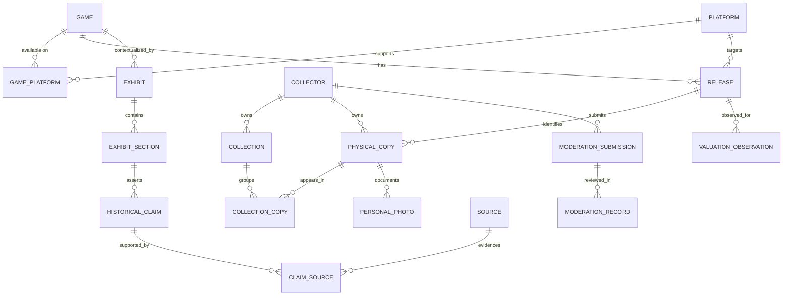

# Provisional domain model

**Status:** Conceptual model for Gate 1 review; no schema or migration exists.

## Entities and relationships

The diagram is a conceptual ER model, not an implemented schema. `COLLECTION_COPY` permits curated grouping; whether every user needs one default collection and whether a copy may appear in multiple collections require Gate 1 decisions.

## Core concepts

- **Game:** Underlying title/intellectual work. Can have many releases and historical exhibits.
- **Platform:** Console, handheld, computer, or other gaming platform; relationships can be many-to-many through a catalogue/platform association.
- **Release/Edition:** A specific platform, region, version, packaging, or edition of a game. Catalogue facts may be incomplete or uncertain.
- **Physical Copy:** An individual real item owned by a collector, linked to a release where known. Holds copy-specific condition, completeness/components, acquisition date, paid price/currency, personal notes, and ownership status.
- **Collection:** A collector-curated set/grouping of copies; visibility is explicit, default private.
- **Media/Artwork:** Distinct records and policies for personal copy photos, catalogue default art, original generated interpretation, and approved community submissions.
- **Historical Exhibit:** Structured sections, claims, timeline events, references, and review/correction history—not an untraceable prose blob.
- **Source/Evidence:** Citation identity, URL, publication/access dates, legally permissible excerpt, source type, and provenance relationship to claims.
- **Valuation Observation (future):** Market estimate or observation with value/range, currency, date, region, condition, completeness, methodology, and provenance. It is not the copy's acquisition price.
- **Collector Profile:** Public/private identity and sharing settings; optional achievements only if later approved.
- **Moderation Record (future):** Submission state, rights attestation, reports, review decisions, takedowns, and audit history.

## Domain rules

1. One Game may have multiple Releases; one Release may have many Physical Copies. A collector can own multiple copies of the same Release.
2. A Physical Copy must belong to an owner; collection membership cannot grant access to another user's private copy.
3. Price paid belongs to a specific acquisition/copy context and must not be silently reused as current market value.
4. Valuations are dated observations and retain method, region, condition, completeness, currency, and provenance; use a range where evidence does not support false precision.
5. Missing catalogue data is explicitly unknown/unverified; do not manufacture region, edition, or attribution.
6. Personal photos are private by default and cannot be overwritten by vote or catalogue fallback.
7. Historical factual claims require source provenance (GC-DATA-001); generative output alone is never evidence (GC-AI-001).
8. Public artwork needs a rights attestation, automated screening, reports, rate limits, moderation, human escalation for uncertainty, and takedown lifecycle.

## Constraints, indexes, and validation candidates

Proposed database constraints (exact fields/keys depend on chosen schema):

- Stable primary keys for all entities; non-null owner foreign key on private records; cascading behavior reviewed before use.
- Unique catalogue provider identifier only within its provider/namespace; do not assume global identifiers are present or correct.
- Candidate unique constraints on normalized platform identifiers and release/provider identifiers where the source supports them; avoid title-only uniqueness because titles can collide.
- Foreign keys preserve Game → Release → Copy; block orphan releases/copies unless explicitly soft-deleted with archival rules.
- Index release/game search keys and foreign keys; index collection owner and membership; add owner-scoped query indexes for private reads. Evaluate full-text search separately.
- Validate currency code and non-negative paid amount; store acquisition date separately from valuation observation date; reject impossible component/condition enum values while allowing “unknown”.
- Validate valuation range lower ≤ upper; require method/source/date/region and condition/completeness context.
- Ensure personal media ownership and visibility references are owner-scoped; enforce public media only after explicit consent and policy approval.
- Maintain timestamps/audit events as policy requires without logging sensitive notes, paid prices, secrets, or photo contents.

No exact indexes or constraints should be applied until query patterns, deletion/export semantics, migrations, and RLS design are approved.

## Migration strategy

Schema changes should be additive where practical, reviewed with data-impact notes, versioned in migrations, and tested against seeded/test fixtures. Document forward compatibility, backfill, rollback limitations, backup-before-destructive-change, and recovery. Never rewrite migration history or drop substantial data without explicit review and approval. No migration tooling is selected yet.
