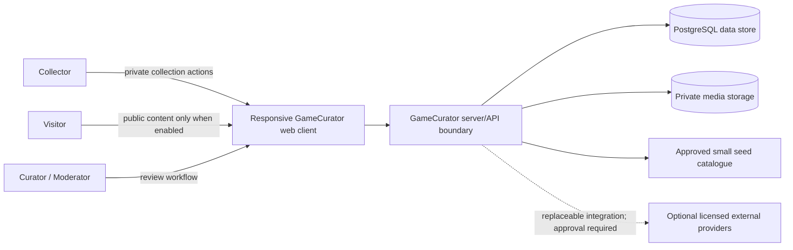
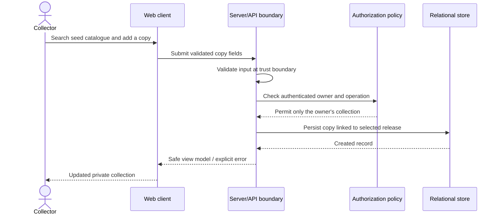

# Provisional system architecture

**Status:** Conceptual Gate 0 proposal; this repository has no application code, deployed services, or validated integrations.

## Architecture proposal

Begin with a modular monolith: one responsive web application, a server-side application/API boundary, and a relational data store with private object storage. Group code by domain capability (catalogue, collections, media, exhibits) while keeping ownership and validation rules explicit. A later native client should call reusable server APIs rather than reimplementing business rules.

External catalogue, image-generation, and valuation providers must sit behind replaceable interfaces if ever adopted. MVP can operate on a small labelled seed dataset and user-entered metadata without purchased catalogue or generation services.

## Context diagram

Solid lines represent the proposed product boundary, not implemented connectivity. The optional provider is deliberately not required for MVP.

## Logical boundaries

- **Identity/access:** Authentication identity and session, authorization policies, explicit public/private state.
- **Catalogue:** Game intellectual work/title, Platform, and Release/Edition records; sources and completeness confidence.
- **Collection:** User-owned Physical Copies, copy-specific attributes, and Collection membership/curation.
- **Media:** Separate personal photos from catalogue artwork, generated defaults, and approved community submissions; each has rights, visibility, and lifecycle metadata.
- **Historical content:** Exhibit, structured sections/claims, timeline events, sources/evidence, review/corrections.
- **Valuation (future):** Observations separated from paid-price details and tied to methodology, currency, date, region, condition, completeness, and provenance.
- **Moderation (future):** Submission/report/review/takedown/audit workflow, with human review for disputed rights.

## Proposed request/data flow

The diagram expresses a desired flow only. Specific APIs, database row-level security, and session mechanics remain undecided pending Gate 1 and Gate 2 evidence.

## API and persistence boundaries

Prefer domain-oriented server operations for catalogue search, copy create/update, collection retrieval, media lifecycle, and exhibit read/report. Keep persistence behind repository interfaces only where they provide useful test seams; do not add abstraction for its own sake. Validate inputs at API and upload boundaries. Restrict private collection reads/writes to their owner in both application logic and persistence policy. Public response models must be allow-listed and omit private copy fields.

Use versioned database migrations for schema changes. Seed data must be clearly identified and reproducible. Define backups, restore tests, retention, export/deletion, and migration rollback constraints before production use.

## System assumptions and non-decisions

Managed PostgreSQL/auth/storage and Next.js are provisional. No hosting topology, provider, API contract, storage policy, auth flow, or deployment is selected/operational. Camera/barcode, PWA/offline behavior, valuation, public profiles, and native iOS remain future investigations.
