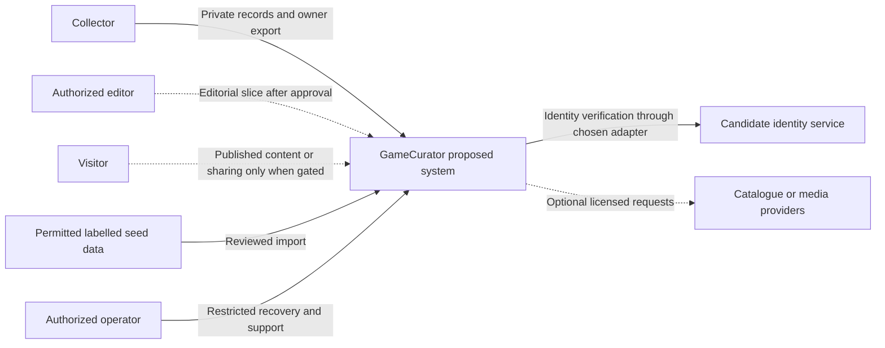
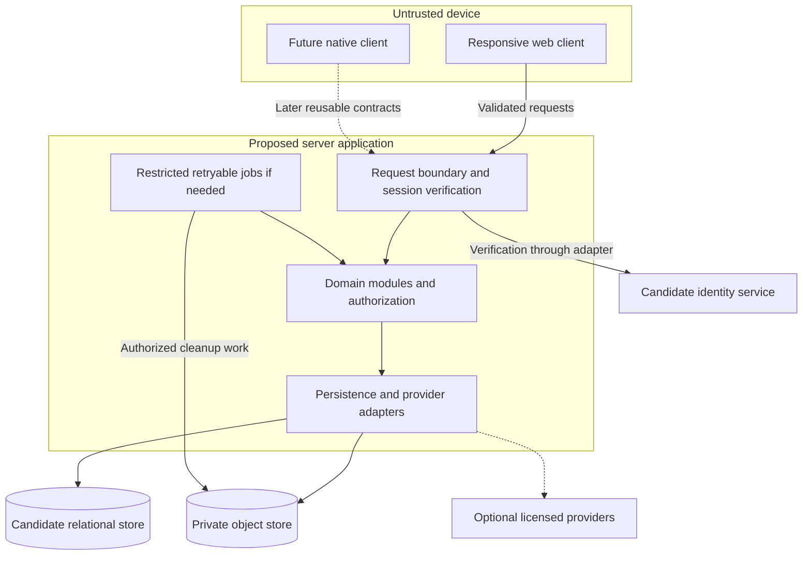
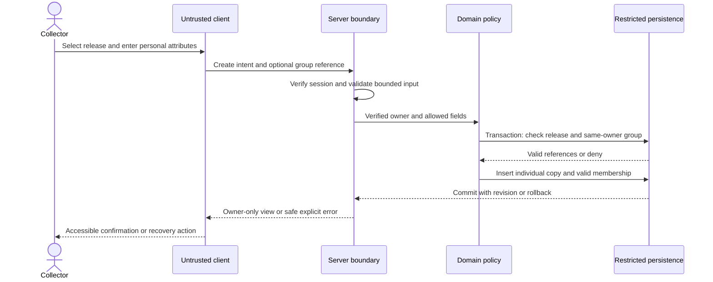
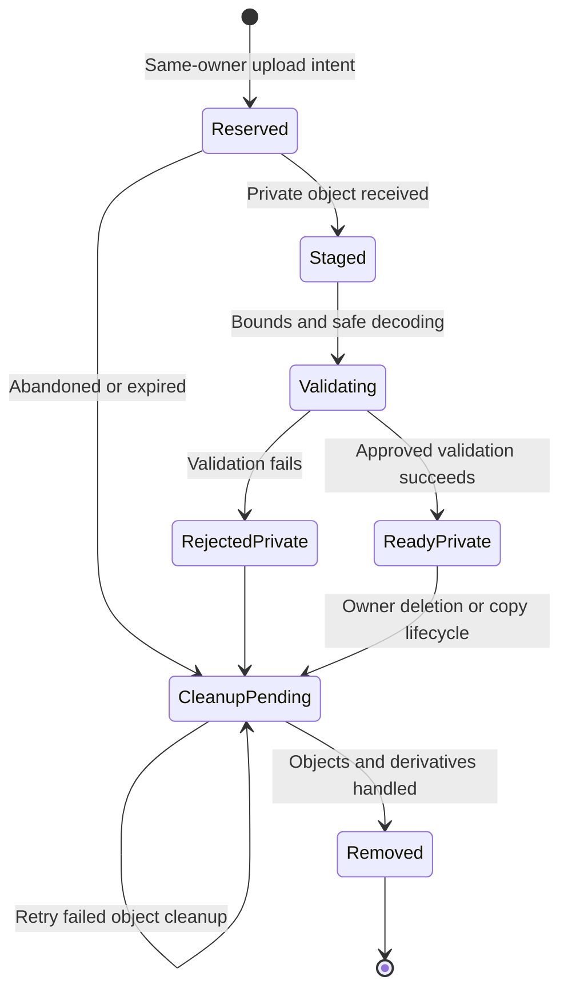
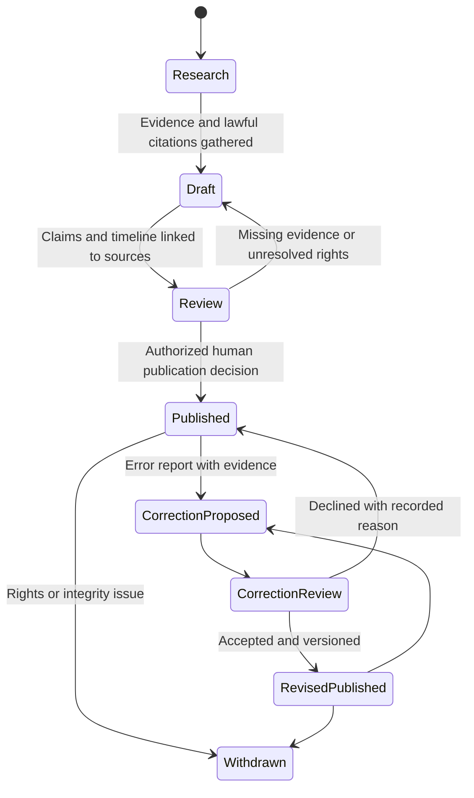
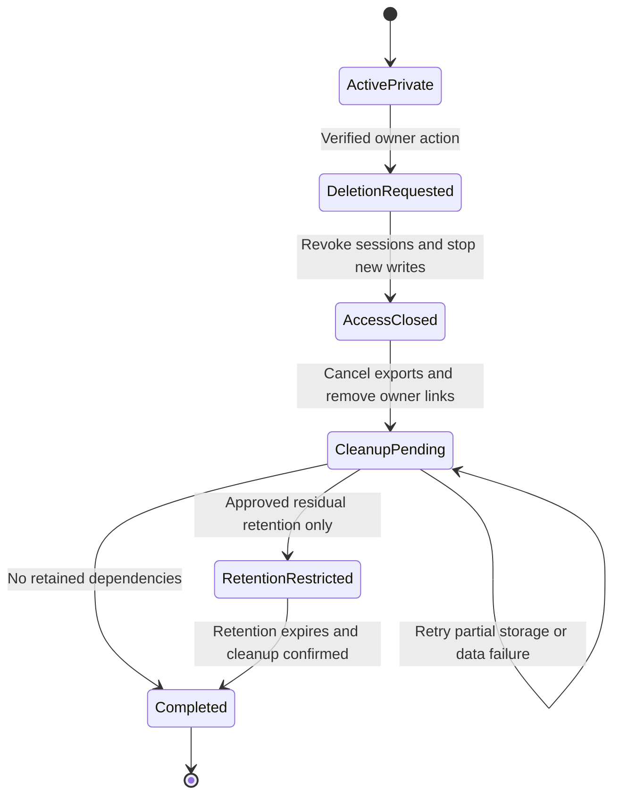

# Technical design document — provisional

**Status:** Gate 0 proposal for human review, not implementation authorization. No application, deployed service, schema, API, integration, spike result, cost quote, or test result is established by this document. All diagrams describe a proposed system. Package choices, operation names, field policies, state labels, and infrastructure remain subject to Gate 1 decisions and relevant Gate 2 evidence.

## 1. Purpose, objectives, and non-goals

Prove a trustworthy private collecting loop: select a clearly labelled catalogue release, record individual physical copies, return to an accessible collection, edit personal details, and export the owner's records. Preserve Game, Platform, Release/Edition, and Physical Copy as distinct identities; multiple copies of one release are normal, not duplicates. Acquisition price is not valuation.

Design objectives, using the canonical NFR references for the coordinated requirements update:

| Objective | Architectural response | Required evidence, not a result |
| --- | --- | --- |
| NFR-01 accessibility | Responsive semantic cards/forms, keyboard paths, understandable empty/loading/error/denied states; diagrams have text explanations. | Agreed accessibility target; manual and automated journey evaluation. |
| NFR-02 privacy/security | Server-authoritative owner scope, least-privilege persistence and private storage; separate future photo consent. | Cross-account denial including lists, joins, exports, deletion, and object access. |
| NFR-03 integrity | Relational identities, explicit uncertainty, transactions, constrained same-owner links. | Domain, schema, concurrency, and migration evidence. |
| NFR-04 maintainability | Modular monolith, business rules separate from UI/persistence, small replaceable adapters. | Boundary review and reproducible approved toolchain. |
| NFR-05 portability | Owner-only record export and reusable server operations for a possible later client. | Export specification, rights review, round-trip/recovery assessment. |
| NFR-06 reliability | Recoverable media/deletion jobs, versioned migrations, restoration and rollback planning. | Failure-mode and restore evidence against approved recovery targets. |
| NFR-07 cost | Small permitted seed catalogue; no mandatory paid provider or image generation. | Dated usage model, limits, unit costs, and human budget approval. |
| NFR-08 content | Claim-level citations, uncertainty, accountable editorial review and corrections. | Rights and provenance review of actual content. |

Non-goals for the first slice: comprehensive catalogue coverage, public profiles/sharing, community art/voting, valuation predictions, generated history/art, marketplace, insurance, achievements, subscriptions, native iOS, offline synchronization, or barcode capture. Future decision-only work is GC-I-037–GC-I-044; references do not authorize it. Do not introduce microservices, a public media bucket, or paid infrastructure to satisfy speculative scale.

## 2. Design inputs and decision authority

- [MVP scope](../product/mvp-scope.md), [requirements](../product/requirements.md), [journeys](../product/user-journeys.md), and [design principles](../design/design-principles.md).
- [Domain model and field dictionary](domain-model.md), [technology evaluation](technology-evaluation.md), and [ADR-0001](decisions/0001-provisional-technology-and-modular-monolith.md).
- [Security/privacy](../security/privacy.md), [catalogue/licensing](../research/catalogue-and-licensing.md), [artwork policy](../research/artwork-policy.md), and [historical provenance](../research/historical-provenance.md).
- [Testing/delivery](../quality/testing-and-delivery.md), [local development status](../operations/local-development.md), [backlog](../operations/proposed-backlog.md), [open decisions](../operations/open-decisions.md), [risks](../operations/risks-and-assumptions.md), and [commercial sustainability](../research/commercial-sustainability.md).

Human product-owner approval controls material scope, architecture, trust boundaries, provider contracts, costs, irreversible migrations, and release. GC-I references below are canonical draft planning identifiers, not real GitHub issues; no real issues have been created. NFR-01–NFR-08 are the canonical requirements identifiers. Any older P identifiers in supporting documents need reconciliation, not separate implementation authority.

## 3. Proposed architecture and alternatives

Recommend a responsive web client and server-side modular monolith, relational persistence, and private object storage. Share domain rules through server operations, not through client authority. A later iOS client can reuse those operations without replacing the domain or creating a second ownership policy.

ADR-0001 is **proposed**, not accepted. It covers web-first versus native-first, managed versus self-managed backend, and candidate technology direction. Next.js/React/TypeScript and managed PostgreSQL/auth/storage are candidates in the evaluation, not selected packages or deployed containers. No dependency installation is authorized here.

| Material alternative | Benefit | Cost/risk and reconsideration trigger |
| --- | --- | --- |
| Web modular monolith with managed backend (recommendation) | Broad device reach, one domain boundary, reduced initial operational surface. | Provider terms, auth/RLS/storage limitations, egress and recovery coupling; reconsider on isolation/restore/cost spike failure. |
| Web plus self-managed database/API/auth/storage | More control over policies, hosting, and portability. | Team owns upgrades, security, backups, availability; reconsider if managed constraints are material and operations capacity is evidenced. |
| SwiftUI-first with backend | Native capture/accessibility and potential offline UX. | iOS-only reach, store distribution, backend still necessary; reconsider if validated capture/offline needs dominate first outcome. |
| Cross-platform native with backend | Shared skills and native capabilities. | Distribution and platform-specific complexity plus public web needs; reconsider after channel research. |
| Microservices rather than a monolith | Independent deployment/scaling where genuinely needed. | Distributed transactions and operational overhead without demonstrated need; not proposed for MVP. |

Follow-on decisions needing recorded rationale include session mechanism, unknown-release policy, collection multiplicity, deletion semantics, export field/format policy, privileged access, and infrastructure recovery. No additional ADR is created or silently accepted by this document. GC-I-002 and GC-I-010 should reconcile those decisions with ADR-0001 before implementation.

### Context: people and external systems

Collectors are owners of private records, not catalogue administrators. Editors and operators require explicit, distinct authorization; possession of a collector account must not grant either role. Visitors/providers are conditional boundaries, not live services.

### Containers: proposed deployment units, not existing services

The job runner may execute within the same application/process initially; this does not prescribe a queue service or extra deployment. Database and object storage are separate failure/authorization domains even if one vendor offers both. Browser persistence access, if a chosen platform requires it, needs an explicitly reviewed restricted access model; no direct privileged access is assumed.

## 4. Modules, responsibilities, and trust boundaries

| Module | Owns and exposes | Must not do |
| --- | --- | --- |
| Identity/access | Map verified identity to internal owner; session checks, role decisions, revocation/recovery integration. | Accept a client-supplied owner/role, leak privileged credentials, or equate editor/operator with collector authority. |
| Catalogue | Game/Platform/Release identity, permitted seed/import search, fact provenance, uncertain values, provider mapping. | Convert unknowns to invented facts; treat title/barcode as unique identity without evidence. |
| Collections/copies | Individual copies, attributes, private groups/membership, owner-scoped retrieval and mutations. | Deduplicate real copies by release; equate paid price with value; link across owners. |
| Media | Personal-photo upload/read/selection/deletion, rights-aware catalogue media, distinct categories and lifecycle. | Promote personal photos through collection visibility or overwrite selection by community voting. |
| Export/privacy lifecycle | Owner record snapshot, export artifact access/expiry, account/copy deletion and retryable cleanup. | Export another owner's links, use a public download location, or report deletion complete before dependencies are handled. |
| Editorial | Exhibit sections, claim/source links, proposed timeline/correction versions, publication review. | Publish unsupported claims or treat AI output as evidence. |
| Sharing/moderation (future) | Explicit consent, public projections, submissions/reports, rights review, takedown and revocation. | Rely on UI hiding/filtering for public safety or enable distribution before policy and staffing approval. |
| Operations/adapters | Migrations, restricted jobs, minimal telemetry, provider failure translation and recovery. | Become a blanket authorization bypass or copy production private data into development. |

Domain services decide invariants independently of presentation and database libraries. Repositories/adapters provide useful transaction and replacement seams, not generic abstraction for every query. Catalogue/editorial reads and private-owner reads use separate projections; no shared “full object” response is filtered only in the browser.

Trust boundaries require runtime validation: client-to-server, identity assertion-to-owner mapping, server-to-persistence, upload-to-decoder/storage, external provider-to-catalogue, editorial input-to-public presentation, and privileged job-to-user data. A service key can bypass database policies on some platforms; such paths need narrowly scoped server authorization, documented uses, and negative tests. RLS, where selected/supported, is defense in depth, not a substitute for those checks.

## 5. Feature operation contracts

These are logical use cases for review, **not deployed endpoints**, fixed route names, HTTP methods, payload schemas, or a selected API style. Gate 1 must approve exact inputs, bounds, field policy, and error mapping. Server-rendered actions and a documented API are alternatives provided the same rules hold.

| Operation / backlog | Inputs and authorization | Proposed atomic effect / result / failure behavior |
| --- | --- | --- |
| Establish/end session — GC-I-013 | Chosen identity flow; verified session context, not an owner parameter. | Map owner or deny; revoke/expire according to selected mechanism; safe generic recovery responses. |
| Find catalogue release — GC-I-015 | Bounded search and approved filters; access/discoverability decision pending. | Return labelled seed/provenance, release distinctions and unknowns; no “complete catalogue” promise. Provider failure must not mutate private records. |
| Create copy — GC-I-016/017 | Owner context, selected release or approved unknown-release representation, approved attributes; optional same-owner group. | Insert one individual copy and requested valid membership in one transaction; return private view and revision. Two deliberate creates may represent two physical objects. |
| Read/list/find copies — GC-I-018/019 | Verified owner, bounded query, stable pagination/sort semantics to approve. | Scope base rows, joins, counts and media to owner; private notes/prices never enter shared caches. Empty is distinct from unavailable. |
| Update copy/membership — GC-I-016/017 | Owner context, copy/group references, expected revision, allow-listed editable attributes. | Recheck ownership and revision within transaction; conflict does not silently overwrite. Client cannot edit owner, rights, editorial state, or audit fields. |
| Remove copy/group — GC-I-016/027 | Owner context, target, approved archive/delete intent. | Apply approved lifecycle; a group removal does not imply destroying all its copies. Reject or clean links safely, initiate media cleanup when required. |
| Export owner records — GC-I-020 | Verified owner; approved export scope/format. | Consistent owner-only snapshot with format/version metadata; direct private stream or owner-bound expiring artifact. No public link or implied rights to redistribute catalogue data. |
| Upload/select/read/delete photo — GC-I-023 | Verified owner, same-owner copy/media, approved file envelope and limits. | Private staged upload, validation, ready state, owner-authorized read; selection only for its copy. Retryable cleanup on rejection/replacement/deletion. |
| Read/review/correct exhibit — GC-I-025/026 | Public read only after publication; authorized editor mutation and source evidence; correction-report entry channel to decide. | Structured claim/timeline/source presentation; review and version history before replacing published text. No anonymous direct edit. |
| Share/contribute/moderate — GC-I-029–032 | Future approved owner consent/editor or moderator role and rights policy. | Disabled until approval; server-created public projection and independently approved photo consent; submission quarantine before distribution. |

### Private-copy data flow

The transaction must not authorize a group before a concurrent owner/lifecycle change and then write without rechecking. IDs are references, not capabilities.

## 6. Owner and session authentication design

Compare managed identity with server-controlled sessions against verified token-based access appropriate to the selected clients. The provider, cookie/token mechanism, expiry, revocation, recovery, multi-session rules, and account deletion sequence remain open. Prefer established supported identity mechanisms over inventing password storage.

Proposed invariants:

1. Derive the internal owner from a verified identity/session; never trust an owner ID, editor flag, or storage path from request data.
2. Require authentication and operation-specific authorization for all private reads, writes, joins/memberships, counts/search, exports, and deletes. Unknown or inactive/deletion-pending owners cannot start new private writes.
3. With cookies, evaluate secure/HTTP-only/same-site settings and server-side CSRF/origin controls for state changes. With bearer tokens, evaluate audience/issuer/expiry, safe storage, refresh, theft, and revocation; a future native client does not justify browser token exposure now.
4. Reauthorize export download and photo access, not only creation. Short-lived links are still bearer capabilities; expiry, leakage prevention, and revocation limitations need testing.
5. Restrict operator/editor access by separate roles and audited purposes. Do not place privileged provider keys in a browser bundle or use unrestricted service-role reads for convenience.
6. Private responses/downloads require a reviewed cache policy preventing shared caching and session-to-session reuse. Sign-out/expiry must clear owner UI state without promising deletion of already downloaded data.

GC-I-005 must demonstrate isolation through the actual proposed server, persistence and storage paths, including stale sessions, forged owner fields, guessed IDs, nested joins, export access, and privileged-path mistakes. Mock success is not an integration result.

## 7. Validation, errors, concurrency, and idempotency

Runtime validation precedes domain mutation. Approve bounded strings, query/page limits, identifiers, supported date precision, currency/amount pairing, nullable unknowns, allowed attribute sets, and uploaded format/size/dimensions before implementation. Reject or explicitly handle unknown request fields to prevent mass assignment. Treat provider responses and rendered editorial/source text as untrusted; sanitize/encode presentation and avoid arbitrary server fetching of user URLs.

Error contract candidates: unauthenticated, inaccessible/not found, invalid input with safe field feedback, stale revision/conflict, unsupported or rejected media, throttled, and temporarily unavailable. Exact codes/statuses/envelope are undecided. Do not disclose whether another owner's record exists; do not expose SQL, stack traces, secrets, storage keys, signed URLs, notes, or price in errors. Use a non-sensitive correlation reference for support. Accessible UI feedback retains safe form inputs and offers retry only when appropriate.

- **Optimistic concurrency:** A proposed revision marker on mutable private records and editorial versions prevents last-writer-wins loss. Updates/removals compare expected revision within the transaction. The UI must explain a conflict and require refresh/reconciliation, not automatic overwriting.
- **Create retry:** A client retry token, if adopted, is scoped to verified owner plus logical operation, checked against a canonical request fingerprint, and recorded atomically with the result. Same key/different intent is a conflict. Its expiry/retention remains open; it must not make two intentionally owned copies impossible.
- **Membership:** Uniqueness of collection/copy pair prevents duplicate membership, not duplicate ownership. A same-owner constraint and transaction protect concurrent additions.
- **Deletion:** Repeated authorized delete/cleanup requests converge to the approved deleted state without exposing another owner's object. Unknown-target response semantics need privacy review.
- **Uploads/jobs:** Staging identifiers and durable completion/cleanup records support retries. Exactly-once delivery is not assumed; repeated execution must be safe and observable.
- **Exports:** Specify snapshot consistency and capture/version time; an export must not mix changing memberships/attributes unpredictably. Recheck lifecycle before delivery so a deletion request cancels pending exports.

## 8. Domain, persistence, and transaction design

The [domain model](domain-model.md) supplies the explicit proposed field dictionary, relationships, and lifecycle conditions. Names are conceptual, not schema or API commitments.

Recommend relational persistence for foreign keys and transactions; PostgreSQL is a candidate, not a provisioned database. Objects belong in private storage with relational owner/copy references. Source, media, claim, and correction links are typed concepts, not arbitrary “attach anything” joins.

Proposed constraints and query-aligned indexes:

- Stable entity identities; required owner references for private aggregates and owner-bound export/deletion work. Provider IDs unique only within provider/namespace; titles are not globally unique.
- Game and Platform determine Release identity; an owned Physical Copy does not become the Release record. Do not enforce uniqueness on `(owner, release)` because multiple copies are valid.
- Membership requires equal collection owner and copy owner. Candidate composite owner/reference foreign keys enforce this at persistence as well as server policy; apply equivalent constraints to photo and selected-photo references.
- Null unknowns differ from zero price or an invented date. Validate paid amount/currency pairing, non-negative amount with approved precision, and future valuation lower/upper bounds independently.
- Candidate indexes: owner plus copy identity/lifecycle for private lookup; owner plus approved sort key and stable ID for list pagination; owner/collection/copy for membership; release foreign keys; owner/copy/lifecycle for photos; provider namespace/ID; exhibit/version and claim/source links. Search strategy and full-text indexes await seed/query evidence.
- Every private join/count/search must retain owner scope, even when it uses catalogue data. Public catalogue indexes must not index private notes or acquisition details.

Transaction units: copy creation plus initial memberships; attribute/membership update plus revision; photo ready/selection metadata; export snapshot registration; deletion marking plus work registration; editorial publication plus citation/review/version changes. Choose transaction/isolation and locking strategy based on concurrency evidence. External storage/provider calls cannot be made atomic with a SQL transaction: stage work, record intended progress, retry/compensate, and reconcile orphan objects.

### Unknown catalogue data

Display absent, incomplete, collector-reported, source-conflicting, and verified facts distinctly according to an approved vocabulary. Do not infer edition/region from title or manufacture sources. Imported data is staged and reconciled rather than overwriting private copy annotations.

Whether a copy may have an unknown release is **unresolved**: compare a nullable release reference plus private reported metadata against a separately labelled manual/provisional release-creation workflow or first-slice restriction to known seed releases. Each changes validation, export, reconciliation, editorial exposure, and migration behavior. When seed search misses, show an honest no-match state with retry/refinement or a way to record the unmet need; manual/provisional creation is not promised before Gate 1 approval. Do not create a global “unknown release” that falsely combines unrelated games/copies. GC-I-001/002/003/007 must resolve this without silently turning collector metadata into shared catalogue fact.

## 9. Owner-only export and portability

GC-I-020 covers collection **records**, not an automatic photo archive or backup guarantee. Approve format, version, scope, field inclusion, date/currency representation, catalogue attribution/redistribution rights, and media treatment at Gate 1. The proposed snapshot carries copy identities and memberships so multiple physical copies remain distinguishable.

Export queries derive owner from the session, scope every dependent relation, and cannot include other owners' copies, photos, collections, requests, or audit records through joins. Notes/prices remain private even in an export; including them is an owner-only portability decision, not a public field policy. Exclude credentials, storage keys, moderation private data, and other users' identities.

If streamed, avoid shared cache and unsafe logging. If a background artifact is justified by evidence, bind request/artifact to owner, reauthorize retrieval, enforce private storage and approved expiry, support cancellation/deletion, and test guessed identifiers and expired sessions. Signed access alone does not settle authorization/revocation. Distinguish “export generated” from “delivered,” and document that downloaded files cannot be remotely recalled.

## 10. Private-media lifecycle and fallback

GC-I-006 validates storage assumptions; GC-I-023 implements only approved results. Formats, limits, scanning/decoder, metadata removal, URL policy, consent granularity, retention, and costs remain open. Do not publish original uploads, infer public rights from uploading, or send private photos to an external classifier/generator without a reviewed purpose and approval.

These labels describe behavior, not approved enum values. A replacement photo becomes ready before an owner-authorized selection change; old media is cleaned only according to the approved policy and active references. A failed replacement does not destroy the current photo. Server and storage policies deny cross-owner read, upload, selection, update, and delete. Verify actual file signatures/content and dimensions, safe decoding/re-encoding and metadata treatment, quota/rate limits, malformed files, and staging/orphan cleanup.

Personal photos belong to specific copies and owners. Public use needs **separate, explicit, revocable photo consent**, independent of any future collection visibility. Consent is not equivalent to rights clearance. Community votes cannot change an owner's selection.

Retain the [artwork policy](../research/artwork-policy.md) fallback: selected available personal copy photo for the owner; otherwise approved community favourite, approved generated interpretation, authorized catalogue art, then a neutral placeholder. In the first slice, unimplemented/unapproved categories are skipped, not enabled by that ordering. Personal photos are never catalogue fallbacks. Availability and authorization are required for active display/access, not for retaining an owner's preference. Missing/unavailable/deleted photos must show a usable lawful fallback and replacement option without deleting or silently overwriting the preference/record or inventing a successful upload. Approve a minimal tombstone or separate logical preference representation that preserves same-owner/copy integrity without dangling foreign keys, retaining image bytes or granting access. Explicit owner replacement/withdrawal and approved copy/account deletion remain distinct lifecycle actions.

The [research media lifecycle evidence](../research/artwork-policy.md#delivery-boundaries-and-lifecycle-evidence) requires unavailable/deleted assets, expired permissions, held/rejected submissions and lawful fallback cases for each implemented category. A takedown decision addresses stored assets, derivatives, references and controlled caches; no workflow promises recall of already downloaded third-party copies.

## 11. Editorial claims, timelines, corrections, and future public gates

GC-I-025/026 propose structured exhibits, sections, claims, sources, timeline events and corrections, rather than untraceable prose. GC-DATA-001 requires traceable evidence for factual claims; GC-AI-001 prevents AI-only authority. A source record alone does not prove a linked claim: the claim/source link records the supporting or conflicting passage/location and review context.

Exact classifications/confidence/review states await content-policy approval; retain attributed/disputed interpretations and uncertain date precision without invented certainty. Proposed timeline events refer to claims/evidence, not unsupported dates; approve their display-order rule without inventing precise dates. Follow the [research editorial field dictionary and publication checklist](../research/historical-provenance.md#build-and-editorial-handoff): record accountable editor/reviewer decisions, correction acknowledgement/review state and necessary private submitter information. Acknowledgement is not acceptance, and pending/rejected corrections cannot change published claims. Correction decisions preserve old and new version linkage, reviewer and rationale, while avoiding indefinite storage/public exposure of reporter personal data or unlawful excerpts. Human editorial accountability is required; a public report channel needs validation/rate limits and no direct publication authority.

Sharing is a separately gated extension (GC-I-029 approval; GC-I-030 implementation; GC-I-033 Gate 3c review). Use server-generated allow-listed public projections and tested persistence/storage policies, not a client `public` toggle hiding private fields. Approve public fields, link discoverability/indexing, cache invalidation, consent/revocation, and treatment of price/acquisition/notes/photos before distribution. A private copy stays owner-linked even if a derived view is shared.

GC-I-031/032 submissions/moderation require rights attestation, quarantined originals, screening whose limits are acknowledged, human review for uncertainty, reports, rate limits, takedown, audit and operational staffing. Approval can be revoked; votes do not confer rights. Exclude public media from distribution/cache when rights lapse; test withdrawal and stale links. Disabled future UI alone is not an access-control gate.

## 12. Migrations, seeds, and planned validation

GC-I-011 scaffold/CI follows approval; GC-I-012 schema/seed follows model and vocabulary decisions. No migration tooling, seed SQL, or commands are prescribed here.

- Version and review schema changes with owner/privacy, constraints, data-loss, export, and backward-compatibility impact. Prefer additive changes; backfill with measurable reconciliation before enforcing constraints.
- Record migration ordering across application and data; rehearse upgrades on synthetic/approved fixtures, not private production data. Do not rewrite applied history.
- Destructive changes require human approval, verified recovery material, and a tested plan. Code rollback cannot undo irreversible data transformations; distinguish rollback from restore/forward repair.
- Label seed/sample records with origin, permission/attribution, uncertainty and dataset version. Keep deterministic test fixtures separate; never seed real owner notes/prices/photos/secrets into public datasets.
- Reconciliation of provisional releases or catalogue duplicates must preserve copy IDs, memberships, sources and personal annotations; no automatic cross-owner merging.

Planned evidence (not executed tests):

| Stage / canonical item | Proposed acceptance evidence |
| --- | --- |
| GC-I-005 auth/isolation | Real boundary negative cases including list/count/join/export/delete and object paths, session expiry/revocation, privileged key exposure checks. |
| GC-I-006 media | Upload validation, private reads/replacement, metadata handling, cleanup retry, consent separation and deletion/restore interactions. |
| GC-I-007 catalogue | Permitted seed search, collisions, missing release/region/edition, provenance and replaceable provider failure behavior. |
| GC-I-008 UX/device | Keyboard, narrow viewport, zoom, feedback, assistive technology/reduced motion; camera/barcode only as investigation, not a promised feature. |
| GC-I-009 deploy/restore/cost | Reproducible environment, migration/export/restore paths and dated terms/cost assumptions. |
| GC-I-010 evidence review | Exact environments, steps, results/limitations and human Gate 3 recommendation. |
| GC-I-021 security regression | Cross-user denial through each implemented surface, mass assignment, caches, retry/conflict and lifecycle failures. |

After stack approval, domain/unit tests isolate rules from UI/storage; integration tests cover actual policies/transactions/migrations; journey tests cover sign-in, seed search, multiple copies, edits and owner export. Follow-on suites cover photo and editorial workflows. Agree accessibility and performance budgets rather than claiming conformance or latency without measurements. This documentation change runs no application tests.

Use the [quality evidence contract](../quality/testing-and-delivery.md#evidence-and-agent-handoff-record) and [phase acceptance matrix](../quality/testing-and-delivery.md#acceptance-evidence-by-delivery-phase): record draft identifier, real issue URL only when created, requirement/AC links, approved scope/decisions, candidate commit, fixture/provider status, actual procedure/environment/result/artifact, independent role reviews, limitations and human gate decision. The [security control/evidence matrix](../security/privacy.md#implementation-and-evidence-ownership) assigns enforcement and negative-test responsibilities; this design does not substitute for that evidence or report its completion.

## 13. Deployment, observability, recovery, deletion, and retention

Environment topology and vendor selection remain open. Proposed separation of development, isolated test/staging, and production must prevent credentials/data crossing into clients or fixtures. Privileged migrations/cleanup jobs need scoped execution and accountable operator access. No production deployment/release is authorized before human Gate 5. Separately approved disposable experiments using synthetic/permitted seed data and isolated candidate rehearsals may deploy non-production environments at the applicable earlier gate; record scope, access restrictions, costs and cleanup.

Observe request failure/latency classes, denied authorization counts, migration/job outcome, staging/orphan age, cleanup/export backlog, storage/egress volume, provider quota and budget signals. Log only minimal correlation/operation/result data with reviewed retention/access. Never log tokens, passwords, notes, price, photo contents, signed URLs, raw private payloads, or sensitive search terms. Metrics, alerts, on-call/support owner and incident thresholds are approval items, not configured services.

Define recovery point/time objectives, backup frequency/encryption/location/access/retention, relational-plus-object consistency, identity restoration, and restore drills with GC-I-009/034. A provider offering backups does not prove recoverability. A database restore without required objects can leave broken photos; an object restore can resurrect deleted material. Restores should be isolated, reconciled with deletion/consent/takedown records, and verified before reopening access.

The workflow is proposed, not a fixed account enum. Copy removal/archive, collection deletion, and account deletion are distinct intents. Archive must not masquerade as deletion; deleting a group must not silently destroy copies that belong to other owner groups.

GC-I-027 must specify deletion propagation across memberships, copy attributes/selection, media originals/derivatives/staging, export artifacts, sessions/identity, caches, operational records and backups. Durable owner-bound cleanup may require a minimal restricted tombstone until retries/restore reconciliation finish; approve its purpose and expiry rather than retaining personal contents. Prevent identifier reuse/relinking during cleanup. Shared catalogue/source/editorial records are not deleted just because one collector is deleted; redact personal reporter attribution where required and retain history only where policy/rights permit.

**Production prerequisite:** GC-I-027 account deletion/retention must be implemented and evidenced before accepting production personal data, including a records-only private release. Its backlog grouping with Gate 3b does not make it optional or dependent on selecting photos/editorial; Gate 3c sharing/community is also unnecessary to satisfy this obligation. GC-I-035 release validation depends on GC-I-027, GC-I-034 operations readiness and the approved release scope, not completion of every optional phase.

Choose exact retention periods and exceptions with security, product, operations and human/legal review. Disclose bounded backup persistence and any legal hold; deny access to retained private data and reconcile deletion after restore. Do not claim immediate erasure everywhere or compliance certification. Stop and escalate private exposure, failed isolation, missing recovery evidence, rights disputes, or destructive migration risks.

## 14. Cost, licensing, and provider replacement

No provider is selected or licensed and no free-tier sufficiency is validated. Cost modelling must state owner count/activity, copy count, photos per copy, processed/original sizes, storage/derivative retention, upload/download/egress, exports, auth, database, backups, logs, jobs, and moderation/support effort. Record dated terms and sources, scenarios, limits, budget alerts and a human-approved ceiling; do not hard-code a price assumption as architecture.

Catalogue/media adapters translate provider responses into internal identities/provenance. Keep namespaced external mappings, licenses/attribution and cache/export/deletion permissions apart from owner records. Provider replacement may need reimport/reconciliation and deletion of licensed assets; portable storage alone does not grant redistribution rights. Test outages/quota/timeout and schema change without leaking credentials or corrupting private data.

Use permitted labelled seed data and collector metadata without a mandatory paid catalogue (GC-I-037 remains future decision-only). Placeholder art is a legitimate default. Generation/AI (GC-I-041), commercial features (GC-I-040) and valuation (GC-I-038) require separate evidence/rights/cost approval; valuation stores dated contextual observations, never repurposed acquisition prices.

## 15. Rollout, review checklist, and open choices

| Gate / canonical work | Proposed scope and stop condition |
| --- | --- |
| Gate 1 — GC-I-001–004 | Human product, architecture/security, content policy and UX approval; resolve first-slice field/ownership policies. No app implementation authorized by proposals. |
| Gate 2 — GC-I-005–010 | Auth/media/catalogue/UX-device/deploy-restore-cost evidence and review; stop on unresolved trust boundaries or unjustified cost/rights. |
| Gate 3a — GC-I-011–022 | Approved scaffold, schema/seed, auth, empty state, catalogue, copy CRUD/attributes/cards/search, owner export and security regression; GC-I-022 evidence review. |
| Gate 3b — GC-I-023–028 | Selected optional private photos, filters and editorial model/exhibits/corrections; GC-I-028 review for selected slices. GC-I-027 deletion/retention is required before production personal data even if these optional slices are omitted. |
| Gate 3c, optional — GC-I-029–033 | Separate sharing approval, then selected sharing/submissions/moderation and GC-I-033 review; disabled until required privacy/content/operations controls exist. Not a prerequisite for a private-only release. |
| Gate 4/5 — GC-I-034–036 | GC-I-035 independently validates GC-I-027 deletion/retention, GC-I-034 operations readiness and all applicable acceptance for the approved release scope; omitted optional phases remain disabled. GC-I-036 requires explicit human release approval. No implicit deployment permission. |

Human review checklist (all unchecked; no review outcome is claimed):

- [ ] Product owner approves objectives, exclusions, staged acceptance and exact vocabularies (GC-I-001/004).
- [ ] Architecture/developer/security agree identity/session, owner constraints, privileged access, cache policy and error/privacy behavior (GC-I-002).
- [ ] Product/architecture resolve known versus unknown release, default/multiple collections, delete versus archive, attribute mutability and revision/retry policy.
- [ ] Security/product approve export format/fields/media scope and owner-only delivery/expiry; no implied public price/note/photo policy.
- [ ] Content/research approve seed permissions, field provenance, media fallback/rights, claim classifications, timeline precision and corrections (GC-I-003).
- [ ] Media reviewers approve formats/limits, decoder/scanning, metadata, consent separation, cleanup and retention before photos.
- [ ] QA agrees negative/concurrency/lifecycle/accessibility evidence and staged acceptance under the quality evidence contract and security matrix; GC-I-035 depends on GC-I-027/034 and approved scope, not every optional phase.
- [ ] Operations approves environment/secret separation, deletion/retention, backup consistency and restoration, RPO/RTO, incident ownership, usage model and budget.
- [ ] Human owner accepts or revises ADR-0001 and any irreversible/paid decisions; documents/backlog are reconciled before claiming gate completion.

Outstanding choices include API style and versioning, exact fields/null/date/currency/vocabularies, session mechanism/provider, persistence policy including RLS/privileged paths, search/index strategy, idempotency retention, job runner need, export format, photo access/revocation, correction-report channel, backup/retention and recovery targets, public projection and moderation staffing. Escalate rather than converting these into package, endpoint, field-policy, or production commitments.
