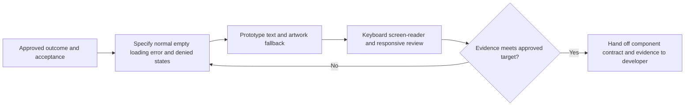

# Design direction and interaction principles

**Status:** Initial design proposal; not a validated visual system.

## Direction

Create an editorial digital museum that makes owned objects and their context feel worthy of attention. Use a typographic hierarchy, generous and responsive card layouts, distinctive but legible identity, rich imagery when rights permit, and restrained transitions. Collection management should remain fast and understandable.

Do not use faux wooden shelves, virtual rooms, cabinets, trading-card-game conventions, or another product's visual identity as the primary metaphor. Avoid rarity/value badges that make expensive ownership appear superior.

## Interaction principles

- Present catalogue title, release/edition, and the user's actual copy as clearly related but distinct information.
- Make add-first-game and add-another-copy actions obvious; allow uncertainty and incomplete metadata rather than forcing guessed values.
- Keep acquisition price/private notes out of public surfaces unless a future explicit, separately reviewed control permits it.
- Give every content and image source a meaningful role and accessible alternative text; do not use decorative art as the only identifier.
- Provide consistent loading, empty, error, denied, saved, and validation-feedback states.
- Design for keyboard use, readable zoom, reduced motion, touch targets, and narrow screens.
- Personal photographs are owned-context media; community curation cannot overwrite a collector's selected photo.

## Candidate core components

Navigation, collection card/list item, game/release summary, physical-copy detail form, condition/completeness controls, search/filter controls, privacy/visibility control, exhibit section/citation, timeline item, media attribution, empty/error/loading states. Component details and tokens await Gate 1.

## Design system work required at Gate 1

Agree responsive breakpoints, type scale, color/contrast palette, spacing, focus/error states, motion policy, image fallbacks, semantic component behavior, and accessibility verification criteria. No usability or WCAG conformance test has been performed at Gate 0.

## Reviewable interaction contract

GC-I-004 proposes the design specification; GC-I-008 gathers prototype evidence. Implementation follows the approved [requirements](../product/requirements.md) and [journeys](../product/user-journeys.md), not this proposal alone.

| Surface | Intended interaction and states | Requirement / delivery issue |
| --- | --- | --- |
| Authentication | Explain session state; accessible errors and recovery; never reveal whether another collector owns a record. | F-01, F-10 / GC-I-013 |
| Empty collection | Explain individual physical copies and provide one clear add action; distinguish empty from failed loading. | F-02 / GC-I-014 |
| Catalogue selection | Search by supported fields; label seed data; separate game, platform, and release; show misses and unknown facts without invention. | F-03 / GC-I-015 |
| Copy form | Persistent labels, optional/unknown states, field-specific errors plus summary; preserve safe input after failure; distinguish price paid from value. | F-04, F-05 / GC-I-016–GC-I-017 |
| Collection and details | Text identifies cards without images; catalogue facts and owned-copy attributes have distinct headings; multiple copies remain distinct. | F-07, F-08 / GC-I-018–GC-I-019 |
| Export/settings | Explain included/excluded fields and ownership boundary; announce progress, failures, and completion. | F-13 / GC-I-020 |
| Photo controls | Explain private default, processing/rejection and replace/delete; personal selection wins over catalogue artwork. | F-06 / GC-I-023 |
| Refinement/counts | Label filters, sort order, result count and clear action; preserve keyboard focus; explain game/release/copy counting. | F-08 / GC-I-024 |
| Exhibit | Readable sections, navigable timeline, claim classifications and source links; evidence-backed correction acknowledgement. | F-09 / GC-I-025–GC-I-026 |
| Future sharing | Preview allow-listed public fields, explicit confirmation, understandable revoke control, separate photo consent. | F-12 / GC-I-029–GC-I-030 |
| Future submissions | Rights explanation, moderation status and reporting; no “verified ownership” claim from an upload. | F-14 / GC-I-031–GC-I-032 |

### Shared accessibility acceptance

The proposed target and test matrix must be approved under NFR-01. Specify focus order/restoration, semantic roles and headings, accessible names, validation announcements, contrast, readable zoom/reflow, touch targets, non-colour status cues, image alternatives, and reduced motion for each component. Record actual keyboard, screen-reader, and viewport evidence rather than declaring conformance from a mockup.

No design token values, formal conformance target, analytics event, or visual system is selected here. GC-I-004 must resolve these without introducing shelves, monetary prestige, or mandatory paid artwork.
