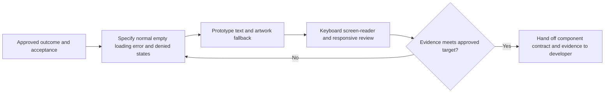

# Design direction and interaction principles

**Status:** Initial design proposal; not a validated visual system.

## Direction

Create an editorial digital museum that makes owned objects and their context feel worthy of attention. Use a typographic hierarchy, generous and responsive card layouts, distinctive but legible identity, rich imagery when rights permit, and restrained transitions. Collection management should remain fast and understandable.

Do not use faux wooden shelves, virtual rooms, cabinets, trading-card-game conventions, or another product's visual identity as the primary metaphor. Avoid rarity/value badges that make expensive ownership appear superior.

## Interaction principles

- Present catalogue title, release/edition, and the user's actual copy as clearly related but distinct information.
- Make add-first-game and add-another-copy actions obvious; allow uncertainty and incomplete metadata rather than forcing guessed values.
- Keep acquisition price/private notes out of public surfaces unless a future explicit, separately reviewed control permits it.
- Give every content and image source a meaningful role and accessible alternative text; do not use decorative art as the only identifier.
- Provide consistent loading, empty, error, denied, saved, and validation-feedback states.
- Design for keyboard use, readable zoom, reduced motion, touch targets, and narrow screens.
- Personal photographs are owned-context media; community curation cannot overwrite a collector's selected photo.

## Candidate core components

Navigation, collection card/list item, game/release summary, physical-copy detail form, condition/completeness controls, search/filter controls, privacy/visibility control, exhibit section/citation, timeline item, media attribution, empty/error/loading states. Component details and tokens await Gate 1.

## Design system work required at Gate 1

Agree responsive breakpoints, type scale, color/contrast palette, spacing, focus/error states, motion policy, image fallbacks, semantic component behavior, and accessibility verification criteria. No usability or WCAG conformance test has been performed at Gate 0.

## Reviewable interaction contract

GC-I-004 proposes the design specification; GC-I-008 gathers prototype evidence. Implementation follows the approved [requirements](../product/requirements.md) and [journeys](../product/user-journeys.md), not this proposal alone.

| Surface | Intended interaction and states | Requirement / delivery issue |
| --- | --- | --- |
| Authentication | Explain session state; accessible errors and recovery; never reveal whether another collector owns a record. | F-01, F-10 / GC-I-013 |
| Empty collection | Explain individual physical copies and provide one clear add action; distinguish empty from failed loading. | F-02 / GC-I-014 |
| Catalogue selection | Search by supported fields; label seed data; separate game, platform, and release; show misses and unknown facts without invention. | F-03 / GC-I-015 |
| Copy form | Persistent labels, optional/unknown states, field-specific errors plus summary; preserve safe input after failure; distinguish price paid from value. | F-04, F-05 / GC-I-016–GC-I-017 |
| Collection and details | Text identifies cards without images; catalogue facts and owned-copy attributes have distinct headings; multiple copies remain distinct. | F-07, F-08 / GC-I-018–GC-I-019 |
| Export/settings | Explain included/excluded fields and ownership boundary; announce progress, failures, and completion. | F-13 / GC-I-020 |
| Photo controls | Explain private default, processing/rejection and replace/delete; personal selection wins over catalogue artwork. | F-06 / GC-I-023 |
| Refinement/counts | Label filters, sort order, result count and clear action; preserve keyboard focus; explain game/release/copy counting. | F-08 / GC-I-024 |
| Exhibit | Readable sections, navigable timeline, claim classifications and source links; evidence-backed correction acknowledgement. | F-09 / GC-I-025–GC-I-026 |
| Future sharing | Preview allow-listed public fields, explicit confirmation, understandable revoke control, separate photo consent. | F-12 / GC-I-029–GC-I-030 |
| Future submissions | Rights explanation, moderation status and reporting; no “verified ownership” claim from an upload. | F-14 / GC-I-031–GC-I-032 |

### Shared accessibility acceptance

The proposed target and test matrix must be approved under NFR-01. Specify focus order/restoration, semantic roles and headings, accessible names, validation announcements, contrast, readable zoom/reflow, touch targets, non-colour status cues, image alternatives, and reduced motion for each component. Record actual keyboard, screen-reader, and viewport evidence rather than declaring conformance from a mockup.



No design token values, formal conformance target, analytics event, or visual system is selected here. GC-I-004 must resolve these without introducing shelves, monetary prestige, or mandatory paid artwork.

## Gate 1 collection and detail concepts

**Status:** Three low-fidelity proposals for GC-I-004, not approved designs, interactive prototypes, or usability evidence. All imagery below is a neutral placeholder; no third-party artwork, real personal data, or historical claim is supplied. Use the [synthetic collecting scenario](../product/user-journeys.md#gate-1-synthetic-collecting-scenario) for comparison and record the human selection in the [Gate 1 review package](../operations/open-decisions.md#gate-1-review-package).

### A — Editorial gallery

An image-forward collection with generous whitespace and short museum-style object labels. Detail opens as a separate reading surface, with catalogue and personal context visibly separated.

```text
MY COLLECTION — Private                     Add a physical copy
Search my copies

[Neutral image]                 [Neutral image]
Paper Comet                     Paper Comet
Sample Console / Release R-A     Sample Console / Release R-A
Copy C-A1 · manual present       Copy C-A2 · completeness unknown
View my copy                    View my copy

COPY C-A1 — Private
[Neutral image]  Catalogue: Paper Comet / Sample Console / R-A
My copy: condition unknown · manual present · price paid unknown
Edit my copy | Add another copy | View catalogue release
```

On narrow screens cards become a single column and the detail image precedes labelled text. Keyboard order follows search, add action, then each card's copy link; returning from detail should restore focus to that copy. Risk to evaluate: large images may slow scanning and push management actions below the initial view.

### B — Archive index

A compact typographic index with small image accents. Selecting a copy leads to a two-section object record rather than implying that a title row is an owned object.

```text
MY COLLECTION — Private                     Add a physical copy
Search my copies
Image   Game / platform / release              My physical copy
[—]     Paper Comet / Sample Console / R-A      C-A1 · manual present
[—]     Paper Comet / Sample Console / R-A      C-A2 · unknown

COPY C-A1 — Private
CATALOGUE RECORD                 MY OBJECT
Paper Comet                     Condition: unknown
Sample Console / R-A            Components: manual present
Region: unknown                 Price paid: unknown
View catalogue release          Edit my copy | Add another copy
```

On narrow screens each row becomes a labelled stacked record; catalogue and object sections stack without losing headings. Each row has a descriptive copy link, not a click-only container. Risk to evaluate: efficient scanning could feel like an inventory spreadsheet unless typography, spacing and object labels retain editorial character.

### C — Object dossier

Quiet image-and-text cards lead to a copy-focused dossier with a prominent release breadcrumb and private object context. History discovery appears only in a separately labelled follow-on design panel.

```text
MY COLLECTION — Private                     Add a physical copy
Search my copies
[Neutral image] Paper Comet · R-A · My copy C-A1
[Neutral image] Paper Comet · R-A · My copy C-A2

Paper Comet > Sample Console > Release R-A > My copy C-A1
MY PHYSICAL COPY — Private
[Neutral image]  Manual present · condition unknown
Edit my copy | Add another copy | View catalogue release

FOLLOW-ON DESIGN ONLY — NOT A LIVE EXHIBIT
Historical context for the game
Claim classification | Source locator | Correction route
No historical text or working publication/submission is supplied.
```

On narrow screens the breadcrumb wraps as readable text and copy actions precede the optional history panel. Use headings and ordinary links, not hover-only discovery or an obligatory carousel. Risk to evaluate: history could distract from editing or suggest that an exhibit is already delivered. The panel belongs to F-09/GC-I-025–026 only if approved; it is omitted from the first-slice application.

### Comparison and selection evidence

Product designer prepares annotated screen/state variants; QA independently reviews the evaluation matrix; the human owner selects or requests revision. These are proposed handoffs, not accepted assignments. No candidate is preferred or scored as tested here.

| Evaluation | Same task for every direction | Record before selection |
| --- | --- | --- |
| Copy/release clarity — AC-01/02 | Identify R-A, distinguish C-A1/C-A2, then edit only C-A1. | Participant explanation, misidentifications and resulting revisions. |
| Entry and recovery — F-02–05/10 | Add a copy, cancel, encounter a failed save and an unmatched item. | Steps, hesitation/errors, observed completion time if measured, safe recovery. No target time is assumed. |
| Mobile readability — AC-06 | Read titles/labels/actions on the agreed narrow viewport and at zoom. | Exact viewport/zoom, overflow and truncation observations. |
| Keyboard/accessibility — NFR-01 | Traverse search, add, copy detail, errors and return focus. | Focus order, names, feedback and barriers; static annotations are not conformance results. |
| Museum character — R3 | Explain what makes an ordinary inexpensive item worthy of attention. | Qualitative feedback on typography, hierarchy and imagery without price/rarity prestige. |
| History discovery — R5 follow-on only | Inspect C's labelled history panel without confusing it with live content. | Comprehension of deferred status, citations and private-versus-catalogue boundaries. |

Selection must record direction, rationale, rejected alternatives, artifact revision, actual evaluation results/limitations and human approval/date. Before handoff, approve type scale, contrast palette, spacing, focus/error states, image fallback and responsive rules; these wireframes do not select token values. Approved design direction does not approve the stack, photos, exhibits, sharing, or release.
