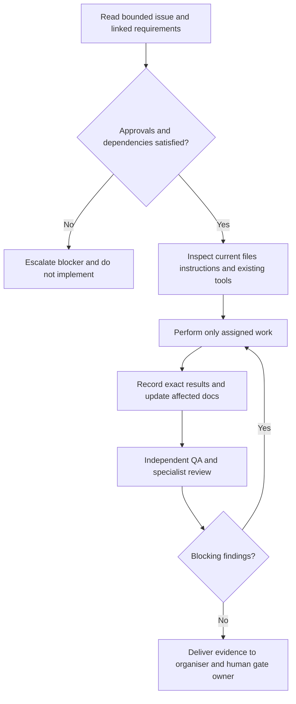

# Local development and deployment status

**Status:** No application or toolchain has been selected or implemented. This document intentionally does not invent setup commands.

At Gate 0 the repository contains planning documentation, GitHub issue and pull request templates, reusable prompts, and specialist agent guidance only. There is no package manifest, application code, test suite, database migration, seed SQL, deployment configuration, or CI workflow. Therefore there is no verified local run/build/test command.

After Gate 1 approval, the first implementation issue should establish the approved web stack and reproducible local setup, including:

- supported runtime/package manager versions and exact install, development, lint, type-check, build, and test commands;
- example environment-variable names without secrets and secure secret setup;
- local database/auth/storage or isolated test equivalents and migration/seed/reset instructions;
- how to run access-control and end-to-end tests without production data;
- CI workflow matching local checks, dependency/security scanning, and artifact handling;
- deployment environment separation, migration order, rollback limitations, backup/restore, monitoring, and incident contacts.

Do not add real credentials, production data, or privileged keys to examples. Do not describe local service emulation or mocks as a production integration.

## Agent execution contract

This is supporting build guidance, **not permission to build at Gate 0**. Begin with the [phased backlog](proposed-backlog.md); GC-I-001–GC-I-004 require human review, GC-I-005–GC-I-010 require approved experiments and evidence review, and GC-I-011 establishes the selected toolchain only after those prerequisites.

### Inputs required before an agent starts an implementation issue

- A bounded `GC-I-*` issue specification and real issue URL if filed; phase, dependencies and approved decisions.
- Linked functional/non-functional requirements and acceptance references; explicit exclusions and known open questions.
- Relevant technical design/domain model, UX states, privacy controls and content/provenance rules.
- Current repository state, applicable scoped instructions, existing commands/tests, seed or fixture provenance, and required specialist reviewers.
- Defined deliverable, test/evidence expectations, handoff recipient and stop conditions. Parallel agents must have non-overlapping file ownership or an explicit integration owner.

### Responsibilities and handoffs

| Role | Deliverable | Next reviewer / recipient |
| --- | --- | --- |
| Product manager | User outcomes, issue scope, acceptance, exclusions and decision requests | Human product owner; designer and architect |
| Product designer | Approved interaction/state/accessibility contracts and prototype evidence | Product owner; developer and QA |
| Solution architect | Proposed/approved technical design, ADRs, domain constraints and trust boundaries | Product owner; security engineer and developer |
| Research analyst / content curator | Dated rights/cost evidence; seed provenance; reviewed claims and media policy | Product owner; architect and editorial reviewer |
| Security engineer | Threat/control review and negative-case evidence requirements | Architect/developer; independent QA |
| Developer | Approved bounded feature, migration/tests, exact results and updated diagrams | Independent code reviewer and QA |
| DevOps engineer | Reproducible CI/environment, migration/recovery/monitoring and rollback evidence | Security engineer; QA and release owner |
| QA engineer / code reviewer | Independent acceptance/regression review with findings and limitations | Developer for fixes; organiser for gate evidence |
| Organiser | Dependency status, filing/traceability map and consolidated evidence | Human product owner for gate/release decisions |

No role may approve its own material product/architecture choice, production release, commercial commitment, or merge.

### Build bootstrap deliverable — GC-I-011

Once approved, publish exact supported runtime and package-manager versions, installation/lockfile procedure, local environment names, isolated database/auth/storage setup, migration/seed/reset workflow, and verified development/lint/type-check/test/build commands in this document. Explain emulation versus real-provider coverage, secret handling, fixture cleanup and CI equivalence. Do not copy candidate commands into this document before they work on the chosen stack.

### Stop and escalate

Missing approval, conflicting requirement/design references, unapproved paid dependency, unclear data/media rights, untested owner isolation, destructive migration, production data access, or unexpected personal-data exposure are blockers. Record the decision needed and responsible human; do not silently choose an answer to unblock an agent.
