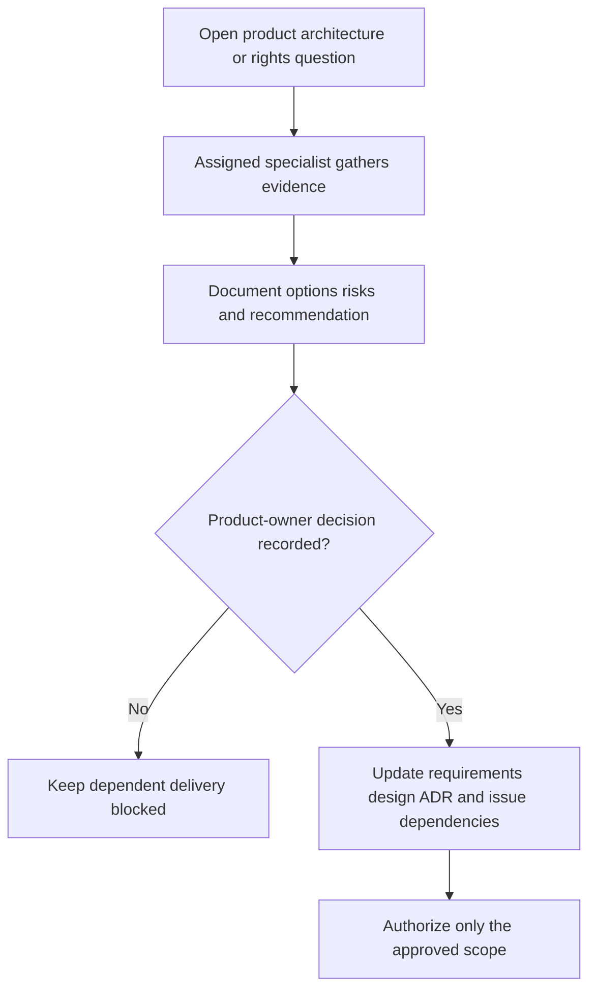

# Open decisions for human product-owner review

**Status:** All items below remain open; Gate 0 does not grant implementation or purchasing approval.

| Decision | Gate 0 recommendation | Evidence/approval needed |
| --- | --- | --- |
| First user outcome and MVP boundary | Start with a private first-copy collection loop using a small identified seed dataset. | Validate priorities/personas and approve acceptance criteria at Gate 1. |
| Web-first versus native-first | Provisional responsive web default; keep SwiftUI-first as a meaningful alternative. | Review user needs and camera/offline importance; compare spike results before commitment. |
| Framework and managed backend | Evaluate proposed Next.js/TypeScript/PostgreSQL/Auth/Storage defaults; no provider selected. | Approve comparative evidence, current terms, cost assumptions, export/restore and ownership-policy tests. |
| Collection structure and lifecycle | Model individual copies separately; collection grouping, deletion/archive, soft-delete, and multi-collection behavior remain undecided. | Review data model, export/deletion, retention, and recovery consequences. |
| Copy attribute vocabularies | Record region, condition, completeness/components, date, optional paid price/currency; exact vocabularies and unknown states need definition. | Product/design/collector review and validation criteria. |
| Personal photo storage and visibility | Private by default; public display requires explicit action independent of collection visibility. | Gate 2 secure upload/access/deletion, metadata, cost, and restore evidence. |
| Public collections/profile | Defer until privacy controls and public-field allow-list are approved. | Decide separate control granularity, discoverability/indexing, revocation, and abuse response. |
| Catalogue data and imagery | Use clearly labelled seed data and collector-entered details first. | Rights/terms assessment before importing, caching, attribution, or redistribution. |
| Community/generated artwork | Not required for MVP; retain separate categories, fallback policies, and moderation safeguards. | Approve cost, rights, reporting/takedown process, human review, and provider choice before launch. |
| Historical exhibit publication | Require traceable claims and editorial review; no sample exhibit is claimed. | Approve claim schema, correction process, source rights, editorial accountability, and first sourced exhibit. |
| Accessibility target and design tokens | Use accessible responsive defaults; exact formal target/component system not chosen. | Agree conformance target, manual/automated checks, and initial design system at Gate 1. |
| Subscription, affiliate, and paid services | No pricing, commercial commitment, or paid provider is approved. | Sourced unit economics, cancellation/archive policy, rights/security review, and explicit human approval. |
| Operational service levels | No hosting, backup schedule, recovery objective, or monitoring service is selected. | Gate 2 cost/restore evidence and Gate 4 approved operational runbook/targets. |

The organiser should track resulting approvals and dependencies in the issue/decision records. No decision should be inferred from this recommendation table.

## Decision-to-work-item traceability

The stable draft identifiers below link to the [issue-ready backlog](proposed-backlog.md); they are not GitHub issue numbers.

| Open decision area | Decision/research work | Delivery blocked until resolved |
| --- | --- | --- |
| First outcome, fields, seed misses/manual entry, collection grouping and archive/removal | GC-I-001, GC-I-002 | GC-I-012, GC-I-015–GC-I-017 |
| Stack, session/access boundaries and managed versus self-managed providers | GC-I-002, GC-I-005, GC-I-009, GC-I-010 | GC-I-011–GC-I-013, GC-I-021 |
| Accessibility target, tokens, state handling and device priorities | GC-I-004, GC-I-008 | GC-I-014–GC-I-019, GC-I-024 |
| Seed/source rights, attribution and missing/conflicting facts | GC-I-003, GC-I-007 | GC-I-012, GC-I-015; any real-provider integration |
| Export format/fields, deletion confirmation, retention and restore suppression | GC-I-001, GC-I-002, GC-I-009 | GC-I-020, GC-I-027, GC-I-034–GC-I-035 |
| Private upload formats/limits/metadata and recovery/cost policy | GC-I-002, GC-I-006, GC-I-009 | GC-I-023 |
| Claims/sources, editorial authority and correction submission/abuse policy | GC-I-003 | GC-I-025–GC-I-026 |
| Public allow-list, photo consent, discoverability, revocation/cache handling | GC-I-029 | GC-I-030 |
| Community rights, reviewer authority, reports, takedown and any voting rules | GC-I-003, GC-I-029; refine in GC-I-031–GC-I-032 before enablement | Public submissions/art distribution; GC-I-033 |
| Service levels, backup/restore targets, monitoring, environment and rollout | GC-I-009, GC-I-034 | GC-I-035–GC-I-036 |
| Licensed catalogue, valuation and native/offline/camera expansion | GC-I-037–GC-I-039 | Any corresponding future implementation |
| Commercial model, AI/generated artwork, achievements, marketplace, insurance | GC-I-040–GC-I-044 | Any purchase, commercial commitment or corresponding implementation |

### Approval record required

Each resolved choice must record the exact scope, options considered, rationale, evidence links, approving human, approval date, limitations/reconsideration trigger, and affected requirement/design/backlog references. Technical decisions also update the applicable ADR. An agent recommendation or a completed investigation is not human approval.

GC-I-036 approves release of the declared candidate only. It does not approve deferred public features, providers, or commercial models. If optional phases are skipped, resolve account deletion/retention and operational controls separately before production personal data.
