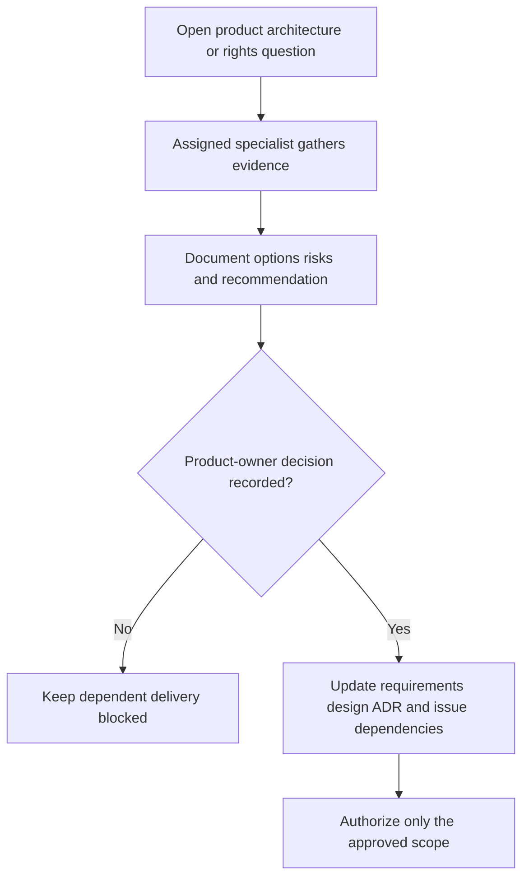

# Open decisions for human product-owner review

**Status:** All items below remain open; Gate 0 does not grant implementation or purchasing approval.

| Decision | Gate 0 recommendation | Evidence/approval needed |
| --- | --- | --- |
| First user outcome and MVP boundary | Start with a private first-copy collection loop using a small identified seed dataset. | Validate priorities/personas and approve acceptance criteria at Gate 1. |
| Web-first versus native-first | Provisional responsive web default; keep SwiftUI-first as a meaningful alternative. | Review user needs and camera/offline importance; compare spike results before commitment. |
| Framework and managed backend | Evaluate proposed Next.js/TypeScript/PostgreSQL/Auth/Storage defaults; no provider selected. | Approve comparative evidence, current terms, cost assumptions, export/restore and ownership-policy tests. |
| Collection structure and lifecycle | Model individual copies separately; collection grouping, deletion/archive, soft-delete, and multi-collection behavior remain undecided. | Review data model, export/deletion, retention, and recovery consequences. |
| Copy attribute vocabularies | Record region, condition, completeness/components, date, optional paid price/currency; exact vocabularies and unknown states need definition. | Product/design/collector review and validation criteria. |
| Personal photo storage and visibility | Private by default; public display requires explicit action independent of collection visibility. | Gate 2 secure upload/access/deletion, metadata, cost, and restore evidence. |
| Public collections/profile | Defer until privacy controls and public-field allow-list are approved. | Decide separate control granularity, discoverability/indexing, revocation, and abuse response. |
| Catalogue data and imagery | Use clearly labelled permitted seed data and private collector-entered copy attributes first. Manual catalogue entry/provisional releases remain unapproved. | Rights/terms assessment before importing, caching, attribution, or redistribution; explicitly decide the missing-catalogue branch. |
| Community/generated artwork | Not required for MVP; retain separate categories, fallback policies, and moderation safeguards. | Approve cost, rights, reporting/takedown process, human review, and provider choice before launch. |
| Historical exhibit publication | Require traceable claims and editorial review; no sample exhibit is claimed. | Approve claim schema, correction process, source rights, editorial accountability, and first sourced exhibit. |
| Accessibility target and design tokens | Use accessible responsive defaults; exact formal target/component system not chosen. | Agree conformance target, manual/automated checks, and initial design system at Gate 1. |
| Subscription, affiliate, and paid services | No pricing, commercial commitment, or paid provider is approved. | Sourced unit economics, cancellation/archive policy, rights/security review, and explicit human approval. |
| Operational service levels | No hosting, backup schedule, recovery objective, or monitoring service is selected. | Gate 2 cost/restore evidence and Gate 4 approved operational runbook/targets. |

The organiser should track resulting approvals and dependencies in the issue/decision records. No decision should be inferred from this recommendation table.

## Decision-to-work-item traceability

The stable draft identifiers below link to the [issue-ready backlog](proposed-backlog.md); they are not GitHub issue numbers.

| Open decision area | Decision/research work | Delivery blocked until resolved |
| --- | --- | --- |
| First outcome, fields, seed misses/manual entry, collection grouping and archive/removal | GC-I-001, GC-I-002 | GC-I-012, GC-I-015–GC-I-017 |
| Stack, session/access boundaries and managed versus self-managed providers | GC-I-002, GC-I-005, GC-I-009, GC-I-010 | GC-I-011–GC-I-013, GC-I-021 |
| Accessibility target, tokens, state handling and device priorities | GC-I-004, GC-I-008 | GC-I-014–GC-I-019, GC-I-024 |
| Seed/source rights, attribution and missing/conflicting facts | GC-I-003, GC-I-007 | GC-I-012, GC-I-015; any real-provider integration |
| Export format/fields, deletion confirmation, retention and restore suppression | GC-I-001, GC-I-002, GC-I-009 | GC-I-020, GC-I-027, GC-I-034–GC-I-035 |
| Private upload formats/limits/metadata and recovery/cost policy | GC-I-002, GC-I-006, GC-I-009 | GC-I-023 |
| Claims/sources, editorial authority and correction submission/abuse policy | GC-I-003 | GC-I-025–GC-I-026 |
| Public allow-list, photo consent, discoverability, revocation/cache handling | GC-I-029 | GC-I-030 |
| Community rights, reviewer authority, reports, takedown and any voting rules | GC-I-003, GC-I-029; refine in GC-I-031–GC-I-032 before enablement | Public submissions/art distribution; GC-I-033 |
| Service levels, backup/restore targets, monitoring, environment and rollout | GC-I-009, GC-I-034 | GC-I-035–GC-I-036 |
| Licensed catalogue, valuation and native/offline/camera expansion | GC-I-037–GC-I-039 | Any corresponding future implementation |
| Commercial model, AI/generated artwork, achievements, marketplace, insurance | GC-I-040–GC-I-044 | Any purchase, commercial commitment or corresponding implementation |

### Approval record required

Each resolved choice must record the exact scope, options considered, rationale, evidence links, approving human, approval date, limitations/reconsideration trigger, and affected requirement/design/backlog references. Technical decisions also update the applicable ADR. An agent recommendation or a completed investigation is not human approval.

GC-I-036 approves release of the declared candidate only. It does not approve deferred public features, providers, or commercial models. If optional phases are skipped, resolve account deletion/retention and operational controls separately before production personal data.

## Gate 1 review package

**Status:** Prepared documentary inputs for GC-I-001–004; all human decisions remain pending. This package is an index and decision agenda, not a substitute for [requirements](../product/requirements.md), [MVP disposition](../product/mvp-scope.md), or [canonical issue specifications](proposed-backlog.md#gate-1--approval-packages). It authorizes no application work, purchase, spike, or release.

Review GC-I-001 first; GC-I-002/003 coordinate security and rights constraints, then GC-I-004 consolidates the interaction baseline. Record blockers instead of selecting whichever interpretation permits implementation.

| Package / proposed preparer and reviewer | Inputs to inspect together | Human decision / exit record required |
| --- | --- | --- |
| GC-I-001 — Product manager; independent QA acceptance review | [Synthetic collecting scenario](../product/user-journeys.md#gate-1-synthetic-collecting-scenario), requirements and MVP | Exact first outcome/release exclusions; unmatched-item branch; required/optional fields and unknowns; lifecycle/grouping; export field/format policy; discovery plan and measurable acceptance. |
| GC-I-002 — Solution architect; independent security review | [Domain options](../architecture/domain-model.md#unknown-release-unresolved-gate-1-policy), technical design, [ADR-0001](../architecture/decisions/0001-provisional-technology-and-modular-monolith.md), privacy controls | Direction and bounded experiment authorization, owner/session boundaries, permitted candidate providers and budget constraints, deletion/export/recovery contracts. No final provider adoption without Gate 2 evidence. |
| GC-I-003 — Research analyst/content curator; independent rights/provenance review | Catalogue/art/history policies, synthetic scenario and [first-slice fallback](../research/artwork-policy.md#first-slice-catalogue-fallback-proposal) | Permitted seed inventory/use/export and attribution basis; copy-reported versus catalogue facts; lawful imagery/placeholder policy; editorial accountability. No rights or sourced exhibit is established by a synthetic fixture. |
| GC-I-004 — Product designer; independent QA accessibility review | [Three collection/detail concepts](../design/design-principles.md#gate-1-collection-and-detail-concepts), scenario and design state matrix | Selected/revised direction with actual evaluation evidence; responsive hierarchy, tokens, focus/error behavior and accessibility target/matrix. Deferred history/photo/sharing concepts are not first-slice commitments. |

Role assignments above are proposed, not dispatched or accepted. The human may approve, request revision, defer, or block individual decisions; incomplete prerequisites keep dependent work blocked.

### Investigation authorization versus adoption

- **Gate 1:** approve a product/design baseline and explicitly bounded investigation of a candidate architecture/provider. Record allowed synthetic/permitted data, environment, costs, cleanup, negative cases and reviewer. Candidate tooling for an authorized disposable spike is not an application-stack commitment.
- **Gate 2 / GC-I-010:** inspect reproducible results, rights/current terms, owner isolation, export/recovery and cost limitations; revise the ADR and obtain a human adoption/go-no-go decision before GC-I-011. A mock, recommendation or failed integration cannot establish adoption readiness.
- **Gate 3a:** implement only entities and operations needed by the approved scenario and owner boundary. Collection membership depends on the grouping decision; personal-media, editorial, sharing/moderation and valuation structures remain conceptual until their own scope is approved.
- **Production:** GC-I-027 deletion/retention, GC-I-034 operations evidence, GC-I-035 readiness and GC-I-036 human release remain required; first-slice or spike acceptance is not release permission.

### Proportional spike agenda — decision pending

Prioritize GC-I-005 identity/isolation, GC-I-007 permitted catalogue/missing-entry behavior, GC-I-008 responsive interaction and GC-I-009 owner export/deletion/recovery/cost feasibility. Independent experiments may run in parallel only after their recorded prerequisites and authorization.

The current backlog still requires **GC-I-006 media findings for GC-I-009/010**, even when photos are deferred. Ask the human owner whether to retain the bounded media spike or formally resequence it for a records-only candidate. No waiver is made here:

- Retaining it requires actual evidence and honest limitations, without obligating photo delivery.
- Resequencing requires a reviewed scope/risk rationale, an explicit no-photo boundary, and coordinated changes to GC-I-009/010 dependencies, roadmap, MVP, technical evaluation/design and ADR. Define the remaining records-only export/deletion/recovery evidence; preserve GC-I-006 as a prerequisite to any later GC-I-023 photo delivery.
- Until that amendment is approved and reconciled, missing media findings cannot be described as a passed Gate 2 review. Owner isolation, seed rights, portability, deletion/retention and operational readiness are never waived.

### Approval and evidence ledger

Maintain this table when work is authorized or evidence is received. `GC-I-*` entries are draft identifiers; “not recorded” does not assert that no issue exists elsewhere. Every state requires a scoped record rather than a blanket “done”.

| Draft ID / subject | Real issue URL | Decision / dependency status | Evidence revision and result | Independent reviewer outcome | Human approval/date |
| --- | --- | --- | --- | --- | --- |
| GC-I-001 product/scenario | Not recorded | Pending; Gate 0 inputs only | Documentary example linked above; acceptance not executed | Pending | Pending |
| GC-I-002 architecture/security direction | Not recorded | Pending; GC-I-001 | Proposed design/ADR; no spike evidence | Pending | Pending |
| GC-I-003 seed/art/history policy | Not recorded | Pending; GC-I-001, coordinate GC-I-002 | Synthetic fixture only; real seed rights not established | Pending | Pending |
| GC-I-004 design/accessibility | Not recorded | Pending; GC-I-001–003 | Three static concepts; usability/conformance not evaluated | Pending | Pending |
| GC-I-006/009/010 media prerequisite disposition | Not recorded | Pending scope review; existing dependencies unchanged | No media or recovery experiment result | Pending | Pending |
| GC-I-010 technology adoption | Not recorded | Blocked pending GC-I-001–009 evidence and approvals | No comparative spike result | Pending | Pending |

For each update, link the real issue when known, exact artifact/commit revision, expected versus actual criterion results (passed/failed/not-run/blocked), environment/procedure, accountable role, independent review and unresolved limitations. Each human decision needs scope, alternatives, rationale, evidence, approval/date and reconsideration trigger as specified above. Do not insert private data, credentials or signed URLs. Keep this ledger focused on the active review package; subsequent issue evidence follows the [common handoff contract](../quality/testing-and-delivery.md#evidence-and-agent-handoff-record).
