# Proposed phased, issue-ready backlog

**Status: Gate 0 documentation only.** Every item below is a proposal, not an approval, implementation, assignment accepted by a specialist, or delivery commitment. No GitHub issues have been created; issue-creation tools are unavailable in this session. `GC-I-*` are canonical planning identifiers, **not GitHub issue numbers**. Tests, spikes, reviews, content publication, and release decisions described below are required future evidence, not completed activities.

## Authority, source of truth, and filing procedure

- This file owns the canonical backlog IDs, titles, proposed work boundaries, and dependency graph. `docs/product/requirements.md` owns requirement meanings; `mvp-scope.md` owns proposed release boundaries; `roadmap.md` owns gate sequencing. `docs/operations/open-decisions.md` owns unresolved decisions; recorded human decisions must establish approval, never this backlog alone.
- Architecture documents/ADRs own approved technical boundaries when approved. Privacy and research policies constrain all slices. Conflicting sources block the affected issue pending organiser reconciliation and human review; do not silently choose whichever permits work.
- Requirement references retain **R1–R7, F-01–F-14, AC-01–AC-14**. NFR numbering used here is: **NFR-01 accessibility; NFR-02 privacy/security; NFR-03 integrity; NFR-04 maintainability; NFR-05 portability; NFR-06 reliability; NFR-07 cost; NFR-08 content**. These reference the existing non-functional meanings, not new approvals.
- Gate 1 approval work is GC-I-001–004; Gate 2 experiments are 005–009 and evidence review 010. Gate 3a is 011–022; candidate Gate 3b is 023–028; optional Gate 3c is 029–033; Gate 4 is 034–035; Gate 5 is 036. Future 037–044 are **decision-only investigations**, not approved requirements, implementation tickets, or roadmap commitments.
- **Release scope must be explicit:** propose Gate 3a as the minimum collecting-loop candidate. The full Gate 3b and Gate 3c phases are not prerequisites to release. GC-I-001 records the approved release scope; GC-I-035/036 require its evidence. Any selected optional capability requires its corresponding acceptance gate. **GC-I-027 deletion/retention evidence is required before any production personal data is accepted**, regardless of whether optional photos/editorial Gate 3b or public Gate 3c features are selected. Record its extraction/resequencing explicitly; an approved operational route may satisfy the approved behavior without mandating a self-service UI. GC-I-002/009/034 support that evidence or escalate a launch blocker. Deferral cannot waive privacy obligations.
- Accountable roles below are **proposed role handoffs**, not claims of delegation. The organiser sequences bounded packages and records blockers. Human product owner approves material scope/stack/policy/cost choices and release; independent reviewers cannot approve on the owner's behalf. No self-approval or merge authority is granted.

### Filing and handoff procedure

1. Organiser reconciles current requirements, MVP, ADRs, policies, and open decisions at a recorded revision. Confirm prerequisite evidence and scope; unresolved access-control, rights, destructive-change, cost, or legal concerns block work.
2. When authorised tools/permissions exist, open the feature issue template's generated form and populate its fields with one canonical ID/title and the **whole issue section**, including Mermaid: rationale, story, acceptance, dependencies/gate, references, evidence, documentation impact, and DoD. Include the common DoD below. Retain canonical IDs in links until real URLs exist.
3. Record the returned real issue URL/number, status, accountable specialist, reviewer, and prerequisite URLs in a status ledger. Start with the [Gate 1 approval/evidence ledger](open-decisions.md#approval-and-evidence-ledger); record exact evidence revisions and separate direction approval from later technology adoption. Never substitute fictitious `#001` numbers or imply filing occurred. If tools remain unavailable, hand the issue-ready text to the human owner.
4. Specialist confirms a bounded assignment and acceptance baseline before work; organiser coordinates non-overlapping edits. Product manager hands approved behavior to designer/architect; architect/security engineer hand approved boundaries to developer; content curator hands rights/evidence to implementation; developer hands candidate evidence to QA and independent code reviewer; devops engineer hands operational evidence to QA/security and owner.
5. Record actual commands/results/environment/revision or documentary review evidence, omissions, defects, and decisions. Gate reviewer returns **recommend proceed / revise / blocked**. Only recorded human approval opens the next gate. Amend scope/dependencies through reviewed decisions; do not reinterpret a passed gate after material changes.

### Common definition of done (included in every issue)

Each issue's local DoD below is **additional** to: accepted criteria traced to requirements; failure cases evidenced; privacy/security and documentation impacts reviewed; independent review by someone other than the author; exact artifact/revision/environment/result references and limitations recorded; organiser status updated; required human decisions recorded. Implementation additionally requires relevant unit/integration/component/E2E tests and existing mandatory CI checks on the candidate revision, without weakening gates. Approval/research issues use documented reviews and reproducible research instead of invented application tests. A diagram is a proposed workflow until implementation evidence says otherwise.

The **evidence and agent handoff record** and **required negative and boundary cases** in QA are the common evidence contract for every issue. Record criterion-by-criterion expectations/results, actual commands or manual procedures, artifact locations, candidate revision, approved decisions, independent reviewer outcomes, and passed/failed/not-run/blocked status. Label providers real/emulated/mocked and fixtures synthetic/seed; exclude credentials, private records, photos and signed URLs. Map relevant controls to PRIV's **implementation and evidence ownership** matrix across identity, server, persistence, exports, media, public/editorial capabilities, deletion/restore and operations; a UI-only check cannot discharge a lower-layer boundary.

### Reference key

Paths below are relative to the repository root; each issue's **Docs** line identifies both reading references and intended updates in its future work package, not permission to edit them in this Gate 0 change.

| Key | Documentation |
| --- | --- |
| REQ | `docs/product/requirements.md` |
| MVP | `docs/product/mvp-scope.md` |
| ROAD | `docs/product/roadmap.md` |
| JOURNEY | `docs/product/user-journeys.md`, `docs/product/vision-and-personas.md` |
| DEC | `docs/operations/open-decisions.md` |
| RISK | `docs/operations/risks-and-assumptions.md` |
| ARCH | `docs/architecture/overview.md`, `docs/architecture/domain-model.md` |
| TECH | `docs/architecture/technology-evaluation.md`, `docs/architecture/decisions/0001-provisional-technology-and-modular-monolith.md` |
| PRIV | `docs/security/privacy.md` |
| DESIGN | `docs/design/design-principles.md` |
| CAT | `docs/research/catalogue-and-licensing.md` |
| ART | `docs/research/artwork-policy.md` |
| HIST | `docs/research/historical-provenance.md` (GC-DATA-001 and GC-AI-001) |
| COST | `docs/research/commercial-sustainability.md` |
| QA | `docs/quality/testing-and-delivery.md` |
| LOCAL | `docs/operations/local-development.md` |
| GOV | `.github/copilot-instructions.md`, `.github/ISSUE_TEMPLATE/feature.yml` |

## Full canonical index

In the dependency column only, three-digit references abbreviate **GC-I-xxx**; they never refer to GitHub numbers or roadmap priorities. Dependencies mean evidenced completion/required approval, not merely a document existing. Requirements on approval/gate issues denote coverage to review; references on future investigations denote related constraints, not newly approved scope.

| Canonical ID | Canonical title | Phase | Requirement references | Dependencies |
| --- | --- | --- | --- | --- |
| GC-I-001 | Product MVP approval | Gate 1 | R1–R7; F-01–F-14; AC-01–AC-14; NFR-01–08 | Gate 0 artifacts |
| GC-I-002 | Architecture/security approval | Gate 1 | R1–R7; F-01,04,06,11–14; AC-01,02,05,07,09,10,12,13; NFR-02–08 | 001 |
| GC-I-003 | Catalogue/art/history policy approval | Gate 1 | R1,R4–R7; F-03,06,09,14; AC-04,08,10,11,13; NFR-03,07,08 | 001; coordinate 002 |
| GC-I-004 | UX/accessibility design | Gate 1 | R1–R6; F-01–10,12,13; AC-01–06,08–12,14; NFR-01,02 | 001,002,003 |
| GC-I-005 | Auth/owner isolation spike | Gate 2 | R1,R4; F-01,04,11,13; AC-05,07,09; NFR-02,04 | 002,004 |
| GC-I-006 | Private media lifecycle spike | Gate 2 | R4; F-06; AC-10; NFR-02,06,07 | 002,003,004 |
| GC-I-007 | Permitted catalogue/search spike | Gate 2 | R1,R3; F-03,08; AC-04,08; NFR-03,05,07,08 | 002,003,004 |
| GC-I-008 | Responsive/device feasibility spike | Gate 2 | R3; F-07,10; AC-06; NFR-01,05 | 004 |
| GC-I-009 | Deployment/recovery/cost spike | Gate 2 | R4; F-11,13; AC-07,09; NFR-02,05–07 | 002,003; incorporate 005,006 |
| GC-I-010 | Gate2 evidence review | Gate 2 | R1–R7; selected F/AC; NFR-01–08 | 001–009 |
| GC-I-011 | Approved scaffold/local tooling/CI | Gate 3a | F-11; AC-07; NFR-02,04,06 | 010 |
| GC-I-012 | Schema/migrations/seed | Gate 3a | R1,R2; F-03–05; AC-01–04; NFR-02,03,05,08 | 011,003 |
| GC-I-013 | Auth/session | Gate 3a | R1; F-01,10; AC-05–07; NFR-01,02 | 011,012,005 |
| GC-I-014 | Empty/onboarding | Gate 3a | R1; F-02,10; AC-06; NFR-01,02 | 013,004 |
| GC-I-015 | Seed catalogue search/release selection | Gate 3a | R1,R3; F-03,10; AC-01,04,06,08; NFR-01,03,08 | 012,013,007 |
| GC-I-016 | Copy CRUD/lifecycle | Gate 3a | R1,R2; F-04,10; AC-01,02,05,06; NFR-02,03,06 | 013,015,002 |
| GC-I-017 | Copy attributes/price | Gate 3a | R2; F-05,10; AC-03,06; NFR-01–03 | 016,004 |
| GC-I-018 | Responsive cards/game vs copy detail | Gate 3a | R1,R3; F-07,10; AC-01,06; NFR-01,02,08 | 016,017,008 |
| GC-I-019 | Private collection search | Gate 3a | R3; F-08,10; AC-05,06; AC-08 related catalogue journey; NFR-01,02 | 018,013 |
| GC-I-020 | Owner-only export | Gate 3a | R4; F-13,10; AC-05,09; NFR-02,03,05 | 017,013,009 |
| GC-I-021 | Authorization regression suite | Gate 3a | R1,R4; F-01,04,08,11,13; AC-05,07,09; NFR-02,06 | 013,016,019,020 |
| GC-I-022 | Gate3a acceptance | Gate 3a | R1–R4 partial; F-01–05,07,08 search,10,11,13; AC-01–09; NFR-01–08 | 011–021 |
| GC-I-023 | Private photo lifecycle | Gate 3b candidate | R4; F-06,10; AC-05,06,10; NFR-01,02,06,07 | 022,006; inclusion approval |
| GC-I-024 | Filters/sort/counts | Gate 3b candidate | R3; F-08,10; AC-06,14; NFR-01–03 | 022; inclusion approval |
| GC-I-025 | Sourced editorial model/review | Gate 3b candidate | R5; F-09,11; AC-11; NFR-03,08 | 022,003; inclusion approval |
| GC-I-026 | Exhibit reading/timeline/correction | Gate 3b candidate | R5; F-09,10; AC-06,11; NFR-01,02,08 | 025,004 |
| GC-I-027 | Account deletion/retention | Gate 3b placement; launch mandatory | R4; F-01,06,13 lifecycle; AC-05,09,10 related; NFR-02,05,06 | 022,002,009; 023 if photos included |
| GC-I-028 | Gate3b acceptance | Gate 3b candidate | R3–R5; F-06,08,09,10,11; AC-06,07,10,11,14; NFR-01–08 | Selected 023–027; exclusion decisions |
| GC-I-029 | Sharing/privacy design approval | Gate 3c optional | R6,R7; F-12,14; AC-12,13; NFR-01,02,08 | 022,002,003; optional-scope decision |
| GC-I-030 | Opt-in public profile/collection | Gate 3c optional | R6; F-12,10; AC-05,06,12; NFR-01,02 | 029,021; 023 if photo sharing selected; applicable 032 safeguards before public enablement |
| GC-I-031 | Rights-attested community submissions | Gate 3c optional | R7; F-14; AC-13; NFR-02,08 | 029,003; 032 moderation readiness before public use |
| GC-I-032 | Moderation/reports/takedown | Gate 3c optional | R7; F-14,10; AC-06,13; NFR-02,06,08 | 029,003; integrate 031 before launch only if community submissions are selected |
| GC-I-033 | Gate3c acceptance | Gate 3c optional | R6,R7; F-12,14,10,11; AC-05–07,12,13; NFR-01–08 | Selected 030–032; exclusion decisions |
| GC-I-034 | Operational migration/backup/restore/monitoring/rollback | Gate 4 | R1,R4; F-11,13; AC-07,09; NFR-02–07 | 022,009,027; selected 028/033 |
| GC-I-035 | Gate4 release candidate validation | Gate 4 | All selected R/F/AC; NFR-01–08 | 027,034,022 + approved release scope; 028/033 only for included optional capabilities |
| GC-I-036 | Gate5 human release decision | Gate 5 | All selected R/F/AC; NFR-01–08 | 035 |
| GC-I-037 | Licensed catalogue/provider expansion investigation | Future decision-only | Related R1,R3; F-03; AC-04,08; NFR-03,05,07,08 | 001,003,007 |
| GC-I-038 | Valuation methodology investigation | Future decision-only | Related R2; F-05; AC-03; NFR-03,07,08 | 001,003,017 evidence if available |
| GC-I-039 | Native/offline/camera/barcode investigation | Future decision-only | Related R1,R3,R4; F-03,06,07,13; NFR-01–07 | 002,007,008 |
| GC-I-040 | Commercial sustainability/subscription/affiliate investigation | Future decision-only | Related R4; F-13; AC-09; NFR-02,05,07,08 | 001,009,003 |
| GC-I-041 | Generated artwork/AI-assistance investigation | Future decision-only | Related R5,R7; F-09,14; AC-11,13; NFR-02,07,08 | 003,009 |
| GC-I-042 | Equitable achievements investigation | Future decision-only | Related R3; F-08; AC-14; NFR-01,02,08 | 001,004 |
| GC-I-043 | Marketplace investigation | Future decision-only | Related R2,R6,R7; F-05,12,14; AC-03,12,13; NFR-02,07,08 | 001,002,003,040 |
| GC-I-044 | Insurance reporting investigation | Future decision-only | Related R2,R4; F-05,13; AC-03,09; NFR-02,03,05,08 | 001,002,038; 020 evidence if available |

### Phase dependency diagram

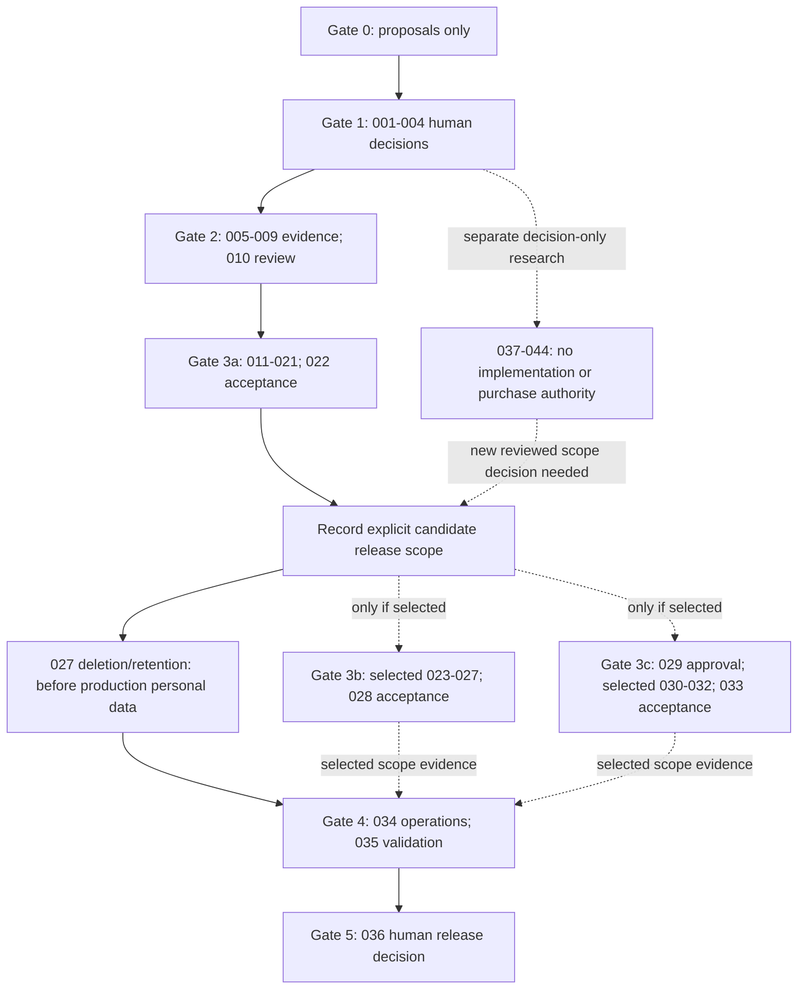

### Legacy umbrella aliases — not roadmap P numbers

Preserve the old backlog names solely for traceability. **Legacy P1–P5 are unrelated to roadmap P1–P5** and are not filing IDs.

| Legacy alias/title | Canonical replacement |
| --- | --- |
| Legacy P1 — Review and approve product MVP definition | GC-I-001; design elaboration GC-I-004 |
| Legacy P2 — Approve architecture, data, and security boundaries | GC-I-002 |
| Legacy P3 — Approve catalogue, artwork, and historical-content policies | GC-I-003 |
| Legacy P4 — Run Gate 2 technical risk spikes | GC-I-005–010, with device expansion separately investigated in GC-I-039 |
| Legacy P5 — Implement approved private collection vertical slice | GC-I-011–022; photographs deliberately separated into GC-I-023, not silently included |

## Gate 1 — Approval packages

### GC-I-001 — Product MVP approval

- **Rationale/requirements:** Review R1–R7, F-01–14, AC-01–14, NFR-01–08; choose a bounded outcome rather than treating all candidates as launch scope.
- **Story:** As product owner, I want an explicit private collecting-loop boundary so the team can prove user value without hidden expansion.
- **Workflow:** Product manager assembles personas, journeys, requirement/acceptance coverage, exclusions, and success signals; owner records approve/revise/defer; organiser reconciles the baseline.
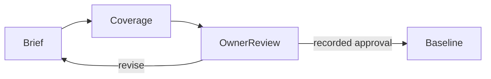
- **Acceptance:** Every F/AC has first-slice, follow-on, deferred, or required-control disposition. Specify required versus optional copy fields, unknown states, record export scope, collection lifecycle, and target devices. Decide or explicitly block missing-seed handling, manual entry/provisional release creation and collection grouping; these remain open Gate 1 decisions, with no guessed match, invented catalogue data or silent permanent exclusion. Record selected release scope and measurable validation plan without inventing user research. Unanswered choices have owners; conflicting privacy or deletion assumptions block approval. Optional phases cannot become implicit release prerequisites.
- **Dependencies/handoff:** Gate 0 artifacts. Accountable product manager → human owner → organiser → GC-I-002/003/004.
- **Tests/evidence:** Requirement coverage review, actual research if conducted, dated decision with artifact revisions and objections; no application tests expected.
- **Security/privacy:** Confirm private defaults and launch deletion obligation; no public/private field decision inferred.
- **Docs:** REQ, MVP, ROAD, JOURNEY, DEC, RISK, GOV; reconcile approved status only after actual decision.
- **DoD:** Common DoD plus explicit human approval or recorded blocked/revise outcome; a proposal is not a passing Gate 1 decision.

### GC-I-002 — Architecture/security approval

- **Rationale/requirements:** R1–R7; F-01,04,06,11–14; AC-01,02,05,07,09,10,12,13; NFR-02–08. Establish domain and trust boundaries before personal persistence.
- **Story:** As a collector, I want my account, copies, exports, and media isolated so another account cannot discover or alter them.
- **Workflow:** Architect compares web/native and provider alternatives; security engineer reviews threat/data flows; owner decides material choices and mandates risk spikes.
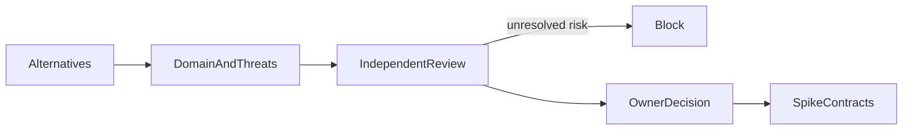
- **Acceptance:** Separate Game/Platform/Release/Copy/Collection/Media; define ownership, multiplicity, lifecycle and unknown data. Document server/persistence/storage enforcement, privileged-key boundary, sessions/recovery, export/deletion/backups, public exclusions, provider replaceability. Compare benefits/risks/costs rather than declaring stack selected. Destructive lifecycle or cross-owner ambiguity blocks approval; document minimum operational deletion route if self-service is deferred.
- **Dependencies/handoff:** GC-I-001; coordinate GC-I-003 policy constraints without circular approval. Accountable solution architect; security engineer independent threat review → owner → spike specialists.
- **Tests/evidence:** Reviewed data-flow diagrams, threat matrix, alternatives/ADR and exact spike acceptance contracts; no isolation success claimed.
- **Security/privacy:** Explicit trust-boundary decision package; escalate legal/residency uncertainty and exposed-secret designs.
- **Docs:** ARCH, TECH, PRIV, DEC, RISK, MVP; record decisions and rejected alternatives.
- **DoD:** Common DoD plus human architecture/security-direction approval; unresolved implementation blockers remain visible.

### GC-I-003 — Catalogue/art/history policy approval

- **Rationale/requirements:** R1,R4–R7; F-03,06,09,14; AC-04,08,10,11,13; NFR-03,07,08. Availability is not reuse permission.
- **Story:** As a collector or reader, I want honest metadata and lawful imagery with traceable claims so missing facts or rights are not disguised.
- **Workflow:** Research analyst checks seed/source terms; content curator defines provenance/editorial rules; rights ambiguity escalates; owner approves policy boundary.
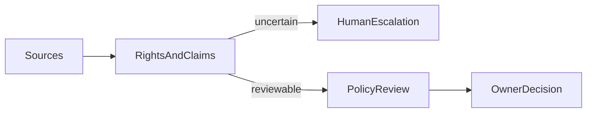
- **Acceptance:** Define a rights-cleared seed inventory and attribution/export restrictions; unknown/conflicting metadata remains marked. Coordinate missing-catalogue/manual-entry disposition with GC-I-001, including provenance of collector-entered facts; do not invent unavailable releases. Separate personal, licensed catalogue, generated, and community media with approved fallbacks. Require claim classification, citations, reviewer/version history, correction path and GC-DATA-001/GC-AI-001. Define attestation/moderation/takedown requirements before future public content. Unlicensed assets use placeholders; unresolved rights cannot be approved by popularity or AI screening.
- **Dependencies/handoff:** GC-I-001; coordinate GC-I-002 domain contracts. Accountable research analyst with content curator → human owner → GC-I-007/025/029.
- **Tests/evidence:** Dated source/terms inventory, permissible sample records, citation checks, missing-rights rejection examples; no actual published exhibit implied.
- **Security/privacy:** Personal media never becomes catalogue fallback; rights records/reporter details minimise personal data.
- **Docs:** CAT, ART, HIST, ARCH, DEC, RISK; record reviewed sources and open legal questions.
- **DoD:** Common DoD plus human policy approval; provider adoption/public artwork remain separately gated.

### GC-I-004 — UX/accessibility design

- **Rationale/requirements:** R1–R6; F-01–10,12,13; AC-01–06,08–12,14; NFR-01,02. Accessible editorial cards must support tasks, not decorative shelves.
- **Story:** As a collector using keyboard, assistive technology, or a narrow screen, I want clear copy management and privacy feedback without losing context.
- **Workflow:** Designer maps approved journeys into states/components; QA reviews evaluation plan; owner approves target and design baseline.

- **Acceptance:** Specify formal accessibility target, viewport/zoom matrix, focus/error announcements, contrast/motion/touch criteria. Distinguish game/release/copy, duplicate-copy action, unknown attributes, private price, neutral art fallback. Include loading/empty/error/denied/retry and destructive confirmation states. Prototype must not imply persisted photos or working auth. Optional sharing/correction concepts stay labelled, not scope additions.
- **Dependencies/handoff:** GC-I-001/002/003. Accountable product designer → QA accessibility review → human owner → GC-I-008 and implementation.
- **Tests/evidence:** State inventory, annotated prototypes, keyboard traversal and contrast specifications; label design checks separately from implemented conformance tests.
- **Security/privacy:** Prevent misleading visibility labels and accidental display of private fields.
- **Docs:** DESIGN, JOURNEY, REQ, MVP, PRIV, DEC; document tokens/component contracts and unresolved accessibility decisions.
- **DoD:** Common DoD plus approved design/evaluation baseline; no conformance certification claimed.

## Gate 2 — Bounded risk experiments

### GC-I-005 — Auth/owner isolation spike

- **Rationale/requirements:** R1,R4; F-01,04,11,13; AC-05,07,09; NFR-02,04.
- **Story:** As a collector, I want evidence that authentication cannot let another user read, write, list, or export my records.
- **Workflow:** In an approved disposable environment create synthetic users A/B, exercise identity/session transitions and direct server/persistence calls, then destroy fixtures and report.
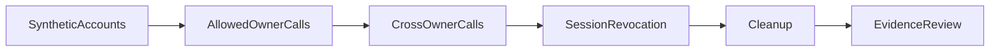
- **Acceptance:** Test anonymous, expired, revoked, A→B and forged owner-ID cases across read/list/create/update/delete/export. Denial returns no private existence/count information and leaves records unchanged. Test persistence policies with ordinary credentials, not only privileged test clients; verify server secrets absent from browser/logs. Failure or unavailable provider capability is a no-go/limitation, not a pass.
- **Dependencies/handoff:** GC-I-002/004. Accountable security engineer, developer executes experiment → independent QA → GC-I-010.
- **Tests/evidence:** Reproducible fixture/setup, requests and assertions, environment/versions/results, cleanup evidence and residual risks.
- **Security/privacy:** Synthetic data only; restricted credentials, rate-limit/session threat findings documented.
- **Docs:** PRIV, TECH, QA, RISK, DEC; record actual spike findings.
- **DoD:** Common DoD plus reproducible isolation evidence or blocked result; spike is not production auth implementation.

### GC-I-006 — Private media lifecycle spike

- **Rationale/requirements:** R4; F-06; AC-10; NFR-02,06,07.
- **Story:** As a collector, I want my photos privately stored, safely validated, and removable without lingering public access.
- **Workflow:** Upload synthetic files to an owner-bound private object, verify access/expiry, replace/delete, simulate partial failures, reconcile storage.
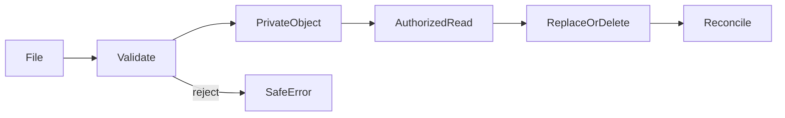
- **Acceptance:** Demonstrate approved MIME/signature/size/dimension checks, metadata stripping decision, safe decoding and scanning decision. Deny guessed keys, cross-owner upload/read/delete and expired access URLs. Exercise interrupted upload, failed record write, failed object deletion, retry and orphan cleanup; no falsely successful deletion. Verify private bucket/cache settings and recovery/deletion propagation. A local preview/mock does not satisfy durable storage evidence.
- **Dependencies/handoff:** GC-I-002/003/004. Accountable security engineer with devops engineer; independent QA → GC-I-010/023.
- **Tests/evidence:** File matrix including forged/oversized/corrupt/EXIF cases; object/record lifecycle assertions; cost/retention constraints and cleanup results.
- **Security/privacy:** Synthetic media, no personal location metadata or signed URLs in reports.
- **Docs:** PRIV, ART, TECH, QA, RISK, COST; record approved limits or unresolved decisions.
- **DoD:** Common DoD plus demonstrated storage boundary/lifecycle or explicit no-go; optional photo scope remains unapproved.

### GC-I-007 — Permitted catalogue/search spike

- **Rationale/requirements:** R1,R3; F-03,08; AC-04,08; NFR-03,05,07,08.
- **Story:** As a collector, I want to find an identifiable release without relying on an unlicensed comprehensive provider.
- **Workflow:** Load permitted synthetic/rights-cleared seed records, query games/releases, select platform/edition, compare results and incomplete metadata.
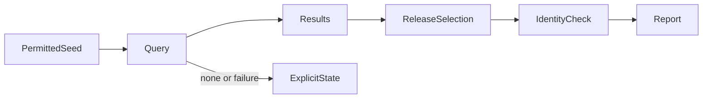
- **Acceptance:** Seed/sample label and source attribution persist through selection. Demonstrate multi-platform/multi-release/duplicate-name cases, unknown fields, empty query/no results, malformed query and timeouts. Select release identity, never infer edition from title alone. Define bounded search behavior and latency/data-size measurement plan. Provider failure cannot force prohibited scraping or invented details.
- **Dependencies/handoff:** GC-I-002/003/004. Accountable developer, research analyst verifies data permission → QA → GC-I-010/015.
- **Tests/evidence:** Dataset provenance manifest, deterministic query fixtures, identity assertions, measured environment/results and scaling limitations.
- **Security/privacy:** No private collection data in catalogue queries/logs; keys remain server-side if an approved experiment uses one.
- **Docs:** CAT, ARCH, TECH, DESIGN, QA, RISK; document query contract and seed limits.
- **DoD:** Common DoD plus reproducible permitted-data selection evidence; no large catalogue integration claimed.

### GC-I-008 — Responsive/device feasibility spike

- **Rationale/requirements:** R3; F-07,10; AC-06; NFR-01,05.
- **Story:** As a collector on varied devices, I want usable cards and copy forms, with honest limits for camera/barcode support.
- **Workflow:** Build labelled disposable interaction prototype; exercise approved viewport/input matrix; record browser/device capability evidence separately from core layout.
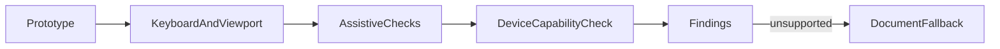
- **Acceptance:** Verify readable reflow/zoom, logical focus, names/errors, reduced motion, image fallback and multiple-copy navigation against GC-I-004 targets. Record actual tested devices/browsers, not generic compatibility claims. Camera denied/unavailable and barcode ambiguity have manual-entry fallback proposals. Native/offline/camera/barcode production features are excluded; additional investigation belongs to GC-I-039.
- **Dependencies/handoff:** GC-I-004. Accountable product designer with developer; QA independent checks → GC-I-010/018.
- **Tests/evidence:** Prototype revision, measured viewport/keyboard/screen-reader results where exercised, device permission observations, explicit untested cells.
- **Security/privacy:** No real camera images retained; permissions requested only in approved experiment and data flow documented.
- **Docs:** DESIGN, TECH, QA, RISK, DEC; separate feasibility from conformance.
- **DoD:** Common DoD plus evidence-backed responsive recommendation and device limitations; no working native application claimed.

### GC-I-009 — Deployment/recovery/cost spike

- **Rationale/requirements:** R4; F-11,13; AC-07,09; NFR-02,05–07.
- **Story:** As operator and collector, I want a recoverable, affordable platform that does not trap my data.
- **Workflow:** Compare candidate services; rehearse disposable deployment/migration/export/restore and failure rollback; model usage costs.
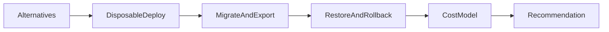
- **Acceptance:** Exercise fresh setup, migration failure, backup restore and export readability with synthetic data; compare expected records/constraints after restore. State proposed RPO/RTO, retention and deletion-in-backup handling for human decision. Source/date low/typical/high auth/storage/egress/backup/observability costs and exit costs. Include media findings if evaluated; unavailable restore, unbounded spend or secret leakage blocks recommendation. No purchase/production deployment.
- **Dependencies/handoff:** GC-I-002/003; incorporate GC-I-005/006 findings before closing. Accountable devops engineer with research analyst → security/QA review → GC-I-010.
- **Tests/evidence:** Environment/commands/results, restore reconciliation, failure rehearsal, dated pricing/terms and assumptions; no SLA inferred from vendor marketing.
- **Security/privacy:** Least-privilege deployment credentials, restricted/encrypted backups, synthetic datasets and redacted logs.
- **Docs:** TECH, LOCAL, PRIV, QA, COST, RISK, DEC; record runbook requirements and no-go choices.
- **DoD:** Common DoD plus measured recovery/cost recommendation; material provider/cost choices require owner decision.

### GC-I-010 — Gate2 evidence review

- **Rationale/requirements:** R1–R7 and selected F/AC; NFR-01–08. Experiments do not themselves authorise application work.
- **Story:** As product owner, I want independent evidence synthesis so an attractive prototype cannot conceal unresolved security or rights failures.
- **Workflow:** Organiser compiles GC-I-005–009 reports; QA/security compare contracts and gaps; owner records proceed/revise/stop and approved Gate 3a scope.
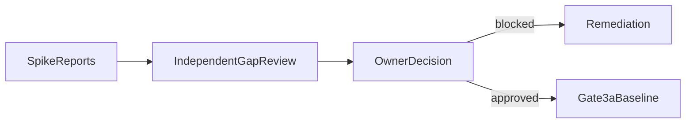
- **Acceptance:** Each planned spike has result/evidence/limitations; no missing auth or rights proof excused as optional. Review photo findings even if photos deferred, clearly distinguish deferral from passed storage validation. Reconcile stack/ADR, accessibility target, lifecycle/export and operational deletion route. Optional scope exclusions are explicit. Material changed assumptions return to approval; no automatic gate pass.
- **Dependencies/handoff:** GC-I-001–009. Accountable organiser; QA/security independent review → human owner → GC-I-011.
- **Tests/evidence:** Evidence matrix with reproducibility/status, dated reviewer findings, unresolved risks and human decision.
- **Security/privacy:** Cross-owner leaks, unsafe media, legal ambiguity or destructive-change uncertainty block affected implementation.
- **Docs:** ROAD, MVP, TECH, DEC, RISK, QA, PRIV; align baseline and conditional decisions.
- **DoD:** Common DoD plus explicit Gate 3 authorisation or stop/revise record; no application completion asserted.

## Gate 3a — Private collecting loop

### GC-I-011 — Approved scaffold/local tooling/CI

- **Rationale/requirements:** F-11; AC-07; NFR-02,04,06.
- **Story:** As a developer, I want reproducible approved tooling so focused feature changes can be validated without ad-hoc environment assumptions.
- **Workflow:** Implement only selected stack scaffold, documented local setup and isolated test configuration; establish mandatory checks before features.
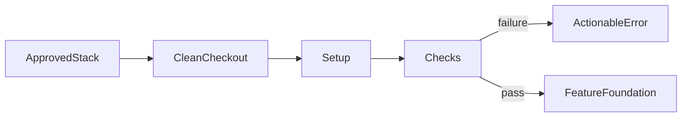
- **Acceptance:** Fresh setup follows documented steps and starts only minimal scaffold. Provide formatting/lint/type/runtime-validation conventions, test/build and dependency/security checks appropriate to approved stack. CI fails on deliberately invalid fixtures/check failures; no bypass or invented commands. Configuration distinguishes local/test/production, uses safe environment examples, no privileged browser secrets. Unsupported environment gets explicit prerequisites.
- **Dependencies/handoff:** GC-I-010. Accountable developer; devops engineer owns CI/config review → independent code reviewer/QA → GC-I-012.
- **Tests/evidence:** Clean-checkout setup and actual check logs on candidate revision, deliberate failure proof, secret/config review.
- **Security/privacy:** Least-privilege automation and isolated synthetic test data; inspect dependency provenance.
- **Docs:** LOCAL, QA, TECH, ARCH, GOV; document actual commands/tool versions.
- **DoD:** Common DoD plus observed reproducible mandatory checks; scaffold does not satisfy collector features.

### GC-I-012 — Schema/migrations/seed

- **Rationale/requirements:** R1,R2; F-03–05; AC-01–04; NFR-02,03,05,08.
- **Story:** As a collector, I want each owned copy to retain its identity even when several copies share a release.
- **Workflow:** Migrate separate catalogue/owner records, install approved constraints and ownership policies, load labelled permitted seed data.
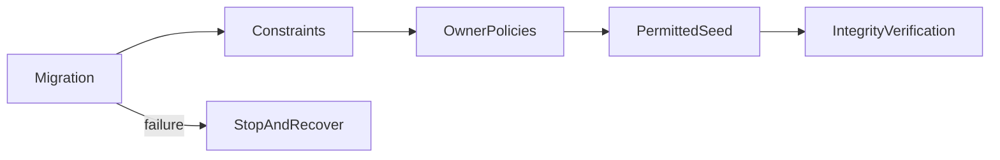
- **Acceptance:** Preserve Game→Release/Platform relationships and independently identified copies; no title-based copy uniqueness. Enforce approved required/optional fields, foreign keys, lifecycle and currency rules, source namespaces and unknown metadata. Test fresh migration and supported upgrade path; failure leaves recoverable consistent state. Seed repeat-run behavior is documented and cannot overwrite user copies or import unapproved artwork.
- **Dependencies/handoff:** GC-I-011/003 and approved GC-I-002 model. Accountable developer → architect/security/code reviewer → feature developers.
- **Tests/evidence:** Constraint/persistence tests, multi-copy fixture, policy denials, migration failure/upgrade and deterministic seed checks.
- **Security/privacy:** Owner binding enforced below UI; privileged migration credentials remain outside application clients.
- **Docs:** ARCH, CAT, ART, LOCAL, QA, PRIV; document schema, constraints, seed source and recovery.
- **DoD:** Common DoD plus reproducible migrations/seed and independent domain/policy review.

### GC-I-013 — Auth/session

- **Rationale/requirements:** R1; F-01,10; AC-05–07; NFR-01,02.
- **Story:** As a collector, I want secure sign-in, sign-out and recovery so only valid sessions can manage my private collection.
- **Workflow:** Use approved identity mechanism; establish verified server session; protect actions; handle expiration/recovery/revocation and route to private collection.
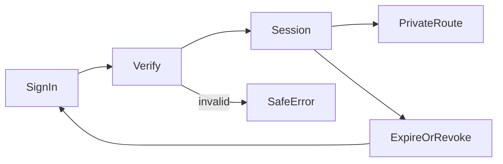
- **Acceptance:** Identity failure never creates an authenticated state; forged client owner values cannot choose account scope. Test sign-out/expiry/revocation/recovery using selected provider's real behavior. Protect state-changing requests per threat model, rate-limit relevant paths, avoid account-enumerating errors. Keyboard-operable forms communicate loading/error/denied states; session loss on save explains outcome without exposing or silently discarding private input.
- **Dependencies/handoff:** GC-I-011/012/005. Accountable developer → security engineer and independent QA/code reviewer → GC-I-014/016.
- **Tests/evidence:** Auth integration and E2E transitions, anonymous/expired/forged request cases, approved session settings and provider limits.
- **Security/privacy:** Tokens/credentials never logged; browser contains no service-role secrets.
- **Docs:** PRIV, ARCH, LOCAL, DESIGN, QA; actual session/recovery flow and limitations.
- **DoD:** Common DoD plus observed session boundary/regression tests; a mock login is not complete.

### GC-I-014 — Empty/onboarding

- **Rationale/requirements:** R1; F-02,10; AC-06; NFR-01,02.
- **Story:** As a new collector, I want a useful empty collection and clear first-copy entry point instead of an unexplained blank page.
- **Workflow:** Load authorised collection; show loading until known empty; guide to seed release search and return to collection.
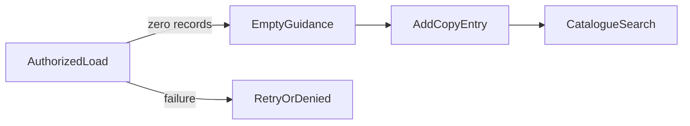
- **Acceptance:** Empty appears only after successful zero-record response, not network or permission failure. Explain seed limits and private default; CTA reaches release selection. Returning user with records sees neither misleading onboarding nor another user's counts. Keyboard/focus/announcements meet design baseline; loading timeout/error offers safe retry, denial offers session action, no fabricated example holdings.
- **Dependencies/handoff:** GC-I-013/004. Accountable developer with product designer review → independent QA → first-copy journey.
- **Tests/evidence:** Component/E2E tests for true empty, delayed, failed, denied, returning user and narrow keyboard path.
- **Security/privacy:** No cross-owner aggregate or sensitive data in analytics; examples explicitly labelled if approved.
- **Docs:** JOURNEY, DESIGN, MVP, QA; update state/CTA behavior and limitations.
- **DoD:** Common DoD plus observed onboarding state distinctions; not complete merely because a static empty card exists.

### GC-I-015 — Seed catalogue search/release selection

- **Rationale/requirements:** R1,R3; F-03,10; AC-01,04,06,08; NFR-01,03,08.
- **Story:** As a collector, I want to find a seed title and choose the actual platform/release before adding a copy.
- **Workflow:** Enter query, inspect clearly labelled game results, choose explicit release/edition, pass stable release identity to copy creation.
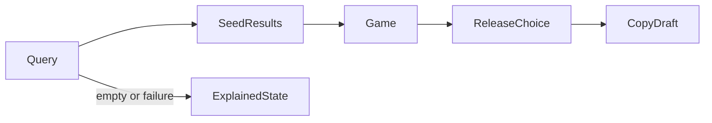
- **Acceptance:** Search behavior matches approved spike contract, including whitespace/no match/invalid query and stale-response handling. Results show sample/source labels and unknown fields without guessing. Same title across platforms/regions remains distinguishable; copy draft receives release ID, not guessed title. Missing seed entry explains coverage limits and offers safe retry/refinement; manual entry/provisional release creation remains open at Gate 1 and is implemented only if separately approved, never by fabricating a match. Keyboard selection and narrow layout work; query error retains input and never becomes no-results success. No unapproved external lookup.
- **Dependencies/handoff:** GC-I-012/013/007. Accountable developer; research analyst checks displayed provenance → independent QA/code reviewer → GC-I-016.
- **Tests/evidence:** Query/selection integration, duplicate-name and multi-release fixtures, missing metadata, race/timeout and accessible E2E.
- **Security/privacy:** Validate/bound query inputs and logging; catalogue data cannot reveal private holdings.
- **Docs:** CAT, ARCH, DESIGN, JOURNEY, QA; document seed coverage and selection contract.
- **DoD:** Common DoD plus actual permitted-seed selection path; comprehensive coverage is explicitly excluded.

### GC-I-016 — Copy CRUD/lifecycle

- **Rationale/requirements:** R1,R2; F-04,10; AC-01,02,05,06; NFR-02,03,06.
- **Story:** As a collector, I want to independently add, read, edit and remove or change status of each physical copy.
- **Workflow:** Select release, create owner-bound copy, read/edit it, apply the approved status/deletion action with confirmation and recovery semantics.
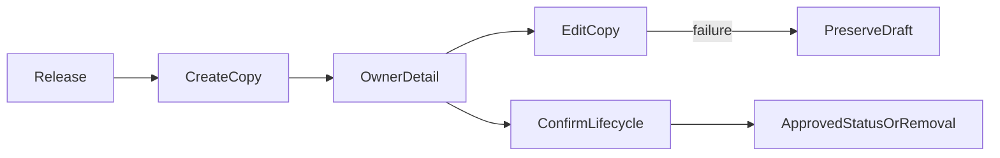
- **Acceptance:** Two copies of one release have separate IDs and independently editable lifecycle; editing a copy never edits catalogue/release or sibling copies. Implement only GC-I-002-approved lifecycle (do not silently choose archive/soft/hard deletion). Prevent accidental duplicate writes from repeated submission; define concurrent-edit handling. Reject invalid/dangling release and cross-owner calls, keep data unchanged on rejected writes, and clearly handle not-found/session loss/save failure.
- **Dependencies/handoff:** GC-I-013/015/002. Accountable developer → architect/security/code reviewer and QA → GC-I-017/018.
- **Tests/evidence:** Domain/persistence/E2E CRUD, duplicate-copy, retries/concurrency, invalid release, deletion/status and cross-owner assertions.
- **Security/privacy:** Server assigns owner; no identifier enumeration; destructive confirmation is not authorisation.
- **Docs:** ARCH, PRIV, JOURNEY, DESIGN, QA, DEC; actual lifecycle and recovery contract.
- **DoD:** Common DoD plus evidenced approved lifecycle; undecided destructive behavior blocks completion.

### GC-I-017 — Copy attributes/price

- **Rationale/requirements:** R2; F-05,10; AC-03,06; NFR-01–03.
- **Story:** As a collector, I want edition context, condition, completeness, acquisition and optional paid price to describe my object honestly.
- **Workflow:** Edit copy-specific attributes using approved vocabularies/unknown states; validate and save without overwriting catalogue facts.
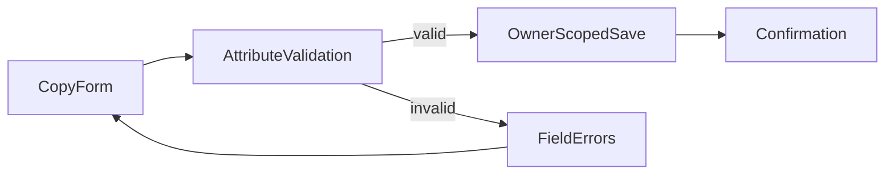
- **Acceptance:** Define release-linked edition/region versus copy-specific annotations; preserve unknown/not recorded separately from zero/none. Apply approved condition/components/date/note limits and date rules, not invented historical dates. Optional paid amount/currency uses exact approved precision/validation and never displays market value; missing price is not zero. Invalid amount/currency/date leaves persisted data unchanged and presents accessible field errors. Private notes/acquisition/price stay owner-only.
- **Dependencies/handoff:** GC-I-016/004 and GC-I-001 field decisions. Accountable developer; product manager validates vocabularies → QA/code reviewer.
- **Tests/evidence:** Domain round trips for precision/unknowns/components, invalid inputs, owner-scoped saves and keyboard error correction.
- **Security/privacy:** Bound/sanitise notes; exclude sensitive fields from public paths/logs.
- **Docs:** REQ, ARCH, DESIGN, PRIV, QA, DEC; field dictionary, currency semantics and unknown values.
- **DoD:** Common DoD plus agreed field rules and paid-price distinction verified.

### GC-I-018 — Responsive cards/game vs copy detail

- **Rationale/requirements:** R1,R3; F-07,10; AC-01,06; NFR-01,02,08.
- **Story:** As a collector, I want attractive readable cards linking game context and my separate copy detail without confusing ownership.
- **Workflow:** Render authorised copy cards with approved art/placeholder; navigate to copy or catalogue detail via distinct labels/actions.
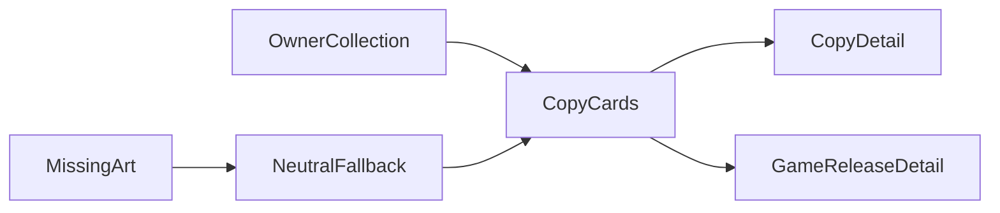
- **Acceptance:** Multiple copies remain identifiable; game/release detail cannot expose owner's notes/paid price or imply catalogue entry is an owned object. Use rights-valid fallback, accessible names/alt text, keyboard focus, reflow/zoom/reduced motion per GC-I-004/008. Broken/revoked imagery falls back without losing copy identity; delayed/error/denied collection states are distinct. No fake shelf UI or value superiority badges; no personal-photo behavior claimed before GC-I-023.
- **Dependencies/handoff:** GC-I-016/017/008. Accountable developer with product designer/content review → independent QA.
- **Tests/evidence:** Component and E2E navigation/duplicate copies, image failure, narrow/zoom/keyboard/manual accessibility matrix.
- **Security/privacy:** Owner-only card payloads; shared/catalogue component cannot leak private props or cached details.
- **Docs:** DESIGN, ART, ARCH, JOURNEY, QA, PRIV; implemented card/detail distinction and fallbacks.
- **DoD:** Common DoD plus tested responsive semantic distinction; screenshots alone are insufficient.

### GC-I-019 — Private collection search

- **Rationale/requirements:** R3; F-08,10; AC-05,06; AC-08 remains specifically catalogue selection covered by GC-I-015; NFR-01,02.
- **Story:** As a collector, I want to find a copy already in my collection without searching another account's holdings.
- **Workflow:** Search authorised collection by approved title/release fields, show owned-copy results, open copy; clear query to restore view.
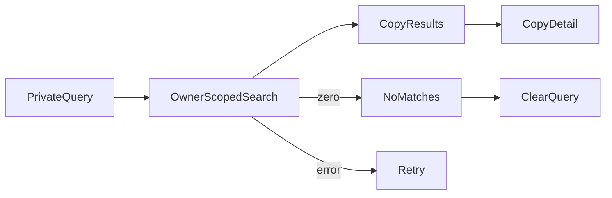
- **Acceptance:** Search scope is owner's copies; duplicates remain separate. Define fields/normalisation and bounded query rules; exclude private note/price search unless expressly approved. Distinguish empty collection from no matches and error/denied. Clearing preserves collection context; stale responses cannot replace latest query. Keyboard submission, announcements and narrow screens meet baseline; forged owner filters cannot broaden results or counts.
- **Dependencies/handoff:** GC-I-018/013. Accountable developer → QA/security/code reviewer → GC-I-021/024.
- **Tests/evidence:** Deterministic query fixtures, duplicate copies, A/B isolation, malformed/timeout/race cases and accessible E2E.
- **Security/privacy:** Scope at query boundary, not client filtering; minimise query logs and prevent count leakage.
- **Docs:** REQ, DESIGN, ARCH, PRIV, QA; distinguish private search from seed search and deferred refinements.
- **DoD:** Common DoD plus actual owner-scoped search evidence; filters/statistics excluded until GC-I-024.

### GC-I-020 — Owner-only export

- **Rationale/requirements:** R4; F-13,10; AC-05,09; NFR-02,03,05.
- **Story:** As a collector, I want a documented portable export of my records so I can retain them outside the selected service.
- **Workflow:** Request export as verified owner, obtain approved fields in versioned format, download securely, validate against schema.
```mermaid
flowchart LR
  OwnerRequest --> Authorization --> SerializeOwnRecords --> SecureDownload
  Authorization -->|denied| NoExport
  SerializeOwnRecords -->|failure| SafeRetry
```
- **Acceptance:** Document format/version, field inclusion, dates/currencies/unknowns, catalogue-source restrictions and media treatment; record export is not automatically photo backup. Multiple copies preserve identity/relationship without other users' records. Empty export is valid/documented. Reject anonymous/cross-owner requests, expired links and unsafe spreadsheet content if applicable. Failure/large-result limits provide explicit retry/status, no partial export falsely labelled complete; no durable public download.
- **Dependencies/handoff:** GC-I-017/013/009. Accountable developer; architect/research analyst check portable/rights contract → security/QA/code reviewer.
- **Tests/evidence:** Parse/schema round trips, empty/multiple-copy fixtures, field completeness, precision, cross-owner/session/timeout and secure download checks.
- **Security/privacy:** Sensitive exported fields explained to owner; links/private content absent from logs/caches.
- **Docs:** REQ, MVP, ARCH, PRIV, LOCAL, QA, CAT; export schema and limitations.
- **DoD:** Common DoD plus demonstrated owner-only readable export; import capability not implied.

### GC-I-021 — Authorization regression suite

- **Rationale/requirements:** R1,R4; F-01,04,08,11,13; AC-05,07,09; NFR-02,06.
- **Story:** As a collector, I want owner isolation continuously tested so later features cannot quietly expose my data.
- **Workflow:** Enumerate implemented entry points and trust boundaries; create synthetic A/B fixtures; run allowed/denied assertions in isolated CI.
```mermaid
flowchart LR
  EndpointInventory --> OwnerFixtures --> AllowedAndDeniedMatrix
  AllowedAndDeniedMatrix --> ServerAndPersistenceChecks --> MandatoryCI
```
- **Acceptance:** Cover read/list/search/count/create/update/delete/lifecycle/export, anonymous/expired/revoked sessions and forged IDs. Verify denied writes leave records unchanged and responses reveal no private contents; test ordinary persistence credentials, not only UI. CI must fail for controlled policy regressions in isolated tests; exclude privileged fixture setup from authorisation proof. Add media/public tests when selected slices exist, never claim coverage for unimplemented endpoints.
- **Dependencies/handoff:** GC-I-013/016/019/020. Accountable QA engineer; developer supplies fixtures → security engineer/code reviewer independent validation → GC-I-022.
- **Tests/evidence:** Executed matrix, endpoint coverage and omissions, candidate CI logs and regression-detection evidence.
- **Security/privacy:** Synthetic isolated accounts; no secrets or private payloads in published logs.
- **Docs:** PRIV, QA, ARCH, RISK; inventory and extension requirements.
- **DoD:** Common DoD plus mandatory owner-boundary checks and reviewed coverage gaps; high-impact gaps block acceptance.

### GC-I-022 — Gate3a acceptance

- **Rationale/requirements:** R1–R4 partial; F-01–05,07,08 search,10,11,13; AC-01–09; NFR-01–08.
- **Story:** As product owner, I want independent proof of the private collecting loop before calling the slice accepted.
- **Workflow:** QA exercises sign-in→seed selection→multiple copies→attributes→cards/edit/search→export, plus second-user denial; organiser compiles findings for owner decision.
```mermaid
flowchart LR
  Candidate --> CollectorJourney --> NegativeAndAccessibilityChecks --> Evidence
  Evidence -->|defects| Remediation
  Evidence --> OwnerGateDecision
```
- **Acceptance:** Trace every selected AC to actual results; verify distinction between paid price and valuation, seed limits and separate copies. Inspect mandatory CI, security review, keyboard/narrow state matrix and portable export. Missing photo/editorial/sharing features are explicit exclusions, not completed R4–R7. High-impact isolation/integrity defects block; lower-risk limitations need disposition. This acceptance is not release approval.
- **Dependencies/handoff:** GC-I-011–021. Accountable QA engineer; independent code/security review → organiser → human owner; developer resolves defects.
- **Tests/evidence:** Candidate revision/environment, executed journeys, AC matrix, CI and review references, defect statuses and actual human decision.
- **Security/privacy:** Demonstrate private defaults and no cross-user record/export access; confirm deletion route remains tracked for release.
- **Docs:** MVP, REQ, ROAD, QA, PRIV, RISK, DEC; record accepted scope without overstating outcomes.
- **DoD:** Common DoD plus explicit human Gate 3a decision; optional and release gates remain open.

## Gate 3b — Candidate preservation and editorial slices

Only selected, approved feature packages proceed. Photos, refinements and editorial features can be excluded from the first release. **GC-I-027 is different: its deletion/retention outcome must be evidenced before production personal data is accepted.** Its self-service experience can be deferred in favour of an approved evidenced operational route, but record GC-I-027's extraction/resequencing and acceptance before GC-I-034/035; do not claim the whole Gate 3b phase passed.

### GC-I-023 — Private photo lifecycle

- **Rationale/requirements:** R4; F-06,10; AC-05,06,10; NFR-01,02,06,07.
- **Story:** As a collector, I want to privately attach, select, replace and delete photos of a specific copy without exposing them.
- **Workflow:** Validate upload, persist private owner/copy-bound media, select personal card photo, authorise viewing, replace/delete and reconcile failed operations.
```mermaid
flowchart LR
  Upload --> Validate --> PrivatePersist --> SelectCopyPhoto --> OwnerView
  PrivatePersist -->|partial failure| Reconcile
  OwnerView --> ReplaceOrDelete --> Reconcile
```
- **Acceptance:** Enforce GC-I-006 limits/metadata/scanning decisions; deny cross-owner/guessed-key access and expired URLs. Durable storage survives reload; local preview is not success. Copy deletion follows approved media retention; retries/orphan cleanup and failed deletion show truthful status. Personal choice overrides catalogue fallback and cannot be changed by votes; unavailable photo falls back with replacement action. Public collection never publishes photo implicitly. Accessible upload/progress/error and storage/quota failures are covered.
- **Dependencies/handoff:** GC-I-022/006 and recorded inclusion approval. Accountable developer with devops support → security/QA/code reviewer.
- **Tests/evidence:** Real private-storage integration, malformed/oversized/EXIF files, access expiry, replacement/deletion/orphan retries and E2E persistence.
- **Security/privacy:** Private storage/metadata controls, minimal logs, bounded costs; separate public-photo consent excluded.
- **Docs:** PRIV, ART, ARCH, DESIGN, QA, COST, LOCAL; actual lifecycle and cleanup.
- **DoD:** Common DoD plus durable authorised photo lifecycle and extended GC-I-021 checks.

### GC-I-024 — Filters/sort/counts

- **Rationale/requirements:** R3; F-08,10; AC-06,14; NFR-01–03.
- **Story:** As a collector, I want accessible filters, stable sorting and honest counts to explore my collection without monetary ranking.
- **Workflow:** Combine approved facet filters/search, choose sort, view scoped results/counts, reset and inspect copy.
```mermaid
flowchart LR
  PrivateCollection --> FilterAndSort --> ScopedResultsAndCounts --> CopyDetail
  FilterAndSort -->|no matches| ResetOptions
```
- **Acceptance:** Define approved facets, unknown-value handling, stable tie-breaks and persisted/reset state. Distinguish physical-copy count from unique game/release count; duplicates affect only appropriate totals. Counts obey same owner/filter scope as results. No hidden monetary success score. Empty/no-match/error/denied and stale query behavior are distinct; controls/announcements work via keyboard/narrow screen. Invalid filters cannot bypass owner scope or silently fabricate totals.
- **Dependencies/handoff:** GC-I-022 and inclusion approval. Accountable developer; product designer/product manager verify semantics → QA/security/code reviewer.
- **Tests/evidence:** Unit query/count fixtures with duplicates/unknowns/ties, A/B isolation, combined filters/reset/stale responses and accessible E2E.
- **Security/privacy:** Server-scoped aggregates; sensitive price/notes excluded from unapproved analytics.
- **Docs:** REQ, DESIGN, ARCH, QA, PRIV; filter/count definitions and limits.
- **DoD:** Common DoD plus reproducible semantics and accessibility evidence; valuation/leaderboards excluded.

### GC-I-025 — Sourced editorial model/review

- **Rationale/requirements:** R5; F-09,11; AC-11; NFR-03,08.
- **Story:** As a reader, I want each historical claim checked against traceable evidence before publication.
- **Workflow:** Curator researches a bounded exhibit; model stores sources/claims/classifications/versions; independent editorial review validates rights/citations; authorised human publishes approved revision.
```mermaid
flowchart LR
  Research --> SourcesAndClaims --> Draft --> CitationAndRightsReview
  CitationAndRightsReview -->|unsupported| ReviseOrMarkDisputed
  CitationAndRightsReview -->|approved| VersionedPublication
```
- **Acceptance:** Implement source creator/title/type/URL/dates/rights/reliability and claim classification/confidence/dispute/reviewer/version fields. Factual publication requires supporting evidence, not merely an attached URL or AI output. Missing/broken source, conflict and impermissible excerpt trigger rejection or attributed/disputed treatment. Drafts are not reader-visible; stale edits cannot overwrite reviewed publication. One actual sample needs lawful evidence and accountable human editor; no fabricated sample.
- **Dependencies/handoff:** GC-I-022/003 and inclusion approval. Accountable content curator for content; developer for model → independent editorial/research and code review → GC-I-026.
- **Tests/evidence:** Publication validation/version tests, traceable claim-source sample, dated citation/rights review and permission-boundary failures.
- **Security/privacy:** Restricted editorial writes; lawful excerpts only; no user private holdings in exhibits.
- **Docs:** HIST, CAT, ART, ARCH, QA; schema/editorial workflow and actual source register.
- **DoD:** Common DoD plus approved source-backed sample/model; publication authority remains human.

### GC-I-026 — Exhibit reading/timeline/correction

- **Rationale/requirements:** R5; F-09,10; AC-06,11; NFR-01,02,08.
- **Story:** As a visitor, I want to read an accessible sourced exhibit, understand timeline uncertainty, and submit an evidence-backed correction.
- **Workflow:** Load published version, inspect citations/timeline, submit bounded correction with sources, acknowledge queue; curator reviews without automatic text replacement.
```mermaid
flowchart LR
  PublishedExhibit --> CitationsAndTimeline --> CorrectionSubmission --> ReviewQueue
  ReviewQueue -->|accepted| NewReviewedVersion
  ReviewQueue -->|rejected or uncertain| RecordedDecision
```
- **Acceptance:** Reader sees only published revisions with claim attribution/dispute states and references. Unknown/approximate dates remain explicit; timeline has semantic non-visual reading order. Missing/unavailable source links explain limits without inventing replacement evidence. Correction validation/rate limit handles malformed/no-source/duplicate/error cases; acknowledgement is not acceptance. No direct public edit, reviewer contact leak or unreviewed claim publication; preserve version/decision history.
- **Dependencies/handoff:** GC-I-025/004. Accountable developer with content curator → independent QA/editorial/security review.
- **Tests/evidence:** Published-only API/E2E, citation/timeline keyboard/assistive checks, correction abuse/validation and accepted/rejected version fixtures.
- **Security/privacy:** Minimise correction submitter data; escape submitted text/URLs and restrict reviewer tools.
- **Docs:** HIST, DESIGN, JOURNEY, PRIV, ARCH, QA; reader/correction contracts and handling responsibility.
- **DoD:** Common DoD plus actual reader and reviewed correction path; community artwork moderation is separate.

### GC-I-027 — Account deletion/retention

- **Rationale/requirements:** R4; F-01,06,13 lifecycle; AC-05,09,10 related; NFR-02,05,06. A cross-cutting launch obligation, not a claim that existing F IDs already specify a particular UI.
- **Story:** As a collector, I want to understand retention and request account/data deletion without losing export access unexpectedly.
- **Workflow:** Explain export/retention, verify owner and confirmation, revoke access, delete eligible records/media, track retries and backup propagation under approved policy.
```mermaid
flowchart LR
  OwnerRequest --> ExplainAndConfirm --> RevokeSessions --> DeleteEligibleData
  DeleteEligibleData -->|partial failure| RetryAndStatus
  DeleteEligibleData --> RetentionAndBackupTracking
```
- **Acceptance:** Scope identity/copies/media/exports/logs/community-content exceptions explicitly. Provide approved confirmation/reauthentication and export opportunity; never accept cross-owner deletion. Partial object/provider failure cannot report complete deletion. Document retention reasons/time bounds and restricted backup expiry; restored data cannot resurrect deleted accounts without reconciliation. Provider inability, legal uncertainty or irreversible lifecycle ambiguity blocks. If UX deferred, record accountable operational route and user request channel for release.
- **Dependencies/handoff:** GC-I-022/002/009; GC-I-023 when photos included. Accountable security engineer sets policy; developer/devops implement → independent QA → owner for exceptions.
- **Tests/evidence:** Account/record/session/object lifecycle tests, retry/failure and restored-backup deletion reconciliation, documented exception review.
- **Security/privacy:** Highly destructive; audit minimum metadata without retaining deleted private contents.
- **Docs:** PRIV, ARCH, LOCAL, QA, DEC, RISK; retention/deletion runbook and user explanation.
- **DoD:** Common DoD plus evidenced approved deletion route before production personal data is accepted, regardless of optional phase selection; no unsupported instantaneous-backup deletion claim.

### GC-I-028 — Gate3b acceptance

- **Rationale/requirements:** R3–R5; selected F-06,08,09,10,11; AC-06,07,10,11,14; NFR-01–08.
- **Story:** As product owner, I want separately evidenced preservation/editorial slices so one cannot mask defects in another.
- **Workflow:** Record selected GC-I-023–027 scope, QA evaluates each plus regressions, content/security reviewers assess their boundaries; owner accepts/revises selected gate.
```mermaid
flowchart LR
  SelectedScope --> PhotoAndDiscoveryEvidence --> EditorialAndDeletionEvidence
  EditorialAndDeletionEvidence --> RegressionReview --> OwnerDecision
```
- **Acceptance:** Each selected capability has traced acceptance/negative/accessibility evidence. Photo claim requires real storage; exhibit claim requires verified sample/review; counts require defined semantics. Retention/deletion route documented even if self-service excluded. Exclusions are recorded individually, not labelled passed. Re-run Gate 3a regressions; unresolved privacy/rights defects block relevant release inclusion. This optional gate never silently becomes required for a Gate 3a-only candidate.
- **Dependencies/handoff:** Selected GC-I-023–027 plus recorded exclusion decisions. Accountable QA engineer; content curator/security independent review → organiser → human owner.
- **Tests/evidence:** Candidate AC matrix, selected feature/CI results, editorial source/review evidence, defects and explicit scope decision.
- **Security/privacy:** Validate media/deletion boundaries and correction abuse controls.
- **Docs:** MVP, ROAD, REQ, QA, PRIV, HIST, RISK, DEC; record partial R3–R5 coverage honestly.
- **DoD:** Common DoD plus selected Gate 3b decision; no public sharing or release approval implied.

## Gate 3c — Optional sharing/community

This phase requires its own scope decision. GC-I-031 and GC-I-032 may be developed against an approved shared submission/moderation contract; **neither can enable public distribution until integrated moderation readiness is evidenced**. They are not circular build prerequisites.

### GC-I-029 — Sharing/privacy design approval

- **Rationale/requirements:** R6,R7; F-12,14; AC-12,13; NFR-01,02,08.
- **Story:** As a collector, I want to know exactly what sharing reveals and how to revoke it before public functionality exists.
- **Workflow:** Product/design/security propose granular consent/public fields/discovery; content specialists propose moderation/takedown; human owner approves or defers.
```mermaid
flowchart LR
  OptionalScopeRequest --> VisibilityAndAbuseDesign --> IndependentReview
  IndependentReview -->|uncertain| BlockOrDefer
  IndependentReview --> OwnerDecision --> BoundedContracts
```
- **Acceptance:** Decide profile versus collection controls, public field allow-list, indexing/discoverability, cache/link revocation and separate photo action. Prices/notes/account IDs/storage keys/acquisition context excluded unless separately reviewed policy permits specific change. Define report/submission/moderation permissions, handling capacity, escalation, takedown and retention. Design private-default preview/confirmation/revocation and inaccessible/withdrawn states. Unstaffed abuse handling or unresolved rights blocks enablement.
- **Dependencies/handoff:** GC-I-022/002/003 and explicit optional-scope decision. Accountable product designer; security/content specialists independently review → human owner → GC-I-030–032.
- **Tests/evidence:** Threat/field matrix, consent prototypes, revocation scenarios, moderation operations plan and dated human decisions.
- **Security/privacy:** New public exposure requires explicit review, not reuse of private endpoints.
- **Docs:** PRIV, DESIGN, MVP, ART, HIST, DEC, RISK; approved controls and exclusions.
- **DoD:** Common DoD plus human approval of optional scope/contracts; no sharing implementation authorised by draft alone.

### GC-I-030 — Opt-in public profile/collection

- **Rationale/requirements:** R6; F-12,10; AC-05,06,12; NFR-01,02.
- **Story:** As a collector, I want to opt into a public view of approved fields and withdraw it without exposing private acquisition details.
- **Workflow:** Owner previews allow-listed view, confirms sharing independently for profile/collection, visitor reads public projection, owner revokes and cache/access is invalidated.
```mermaid
flowchart LR
  PrivateDefault --> Preview --> ExplicitConsent --> PublicProjection
  PublicProjection --> Revoke --> WithdrawAndInvalidate
```
- **Acceptance:** No existing/new collection public by default. Public response contains only approved fields and no private prices/notes/IDs/object keys. Direct requests and cached views obey withdrawal policy with documented limits; revoked/non-public target yields safe unavailable state. Separate photo consent is required if selected; otherwise personal photos never appear. Repeated/forged/cross-owner visibility changes fail; accessible preview clearly communicates indexing and irreversible external-copy limitations.
- **Dependencies/handoff:** GC-I-029/021; GC-I-023 if separately approved photo sharing; applicable GC-I-032 public reporting/safety safeguards before enablement, as determined by GC-I-029. Accountable developer → security/QA/code reviewer and product designer.
- **Tests/evidence:** Public response schema allow-list, opt-in/revocation/cache, forged owner and anonymous routes, default/migration privacy regression and accessible E2E.
- **Security/privacy:** Separate public read model, consent history minimised; no claim that revocation erases third-party copies.
- **Docs:** PRIV, ARCH, DESIGN, JOURNEY, QA, DEC; actual discovery/withdrawal contract.
- **DoD:** Common DoD plus evidenced consent/revocation and field isolation.

### GC-I-031 — Rights-attested community submissions

- **Rationale/requirements:** R7; F-14; AC-13; NFR-02,08.
- **Story:** As a contributor, I want to submit artwork or sourced corrections with clear rights/evidence requirements and honest review status.
- **Workflow:** Validate authenticated submission/attestation/provenance, quarantine content, queue review, expose status to submitter; public use only after GC-I-032 approval flow.
```mermaid
flowchart LR
  Contributor --> AttestationAndSources --> Validate --> Quarantine --> ReviewQueue
  Validate -->|invalid| Rejection
  ReviewQueue --> ModerationDecision
```
- **Acceptance:** Attestation identifies rights basis/creator/permission and allowed use; it is not proof of ownership. Artwork obeys validated media limits; correction attaches claim/source evidence and links editorial workflow. Missing rights/source, malicious file/URL, duplicate/rate limit and upload failure produce safe errors without publication. Submitter cannot approve own content or inspect other private submissions. No favourite/voting system or replacement of personal photo is implied.
- **Dependencies/handoff:** GC-I-029/003; approved GC-I-032 contract; GC-I-032 integrated readiness blocks public use, not isolated development. Accountable developer; content curator specifies requirements → security/QA/code reviewer.
- **Tests/evidence:** Attestation validation, quarantine/permission state transitions, abusive input/media cases and pending-status E2E.
- **Security/privacy:** Quarantine/private originals, minimal contributor data, safe storage/logging and rights escalation.
- **Docs:** ART, HIST, PRIV, ARCH, DESIGN, QA; submission fields/state machine and reviewer handoff.
- **DoD:** Common DoD plus safe pending submissions; public distribution withheld until moderation integration.

### GC-I-032 — Moderation/reports/takedown

- **Rationale/requirements:** R7; F-14,10; AC-06,13; NFR-02,06,08.
- **Story:** As a contributor, rights holder or visitor, I want accountable reporting and takedown so unsafe or disputed public content can be removed and reviewed.
- **Workflow:** Ingest report or queued submission, triage with restricted moderator role, approve/reject/remove, invalidate public media/cache, preserve minimal audit and escalate disputes.
```mermaid
flowchart LR
  QueueOrReport --> RestrictedTriage --> HumanDecision
  HumanDecision --> ApproveOrReject
  HumanDecision --> Takedown --> InvalidatePublicUse
  HumanDecision -->|uncertain| Escalation
```
- **Acceptance:** Define authorised moderation roles/decisions and no contributor self-approval. Reports work without leaking reporter identity; malformed/duplicate/spam paths are bounded. Removed/revoked art cannot remain fallback or cached public asset; personal photo selection never changes. Rights disputes, repeat-abuse and appeals follow approved human process, no automatic legal conclusions. Failed takedown/cache invalidation remains visible with retry/escalation and publication restrictions. For sharing-only scope, demonstrate reporting, authorised restriction/withdrawal of the public projection, cache invalidation and escalation without requiring a submission queue or community publication.
- **Dependencies/handoff:** GC-I-029/003; integrate GC-I-031 before launch only when community submissions are selected. Sharing-only scope requires the public reporting/restriction controls approved by GC-I-029, not GC-I-031. Accountable content curator for review operations; developer implements → security/QA/code reviewer; owner approves staffing/legal exceptions.
- **Tests/evidence:** Role matrix, report abuse, audit minimisation, cache revocation and failure recovery for selected scope; sharing-only public-projection restriction rehearsal; submission approval/rejection/art-removal transitions only when community scope is included.
- **Security/privacy:** Restrict reports/audits; authorised media access only, minimum retained dispute data.
- **Docs:** ART, HIST, PRIV, ARCH, QA, RISK, DEC; actual queue/takedown runbook and accountable coverage.
- **DoD:** Common DoD plus staffed reviewed moderation/takedown path; uncertainty escalated, not hidden.

### GC-I-033 — Gate3c acceptance

- **Rationale/requirements:** R6,R7; selected F-12,14,10,11; AC-05–07,12,13; NFR-01–08.
- **Story:** As product owner, I want independent proof that optional public features preserve consent and have functioning abuse/rights controls.
- **Workflow:** QA/security exercise public and private boundary transitions; content reviewer validates moderation operations; organiser presents optional-scope recommendation.
```mermaid
flowchart LR
  SelectedPublicScope --> ConsentAndLeakTests --> ModerationAndTakedownTests
  ModerationAndTakedownTests --> IndependentReview --> OwnerDecision
```
- **Acceptance:** Record selected GC-I-030–032 scope and exclusions; sharing-only does not require community submissions, but selected community features require integrated 031/032. Demonstrate private defaults, allow-list, separate media control, revoked access/cache behavior and staffed reporting. Rights or privacy failures block public inclusion; regression tests keep Gate 3a private behavior intact. Unselected Gate 3c is not prerequisite to release.
- **Dependencies/handoff:** Selected GC-I-030–032 and exclusion decisions. Accountable QA engineer; security/content independent reviews → organiser → human owner.
- **Tests/evidence:** Actual anonymous/owner/other-user/moderator matrix, moderation rehearsals, CI/review references, defects and scope decision.
- **Security/privacy:** Verify no private payload reused publicly; handling capacity and escalation evidence required.
- **Docs:** MVP, ROAD, PRIV, ART, QA, RISK, DEC; record optional gate decision and limits.
- **DoD:** Common DoD plus explicit selected Gate 3c acceptance or block; not a production release decision.

## Gate 4–5 — Operational readiness and human release

### GC-I-034 — Operational migration/backup/restore/monitoring/rollback

- **Rationale/requirements:** R1,R4; F-11,13; AC-07,09; NFR-02–07. One bounded operational rehearsal of the selected candidate, not unrelated feature development.
- **Story:** As a collector and operator, I want the selected release recoverable and observable without exposing private data.
- **Workflow:** Prepare approved candidate configuration/runbooks; rehearse migration, backup/restore and rollback; validate alerts, deletion reconciliation and cost controls in a controlled environment.
```mermaid
flowchart LR
  CandidateConfig --> MigrationRehearsal --> BackupAndRestore --> IntegrityCheck
  IntegrityCheck --> RollbackRehearsal --> AlertsAndCostChecks --> ReadinessEvidence
```
- **Acceptance:** Record approved service/access/retention/RPO/RTO targets, restore timing and reconciled data integrity, migration failure/rollback compatibility and operator responsibilities. Test alert delivery, outage/restore failure escalation, secrets rotation/config isolation, cost-limit behavior and export portability. Include objects only if selected; restored backup respects deletion ledger/retention. If GC-I-027 UI excluded, verify a usable owner request channel and operational account/data deletion procedure. Untested recovery or destructive rollback blocks readiness.
- **Dependencies/handoff:** GC-I-022/009/027; selected GC-I-028/033. Operational preparations can run earlier, but final rehearsal must validate GC-I-027's approved deletion/retention outcome. Accountable devops engineer → security/QA independent rehearsal review → GC-I-035.
- **Tests/evidence:** Exact candidate/environment/runbook commands, before/after reconciliation, timings, alert receipts, failure/rollback results, cost assumptions and operator acceptance.
- **Security/privacy:** Restricted encrypted backups, minimal monitoring data, no signed URLs/tokens/private prices in alerts.
- **Docs:** LOCAL, PRIV, ARCH, QA, COST, RISK, DEC; actual operational runbooks and limitations.
- **DoD:** Common DoD plus successful approved readiness rehearsals or explicit blocker; no production deployment.

### GC-I-035 — Gate4 release candidate validation

- **Rationale/requirements:** All selected R/F/AC and NFR-01–08; excluded scope remains explicitly unimplemented.
- **Story:** As product owner, I want a candidate-specific readiness report so stale tests cannot justify releasing changed software.
- **Workflow:** Freeze candidate/scope, run mandatory checks and independent acceptance/accessibility/security/content/operations reviews; reconcile findings and recommend release or block.
```mermaid
flowchart LR
  ApprovedReleaseScope --> FrozenCandidate
  DeletionRetention027 --> IndependentReadinessReviews
  Operations034 --> IndependentReadinessReviews
  FrozenCandidate --> SelectedACAndCI --> IndependentReadinessReviews
  IndependentReadinessReviews -->|blocker| RemediationAndRevalidation
  IndependentReadinessReviews --> ReadinessReport
```
- **Acceptance:** Report candidate revision/environment/selected scope, actual check results and omissions; changes invalidate affected evidence. Validate production configuration without activating release, dependency/secrets/security findings, approved accessibility matrix, migrations/restore/rollback/deletion and operational ownership. Include optional-gate evidence only when selected. No high-impact unresolved authorisation/rights/data-loss defect; lesser limitations require explicit owner disposition. Monitoring/recovery availability is not proof unless rehearsed.
- **Dependencies/handoff:** GC-I-027 + GC-I-034 + GC-I-022 and recorded approved release scope. GC-I-028/033 evidence is required only for optional capabilities actually included; neither whole optional phase is a blanket release prerequisite. Accountable QA engineer; independent security/content/code/devops reviews → organiser → GC-I-036.
- **Tests/evidence:** Candidate CI/test artifacts, manual checks, threat/content/operational review, requirement coverage, defect disposition and readiness recommendation.
- **Security/privacy:** Stop on exposed data/secrets, unsafe retention or unresolved publication rights.
- **Docs:** QA, MVP, ROAD, PRIV, RISK, DEC, LOCAL; readiness report and exact known limitations.
- **DoD:** Common DoD plus verifiable Gate 4 recommendation; no release/merge approval claimed.

### GC-I-036 — Gate5 human release decision

- **Rationale/requirements:** All selected R/F/AC; NFR-01–08. Release authority remains human.
- **Story:** As product owner, I want to approve, defer or reject an exact release candidate with informed trade-offs.
- **Workflow:** Organiser presents GC-I-035 evidence and unresolved risks; owner records decision/scope/conditions; only separately authorised release work follows.
```mermaid
flowchart LR
  ReadinessReport --> HumanReview
  HumanReview --> ApproveExactCandidate
  HumanReview --> DeferOrReject
  ApproveExactCandidate --> AuthorizedReleaseHandoff
```
- **Acceptance:** Decision names candidate revision, selected/excluded features, reviewed readiness artifacts, risk acceptance, operating owner and rollback trigger. Approval cannot be inferred from silence, agent recommendation or passing CI. Missing/changed evidence, unstaffed operation, material cost/legal uncertainty or unresolved blockers yields defer/reject. Candidate changes require affected revalidation and renewed decision. Merge/deploy actions remain outside this decision-only proposal.
- **Dependencies/handoff:** GC-I-035. Accountable human product owner; organiser prepares record → devops engineer receives authorised conditions only after actual approval.
- **Tests/evidence:** Dated explicit human decision tied to evidence and limitations; no new application test replaces Gate 4 evidence.
- **Security/privacy:** Human review cannot waive unresolved unsafe access/rights obligations by implication.
- **Docs:** ROAD, MVP, DEC, RISK, QA, LOCAL; release decision and handoff conditions.
- **DoD:** Common DoD plus actual approve/defer/reject record; neither deployment nor successful production operation is claimed.

## Future — Decision-only investigations, not approved requirements

These IDs reserve distinct questions. Their related requirement references constrain research, **do not approve the investigated feature**. Output is a sourced no-go/conditional recommendation and human decision request. No code, vendor purchase, public launch, or scope promotion follows without a new approved work package.

### GC-I-037 — Licensed catalogue/provider expansion investigation

- **Rationale/related requirements:** R1,R3; F-03; AC-04,08; NFR-03,05,07,08. Investigate whether seed limits justify lawful expansion.
- **Story:** As a collector, I want broader release coverage only if its provenance, accuracy and portability are trustworthy.
- **Workflow:** Define coverage gaps, compare permitted providers/datasets, evaluate identity/terms/cost/exit, present recommendation.
```mermaid
flowchart LR
  CoverageGaps --> ProviderEvidence --> RightsAndIdentityReview --> CostAndExit
  CostAndExit --> NoGoOrConditionalRecommendation
```
- **Acceptance:** Dated source URLs/terms cover regions/platforms/editions, duplicate identities, caching/display/export/deletion/attribution/commercial use. Assess missing/conflicting metadata and unavailable API/rate limit; propose graceful seed fallback. Unclear redistribution or barcode rights is a blocker, not permission to scrape. Compare low/high usage and replaceable identifiers; no provider selected by this issue.
- **Dependencies/handoff:** GC-I-001/003/007. Accountable research analyst → curator/architect/security review → human owner.
- **Tests/evidence:** Reproducible comparison and legally permitted sample evaluation if authorised, confidence/limitations and current prices; no integration pass claimed.
- **Security/privacy:** Keys, provider data transfer and user-query exposure assessed; no private holdings sent.
- **Docs:** CAT, COST, TECH, ARCH, DEC, RISK; source-backed investigation and proposed next decision.
- **DoD:** Common DoD plus no-go/conditional recommendation; future adoption needs explicit approval/new implementation issues.

### GC-I-038 — Valuation methodology investigation

- **Rationale/related requirements:** R2; F-05; AC-03; NFR-03,07,08. Paid price remains transaction history regardless of valuation research.
- **Story:** As a collector, I want to understand whether a defensible estimate is possible without mistaking asking prices or my purchase price for value.
- **Workflow:** Define use case, compare licensed observations/methods, assess condition/region/currency/date uncertainty, review presentation and cost.
```mermaid
flowchart LR
  UseCase --> PermittedObservations --> MethodAndUncertainty --> IndependentReview
  IndependentReview --> NoGoOrDecisionRequest
```
- **Acceptance:** Distinguish asking/completed sale/estimate; document provenance, sample bias, condition/completeness, date/currency and stale/sparse data. Define confidence/range/no-estimate behavior; no fabricated precision or expensive-collection ranking. Model unavailable feeds, ambiguous item matching and disputed valuations. Rights/cost/legal limitations and suitability disclaimers require human consideration; no feed or methodology approved.
- **Dependencies/handoff:** GC-I-001/003; use GC-I-017 evidence if available, otherwise label proposed data fields. Accountable research analyst → product manager/curator review → human owner.
- **Tests/evidence:** Dated methodological comparison, permitted worked examples, sensitivity and missing-data analysis; not production valuation tests.
- **Security/privacy:** Private purchase/condition data not sent to providers without separately reviewed basis.
- **Docs:** COST, CAT, REQ, ARCH, DEC, RISK; preserve price-versus-value invariant.
- **DoD:** Common DoD plus decision-only recommendation with explicit no-estimate cases.

### GC-I-039 — Native/offline/camera/barcode investigation

- **Rationale/related requirements:** R1,R3,R4; F-03,06,07,13; NFR-01–07.
- **Story:** As a collector away from reliable connectivity, I want to know whether native/offline capture solves real needs beyond responsive web.
- **Workflow:** Gather use cases, compare web/native capabilities, model offline conflicts/local storage and camera/barcode rights/identity, recommend separate bounded options.
```mermaid
flowchart LR
  Needs --> WebVsNative --> OfflineAndDeviceThreats --> IdentityAndRights
  IdentityAndRights --> OptionsAndDecisionRequest
```
- **Acceptance:** Separate native client, offline read/write, camera capture and barcode lookup questions; assess each rather than bundling approval. Address permission denied/no device, unreadable/ambiguous barcode, unlicensed lookup, disconnect/reconnect, duplicate writes, conflict/deletion replay and lost-device data exposure. Compare accessibility, maintenance/store costs, API portability and manual fallback. No prototype device result generalised to all devices.
- **Dependencies/handoff:** GC-I-002/007/008. Accountable solution architect with product designer/research analyst → security/QA review → human owner.
- **Tests/evidence:** Dated compatibility/terms matrix, explicit tested versus researched claims and optional separately authorised synthetic experiments.
- **Security/privacy:** Local encryption/logout/deletion, camera metadata and sync ownership evaluated.
- **Docs:** TECH, ARCH, PRIV, DESIGN, CAT, COST, DEC, RISK; no native/offline commitment.
- **DoD:** Common DoD plus per-capability recommendations and blockers; implementation requires new scope decisions.

### GC-I-040 — Commercial sustainability/subscription/affiliate investigation

- **Rationale/related requirements:** R4; F-13; AC-09; NFR-02,05,07,08.
- **Story:** As a collector, I want sustainable operation without subscriptions or affiliate incentives trapping essential records or distorting curation.
- **Workflow:** Estimate unit economics, compare optional models, assess cancellation/export/archive and affiliate disclosure, request human business decision.
```mermaid
flowchart LR
  UsageAssumptions --> CostAndRevenueOptions --> CancellationAndDisclosureReview
  CancellationAndDisclosureReview --> DownsideAndExit --> HumanDecisionRequest
```
- **Acceptance:** Dated low/typical/high scenarios include auth/storage/egress/backups/review/support/taxes/payment fees. Define essential record access on cancellation/payment failure and portability; no paid MVP dependency assumed. Assess affiliate consent/disclosure/tracking and editorial conflicts. Insufficient margin, unexpected limits or legal/commercial uncertainty produce conditional/no-go recommendation. No pricing, payment integration or subscription enforcement approved.
- **Dependencies/handoff:** GC-I-001/009/003. Accountable research analyst; product manager/devops/security review → human owner for commercial decisions.
- **Tests/evidence:** Sourced spreadsheet-equivalent calculations in reviewable documentation, sensitivity/downside/exit scenarios and dated terms; no revenue claims.
- **Security/privacy:** Billing/tracking data flows minimised; investigate provider/security implications without live payment data.
- **Docs:** COST, MVP, PRIV, DEC, RISK; proposed models and unresolved legal/cost assumptions.
- **DoD:** Common DoD plus decision-ready economics and collector-protection constraints; no vendor/business commitment.

### GC-I-041 — Generated artwork/AI-assistance investigation

- **Rationale/related requirements:** R5,R7; F-09,14; AC-11,13; NFR-02,07,08.
- **Story:** As a reader/collector, I want optional original interpretation or editorial assistance clearly separated from factual evidence and licensed cover art.
- **Workflow:** Compare permissible assistance uses/providers, assess rights/safety/provenance/cost, define human review/fallback, request decision.
```mermaid
flowchart LR
  BoundedUseCases --> ProviderAndRightsReview --> HumanReviewPolicy --> CostAndFallback
  CostAndFallback --> NoGoOrDecisionRequest
```
- **Acceptance:** Separate artwork generation from research/drafting assistance. GC-AI-001 prohibits AI output as sole evidence; citations require independent validation. No deliberate substitute reproduction of covers/logos/distinctive characters; ambiguous rights or unsafe output rejects/escalates. Compare cache/regeneration/review cost, provider terms, unavailable model and invalid citation failure. Personal photos never overwritten and placeholder remains usable. No mass generation/provider selection implied.
- **Dependencies/handoff:** GC-I-003/009. Accountable content curator with research analyst → security/product review → human owner; legal uncertainty escalated.
- **Tests/evidence:** Dated terms/cost comparison, labelled lawful examples only if separately authorised, failure review rubric and confidence limits.
- **Security/privacy:** No private photos/notes/account data sent to models; assess retention/training and prompt/output risks.
- **Docs:** ART, HIST, CAT, COST, PRIV, DEC, RISK; proposed boundaries and rejected uses.
- **DoD:** Common DoD plus decision-only recommendation preserving source/rights rules.

### GC-I-042 — Equitable achievements investigation

- **Rationale/related requirements:** R3; F-08; AC-14; NFR-01,02,08.
- **Story:** As a collector with any budget or ability, I want optional recognition to value care and learning rather than expensive ownership.
- **Workflow:** Explore motivations with labelled research, propose non-monetary accessible options, assess fairness/privacy/abuse and request decision.
```mermaid
flowchart LR
  MotivationQuestions --> NonMonetaryOptions --> FairnessAndAccessibilityReview
  FairnessAndAccessibilityReview --> PrivacyAndAbuseReview --> DecisionRequest
```
- **Acceptance:** No rarity/wealth leaderboard or pressure to disclose holdings. Evaluate budget/device/disability/region bias, opt-out, unknown metadata, offline participation and manipulation. Recognition cannot alter authoritative history/rights or penalise deletion/privacy choices. Define failure/no-data behavior and accessible alternatives; unsupported motivational assumptions remain hypotheses. No achievement system or public comparison approved.
- **Dependencies/handoff:** GC-I-001/004. Accountable product manager with product designer → QA/security fairness/privacy review → human owner.
- **Tests/evidence:** Research protocol/results only if undertaken, scenario-based fairness matrix, explicit unvalidated hypotheses and measurement plan.
- **Security/privacy:** Avoid profiling and compulsory public disclosure; assess retention/minimisation before any tracking proposal.
- **Docs:** REQ, DESIGN, JOURNEY, PRIV, COST, DEC, RISK; investigation not F-08 scope expansion.
- **DoD:** Common DoD plus reviewed no-go/conditional recommendation and safeguards.

### GC-I-043 — Marketplace investigation

- **Rationale/related requirements:** R2,R6,R7; F-05,12,14; AC-03,12,13; NFR-02,07,08. Trading is outside initial MVP.
- **Story:** As a collector, I want a decision on whether exchange/trading belongs in GameCurator without turning private collecting into unsafe public commerce.
- **Workflow:** Assess user problem and alternatives, map transaction/fraud/legal/data risks, cost operational support, request explicit scope decision.
```mermaid
flowchart LR
  ProblemAndAlternatives --> TransactionAndThreatMap --> LegalAndOperationalReview
  LegalAndOperationalReview --> CostAndExit --> NoGoOrDecisionRequest
```
- **Acceptance:** Distinguish listing/discovery from payment/fulfilment/disputes; assess counterfeit/scam/stolen goods, identity/location leakage, chargebacks, consumer/tax obligations and moderation capacity. Private copy records cannot automatically become listings; paid price never implied sale value. Model failed payment, unavailable item and disputed ownership without building flows. Unresolved legal/safety/support concerns yield no-go; no marketplace or payment commitment.
- **Dependencies/handoff:** GC-I-001/002/003/040. Accountable product manager with research analyst → security/content/legal escalation → human owner.
- **Tests/evidence:** Sourced feasibility/risk/options report, negative scenario matrix and dated operating cost assumptions; no live transactions.
- **Security/privacy:** No real payment/address data; separate public-listing consent and abuse controls assessed.
- **Docs:** MVP, COST, PRIV, ART, DEC, RISK; record explicit exclusions and future prerequisites.
- **DoD:** Common DoD plus human decision request; implementation requires separately approved scope.

### GC-I-044 — Insurance reporting investigation

- **Rationale/related requirements:** R2,R4; F-05,13; AC-03,09; NFR-02,03,05,08. Portable export is not an insurance appraisal.
- **Story:** As a collector, I want to know whether documented inventory evidence can help insurance reporting without unsupported valuation or coverage promises.
- **Workflow:** Research recipient/report needs, compare portable record fields/evidence requirements, assess methodology/privacy/liability, request decision.
```mermaid
flowchart LR
  RecipientNeeds --> InventoryEvidenceFields --> MethodAndPrivacyReview
  MethodAndPrivacyReview --> LimitationsAndDecisionRequest
```
- **Acceptance:** Separate purchase evidence/ownership description from valuation/appraisal/coverage. Assess date/currency/condition/completeness/photo provenance, missing receipts/unknown values and insurer-specific formats. No invented value, certified accuracy or insurance guarantee; stale/sparse estimates follow GC-I-038 limits. Reports exclude unnecessary account/location data; copied photos need lawful authorised use. Unsupported insurer/legal assumptions block recommendation.
- **Dependencies/handoff:** GC-I-001/002/038; use GC-I-020 evidence if available, otherwise label format assumptions. Accountable research analyst → product manager/security/curator review → human owner.
- **Tests/evidence:** Dated recipient/source requirements, permitted sample-field mapping, missing-data/uncertainty scenarios and liability questions; no claim of insurer acceptance.
- **Security/privacy:** Sensitive possession/value/photo exports require explicit owner action and secure delivery proposal.
- **Docs:** COST, REQ, ARCH, PRIV, CAT, DEC, RISK; report limitations and proposed future work.
- **DoD:** Common DoD plus decision-only recommendation; no report product or coverage commitment.

## Gate 0 alignment checks and next handoff

The [Gate 1 review package](open-decisions.md#gate-1-review-package) consolidates GC-I-001–004 inputs, the synthetic matched/unmatched-copy scenario and three placeholder-based design concepts. It adds no acceptance authority or approval. Its media-spike agenda is a pending decision: GC-I-006/009/010 dependencies remain unchanged until a human-approved amendment reconciles the affected documents.

- **Next proposed handoff:** GC-I-001 to product manager for preparation and human MVP review. This is a recommendation, not a dispatched or accepted assignment.
- Requirements/MVP/roadmap and architecture may be edited concurrently by other contributors. Before filing, reconcile final revisions against the preserved ID meanings, NFR numbering, canonical title/index, lifecycle and gate dependencies. This file does not amend their authority or approval status.
- **Blocking before affected work:** unresolved lifecycle/attribute vocabularies, stack/provider/security boundary, seed/image rights, accessibility target, retention/deletion/backups, public-field/indexing/revocation policy, moderation staffing, costs and release scope. Resolve at the indicated approval/spike gate; documenting a question does not resolve it.
- Review every selected release against all mandatory privacy/operational obligations. Optional feature deferral is not permission to omit owner isolation, record export, accessible failure states, deletion/retention handling, recovery evidence, or human release review.
- No issue creation, application build/test run, specialist approval, implementation, merge, deployment, or production readiness is evidenced by this backlog change.
