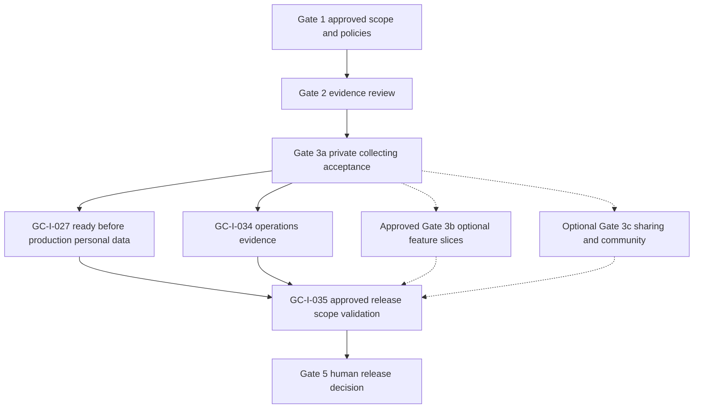

# Proposed MVP scope

**Status:** Gate 0 recommendation only; the product owner must approve scope and Gate 1 artifacts before implementation.

All requirements remain proposed and owner approval is pending. No stack or application capability is implemented; no user research, test result, or demand is asserted here. [Requirements](requirements.md) is the acceptance source, the [canonical backlog index](../operations/proposed-backlog.md) owns issue specifications, and [roadmap](roadmap.md) owns gate sequencing. GC-I references are draft identifiers; no real GitHub issues have been created.

## Objective

Prove that a collector can privately catalogue a real physical game copy, understand what is game/release metadata versus their owned object, and return to a clear, attractive collection view. Keep the initial catalogue small and explicit; do not require a paid proprietary catalogue.

## Minimum viable first vertical slice (proposal)

1. A collector signs in. An explicitly approved secure single-user prototype may be used during a technical spike only; it is not evidence of delivered multi-user authorization.
2. The collector searches a small labelled seed dataset and selects a game/release.
3. The collector records one or more physical copies, including edition/region and optional condition/completeness/acquisition/price fields.
4. The collector sees and edits their copy in a responsive private collection card/list and can export their own collection records in a documented portable format.
5. Another account cannot read or change those records or access their export; empty, loading, error, and denied states are handled.

The proposed first slice does not require public sharing, valuation, community artwork, or purchase of a large catalogue. Secure personal photo upload is a candidate follow-on slice for preserving personal context, not a validated customer-demand claim. It must pass a storage/access-control spike before inclusion and must not be called complete if only a local/mock upload exists.

The collector can also search their private collection (F-08, GC-I-019). Filters, sorting and basic counts remain follow-on. First-slice completion is not production release readiness: GC-I-027 account deletion/retention must be accepted before production personal data is accepted, regardless of optional Gate 3b or Gate 3c scope. The other applicable NFRs also remain readiness obligations even when their implementation follows the collecting loop.

## Capability disposition

| Capability | Proposed disposition | Requirement / canonical issue traceability and dependency |
| --- | --- | --- |
| Authentication | First slice; prototypes are spike-only | F-01; GC-I-005/013/021. Multi-user data needs proven identity/session and owner isolation. |
| Useful empty state | First slice | F-02/F-10; GC-I-014. Explain onboarding and loading/error/denial without inventing ownership. |
| Small searchable seed catalogue and release selection | First slice | F-03; GC-I-003/007/012/015. Label sample data and establish permitted use; missing-catalogue policy remains open. |
| Physical-copy create/read/edit/remove or ownership lifecycle | First slice; lifecycle policy pending | F-04; GC-I-012/016/021. Separate copies, including duplicates, from game/release metadata; review removal/status semantics. |
| Edition/region/condition/completeness/components/date/optional paid price/currency/notes | First slice, staged fields | F-05; GC-I-017. Exact fields/vocabularies need Gate 1 review; price paid is not valuation. |
| Owner-only collection-record export | First slice | F-13/NFR-05; GC-I-020/021. Format, included fields, and temporary artifact lifecycle need review. |
| Secure personal photographs | Candidate follow-on | F-06; GC-I-006/023. Storage/access validation, rights, metadata, cost, deletion and recovery evidence required. |
| Responsive collection cards and game detail distinct from copy | First slice | F-07; GC-I-004/008/018. Accessible task clarity and approved art/fallbacks take precedence over decoration. |
| Private collection search | First slice | F-08; GC-I-019/021. Owner-only search is separate from catalogue selection. |
| Filters, sorting and basic counts/statistics | Follow-on | F-08; GC-I-024. Approved definitions, keyboard operation and fixture-verified counts; no monetary success framing. |
| Sample sourced historical exhibit | Separate editorial follow-on | F-09/NFR-08; GC-I-025/026. Requires evidence, rights, review, timeline and correction workflow. |
| Accessible loading/empty/error/permission states | Required for every delivered journey | F-10/NFR-01; GC-I-004 and applicable feature/acceptance issues. Accessibility target remains pending. |
| CI and reproducible automated checks | Required delivery foundation | F-11/NFR-04; GC-I-011/021. Establish with approved stack before implementation completion claims. |
| Account deletion and retention | Required before production personal data, even if built follow-on | NFR-02/NFR-05; GC-I-027/034/035. Privacy/exit lifecycle across records/media/backups needs approved policy and evidence, independently of optional phase inclusion. |
| Manual entry, provisional release creation and collection grouping | Disposition pending Gate 1 | GC-I-001/003. Missing-seed-entry policy remains open; explain the gap, allow query correction/cancellation and invent no data or unconfirmed copy association. |
| Public profile/collection sharing | Deferred; optional Gate 3c | F-12; GC-I-029/030/032/033. Explicit visibility/consent, revocation, privacy, abuse and indexing decisions required. |
| Rights-attested community artwork/correction submissions | Deferred; optional Gate 3c | F-14; GC-I-031/032/033. Rights, moderation, reports, takedown and human review precede public distribution; voting is not committed. |
| Catalogue expansion, valuation, native/offline/camera/barcode, commercial models, generated art/AI, achievements, marketplace, insurance reports | Future decision-only investigations | GC-I-037–044. Evidence/licensing/cost and human scope approval first; not invented committed F requirements. |

## Proposed acceptance for the first slice

- **AC-01:** A user can distinguish catalogue title/release from every individual owned copy.
- **AC-02:** Multiple copies of one release can be recorded independently.
- **AC-03:** Optional price paid is stored as a transaction detail and is never presented as market value.
- **AC-04:** A small seed dataset is labelled as seed/sample data; missing catalogue details are not invented.
- **AC-05:** A collection is private by default; a second user is denied read and write access.
- **AC-06:** Core add/view/edit paths work with keyboard and narrow viewport; loading, empty, error, and permission-denied states are understandable.
- **AC-07:** Automated tests cover the domain rules and access boundary, and CI results are recorded.
- **AC-08:** A user can search the labelled seed catalogue and select a game/release for a copy.
- **AC-09:** A user can export their own collection records in a documented portable format; the export excludes other users' private records.
- Documentation/diagrams reflect implemented behavior, not future architecture.

Acceptance details require review alongside the security model, design direction, and selected technology at Gate 1.

The detailed F and NFR sections in [requirements](requirements.md) define normal/failure workflows, measurable fixture-based acceptance, privacy/accessibility expectations, evidence, issue mappings, and diagrams. This summary does not replace those criteria. GC-I-022 reviews the first collecting slice; later optional work has its own acceptance, and GC-I-035/036 govern release readiness and the human release decision.

## Staged release boundary and dependencies

- **Gate 1 / GC-I-001–004:** Approve product, architecture/security, catalogue/art/history policy, and UX/accessibility. Manual entry, grouping, missing-catalogue handling, field vocabulary, lifecycle, export format/fields and accessibility target remain unresolved rather than implicit scope.
- **Gate 2 / GC-I-005–010:** Gather scoped identity, media, permitted catalogue/search, responsive/device and deployment/recovery/cost evidence, then review. A media spike informs disposition; it does not require shipping photos. Native/offline/camera/barcode product investigation remains future GC-I-039.
- **Gate 3a / GC-I-011–022:** Build only the approved private-first collecting loop, owner-only search/export, accessible states, CI and authorization regression evidence.
- **Gate 3b / GC-I-023–028:** Candidate photo/refinement/editorial follow-on slices require their own approval/evidence. GC-I-027 deletion/retention remains required before production personal data is accepted even if other follow-on features are excluded; record any extraction/resequencing explicitly.
- **Optional Gate 3c / GC-I-029–033:** Sharing/community may be excluded entirely. Neither public sharing nor community submissions is necessary for a private-first release.
- **Gate 4 / GC-I-034–035 and Gate 5 / GC-I-036:** GC-I-035 depends on GC-I-027 deletion/retention, GC-I-034 operations evidence and acceptance of the approved release scope. Validate applicable F/NFR acceptance and limitations, then obtain human release approval. No optional-feature phase must be completed merely to release the private-first scope.

Dashed branches are required only when included in the approved release scope; they are not dependencies of the minimal private-first release. Deletion/retention readiness is a solid dependency regardless of GC-I-027's follow-on placement.

## Explicit non-goals for initial MVP

No comprehensive game database, price/valuation prediction, marketplace, public community image catalogue, automated historical prose, elaborate gamification, insurance reports, native iOS application, paid subscription enforcement, or production-scale operation until prerequisite decisions and business value are established.

These non-goals do not waive minimum production safeguards: migration/recovery/monitoring/rollback, owner isolation, accessible core journeys, portability and account deletion/retention still require launch evidence. No mandatory paid service, invented SLA/retention duration, signup fields, export format, status enums or approved WCAG target is specified by this proposal.
