# Proposed product requirements

**Status:** Detailed Gate 0 proposal; requirements and priorities require product-owner approval.

All F-01–F-14, NFR-01–NFR-08, and acceptance details below are **proposed, with owner approval pending**. No application stack is implemented and no passing test, customer validation, or release readiness is claimed. “Must” describes proposed acceptance, not an approved implementation commitment.

This document is the source of acceptance; the [canonical backlog index](../operations/proposed-backlog.md) owns issue specifications and [roadmap](roadmap.md) owns phase sequencing. GC-I identifiers below are draft traceability references; no real GitHub issues have been created. [MVP scope](mvp-scope.md) owns the first-slice/follow-on/deferred boundary. Canonical nonfunctional identifiers are NFR-01–NFR-08.

Shared review dependencies: [journeys](user-journeys.md), [design](../design/design-principles.md), [domain model](../architecture/domain-model.md), [architecture](../architecture/overview.md), [provisional ADR](../architecture/decisions/0001-provisional-technology-and-modular-monolith.md), [privacy](../security/privacy.md), [catalogue licensing](../research/catalogue-and-licensing.md), [artwork](../research/artwork-policy.md), [historical provenance](../research/historical-provenance.md), [risks](../operations/risks-and-assumptions.md), and [quality evidence](../quality/testing-and-delivery.md). These are review inputs, not evidence that decisions or implementations are approved.

## User outcomes

- **R1 — Record ownership:** A collector can catalogue actual physical copies and distinguish them from catalogue game/release data.
- **R2 — Describe a copy:** A collector can record release/edition, region, condition, completeness/components, acquisition date, optional price paid/currency, notes, and ownership status.
- **R3 — Find and present:** A collector can search, filter, sort, and view an accessible, responsive collection with useful statistics.
- **R4 — Preserve personal context:** A collector can add private photographs of their own items and retain/export their collection records.
- **R5 — Explore context:** A visitor can read structured historical exhibits with source traceability, timelines, uncertainty, and corrections.
- **R6 — Share by choice:** A collector can make a collection public only through explicit, understandable action; private price/acquisition details and photos need their own clear visibility rules.
- **R7 — Contribute safely (future):** Community artwork and corrections have rights attestations, moderation, reporting, review, and takedown processes before public distribution.

## Functional requirements (candidate)

| ID | Requirement | Outcome(s) | Acceptance reference(s) | Proposed disposition |
| --- | --- | --- | --- | --- |
| F-01 | Account creation/authentication and session handling | R1 | AC-05, AC-06 | First slice; required before multi-user persistence |
| F-02 | Useful empty collection state and add-copy entry point | R1 | AC-06 | First slice |
| F-03 | Search/select from a small, clearly identified seed catalogue or controlled dataset | R1 | AC-04, AC-08 | First slice |
| F-04 | Create, read, edit, and remove/mark ownership status for multiple physical copies | R1 | AC-01, AC-02, AC-05 | First slice; deletion policy needs review |
| F-05 | Capture edition, region, condition, completeness/components, date, optional paid price/currency, notes | R2 | AC-03 | First slice; exact vocabularies for Gate 1 |
| F-06 | Upload personal photos to private storage with validation | R4 | AC-10 | Candidate follow-on slice, subject to Gate 2 security/operations spike |
| F-07 | Responsive art-forward collection cards and a game detail view distinct from copy details | R3 | AC-01, AC-06 | First slice |
| F-08 | Search, filters, sorting, and basic counts | R3 | AC-08, AC-14 | Search in first slice; filters/statistics may follow |
| F-09 | Sample structured historical exhibit with citations, references, timeline, and correction path | R5 | AC-11 | Separate editorial slice after provenance workflow |
| F-10 | Accessible loading, empty, error, and permission-denied states | R1, R3 | AC-06 | Required for all implemented journeys |
| F-11 | Automated checks and reproducible CI | R1–R7 | AC-07 | Required before implementation completion |
| F-12 | Public collector profile / public collection sharing | R6 | AC-12 | Deferred until privacy model and explicit-consent design are approved |
| F-13 | Export a collector's collection records in a documented, portable format | R4 | AC-09 | First slice; format and included fields require Gate 1 review |
| F-14 | Community artwork and correction submissions with rights attestation, moderation, reporting, and takedown | R7 | AC-13 | Deferred until rights and moderation processes are approved |

## Outcome coverage and disposition

| Outcome | Linked requirements | Acceptance references | Proposed coverage/disposition |
| --- | --- | --- | --- |
| R1 — Record ownership | F-01–F-04, F-10, F-11 | AC-01, AC-02, AC-04–AC-08 | Covered by the proposed first slice. |
| R2 — Describe a copy | F-05 | AC-03 | Covered by the proposed first slice. |
| R3 — Find and present | F-07, F-08, F-10 | AC-06, AC-08, AC-14 | Responsive presentation, seed-catalogue selection and private collection search are first slice; filters/statistics may follow. |
| R4 — Preserve personal context | F-06, F-13 | AC-09, AC-10 | Record export is in the proposed first slice; private photos are a candidate follow-on slice. |
| R5 — Explore context | F-09 | AC-11 | Separate editorial slice; depends on sourced-content and correction workflows. |
| R6 — Share by choice | F-12 | AC-12 | Deferred pending privacy and explicit-consent approval. |
| R7 — Contribute safely (future) | F-14 | AC-13 | Deferred pending rights, moderation, reporting, and takedown processes. |

No R1–R7 outcome is left unmapped. Follow-on and deferred outcomes are proposals, not first-slice commitments.

## Acceptance criteria references

These are proposed acceptance criteria; exact implementation details and evidence are subject to Gate 1 review.

| Reference | Acceptance criterion | Proposed scope |
| --- | --- | --- |
| AC-01 | A collector can distinguish catalogue title/release information from each individually owned physical copy. | First slice |
| AC-02 | Multiple copies of one release can be recorded independently. | First slice |
| AC-03 | Optional price paid is stored as a transaction detail and is never presented as market value. | First slice |
| AC-04 | Seed data is labelled as sample data, and missing catalogue details are not invented. | First slice |
| AC-05 | A collection is private by default; a second user is denied read and write access. | First slice |
| AC-06 | Core add/view/edit paths work with keyboard and a narrow viewport; loading, empty, error, and permission-denied states are understandable. | First slice |
| AC-07 | Automated tests cover domain rules and the access boundary, and CI results are recorded. | Required delivery foundation |
| AC-08 | A collector can search the labelled seed catalogue and select a game/release for a copy. | First slice |
| AC-09 | A collector can export their own collection records in a documented portable format; the export excludes other users' private records. | First slice; format and included fields need Gate 1 review |
| AC-10 | Personal-photo upload validates files and keeps each photo private to its owner unless a separately approved visibility action is implemented. | Candidate follow-on slice; requires security/operations evidence |
| AC-11 | A sample exhibit presents traceable sources, a timeline, uncertainty where applicable, and a correction path. | Separate editorial slice |
| AC-12 | Sharing requires explicit action with understandable visibility controls; private price/acquisition details and photos follow separately approved visibility rules. | Deferred |
| AC-13 | Community submissions have rights attestation, moderation, reporting, and a takedown path before public distribution. | Deferred |
| AC-14 | Any follow-on filters, sorting, or statistics are accessible and do not frame monetary value as the primary achievement measure. | Follow-on |

## Detailed functional requirements

The workflows describe intended user-visible behavior, not selected services or implemented architecture. Each criterion is evaluated against approved fixtures and scenarios; exact fields, vocabularies, export format, upload limits, accessibility target, and operating thresholds remain decisions. Evidence listed here is **required future evidence**, not completed testing. All applicable implemented journeys also inherit F-10 and NFR-01–NFR-08.

For each criterion, use the [quality evidence and handoff contract](../quality/testing-and-delivery.md#evidence-and-agent-handoff-record): record the draft issue/requirement/AC references, approved scope, expected versus actual result, fixture/provider status, candidate revision, procedure/environment, safe artefact location, independent reviews, omissions and human gate decision. Apply the [security boundary matrix](../security/privacy.md#implementation-and-evidence-ownership) to applicable identity, ownership, export, media, public projection, deletion/recovery and operational checks. These contracts define future evidence, not completed validation.

### F-01 — Account creation, authentication, and sessions

- **Story/outcome:** As a collector, I want a trustworthy identity and session so that my physical-copy records remain mine (R1; AC-05, AC-06).
- **Intended behavior:** Offer the approved account-creation and sign-in journey without assuming signup fields or an identity provider. Establish and end sessions clearly; require a valid identity before private read/write/export operations. A secure single-user prototype is only a labelled Gate 2 experiment, not proof of multi-user isolation.
- **Normal workflow:** Collector enters the approved account journey, completes authentication, opens their private collection, and signs out. Returning with a valid session restores access to their collection only.
- **Failure workflow:** Rejected credentials, service failure, interrupted creation, or expired/revoked sessions produce understandable feedback and a safe retry/sign-in path. A denied request does not disclose private collection contents or persist a mutation; authentication errors follow the reviewed anti-enumeration policy.
- **Acceptance/evidence:** For each approved sign-in/sign-out/session scenario, the expected identity state and destination are observed. After sign-out or session invalidation, private requests are denied. A two-owner fixture proves that owner B cannot read, change, or export owner A's data, including direct requests outside the UI. Evidence: identity/session scenario matrix, integration and cross-owner results, keyboard/narrow-viewport walkthrough, and security review; no real credentials in evidence.
- **Privacy/accessibility:** Minimise identity data to the approved need; keep credentials/session secrets out of views, logs, and exports. Labels, focus, instructions, errors, and permitted assistive authentication behavior must be reviewed.
- **Traceability/disposition:** First slice; GC-I-001/002/004 approval, GC-I-005 spike, GC-I-013 implementation, GC-I-021/022 evidence. See privacy and journey review inputs above.

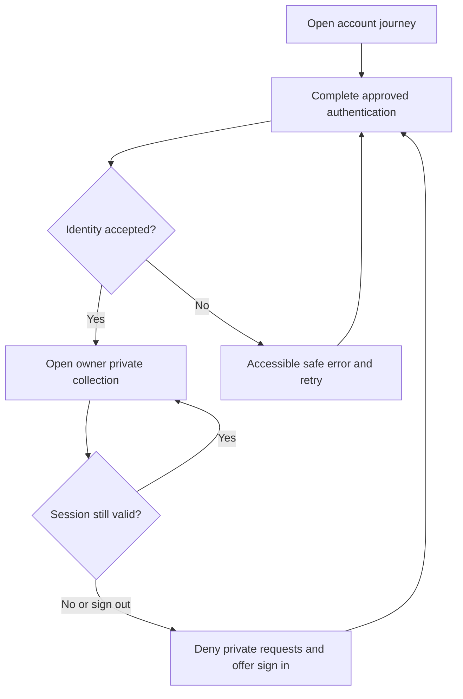
```mermaid
flowchart TD
    A[Open account journey] --> B[Complete approved authentication]
    B --> C{Identity accepted?}
    C -->|Yes| D[Open owner private collection]
    C -->|No| E[Accessible safe error and retry]
    E --> B
    D --> F{Session still valid?}
    F -->|Yes| D
    F -->|No or sign out| G[Deny private requests and offer sign in]
    G --> B
```

### F-02 — Empty collection and add-copy entry point

- **Story/outcome:** As a new collector, I want to understand an empty collection and how to add my first physical copy without mistaking sample games for my possessions (R1; AC-06).
- **Intended behavior:** Distinguish loading from a genuinely empty owner collection. Explain game/release selection versus an owned copy and expose an accessible add-copy action; sample catalogue records must not populate ownership automatically.
- **Normal workflow:** Signed-in collector opens an empty collection, follows the add-copy action, selects a release, saves a copy, and returns to a populated collection.
- **Failure workflow:** Failed loading is not represented as “no copies.” Cancelling creation returns to an unchanged empty state; failed creation offers recovery without claiming a saved copy.
- **Acceptance/evidence:** An owner with zero copies sees the empty explanation and can initiate F-03 using keyboard alone. Another owner with copies sees only their own populated view. Cancel and failed-save fixtures leave the copy count unchanged; successful save replaces the empty state with that copy. Evidence: empty/loading/error fixtures, first-copy end-to-end scenario, keyboard and narrow-viewport observations.
- **Privacy/accessibility:** Do not reveal another owner's records to make the page appear populated. Clear headings, meaningful action text, focus progression, and announced state changes must work without artwork.
- **Traceability/disposition:** First slice; GC-I-004 design, GC-I-014 implementation, GC-I-022 acceptance.

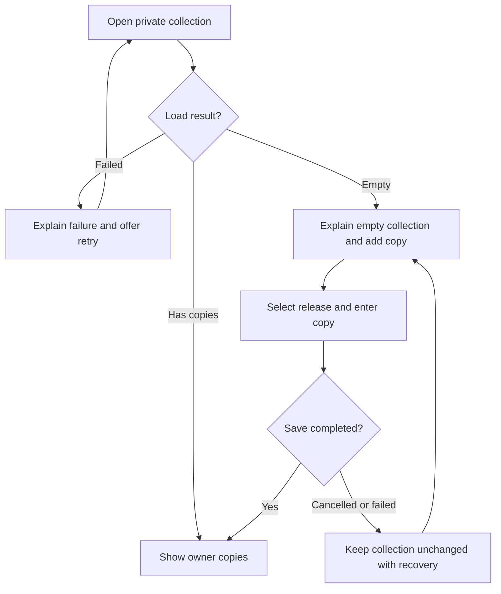
```mermaid
flowchart TD
    A[Open private collection] --> B{Load result?}
    B -->|Failed| C[Explain failure and offer retry]
    C --> A
    B -->|Empty| D[Explain empty collection and add copy]
    B -->|Has copies| E[Show owner copies]
    D --> F[Select release and enter copy]
    F --> G{Save completed?}
    G -->|Yes| E
    G -->|Cancelled or failed| H[Keep collection unchanged with recovery]
    H --> D
```

### F-03 — Labelled seed catalogue search and release selection

- **Story/outcome:** As a collector, I want to find a known game/release in a small honest catalogue so I can attach my copy to the right record without invented facts (R1; AC-04, AC-08).
- **Intended behavior:** Clearly label the seed/sample dataset and its limits. Display distinguishing available game, platform, release/edition, and region information; represent unknown facts as unknown. Select a release, not a fabricated “closest” match. Search permissions and provenance must be approved before any external provider is used.
- **Normal workflow:** Enter a query, inspect matching game/releases, confirm the intended release, and continue to F-04 with the selection retained.
- **Failure workflow:** No match, incomplete release data, ambiguous matches, or failed search must be distinct states. **The approved missing-catalogue handling policy remains open at Gate 1**, including manual entry or provisional release creation. Do not silently create a release, promise manual entry, or choose an unrelated match. The safe fallback is to explain the limitation without inventing data, allow search correction or cancellation, and create no copy against an unconfirmed release. Any additional recovery requires approval; document the policy gap as an approval blocker.
- **Acceptance/evidence:** A known-match fixture returns selectable labelled results; a multi-release fixture enables the correct release choice; zero-match and unknown-metadata fixtures invent no facts or owned copies. Failed/retried search retains the user's query where safe. Evidence: seed provenance/permission review, search and selection results, ambiguity/no-match/error fixtures, and accessible interaction walkthrough.
- **Privacy/accessibility:** Queries and owner information must not be sent to unapproved providers. Results and selection must be keyboard operable, with announced loading/result changes; obscure titles receive the same unknown-data treatment as prominent titles.
- **Traceability/disposition:** First slice; GC-I-003 policy, GC-I-007 spike, GC-I-012 seed, GC-I-015 implementation, GC-I-022 acceptance.

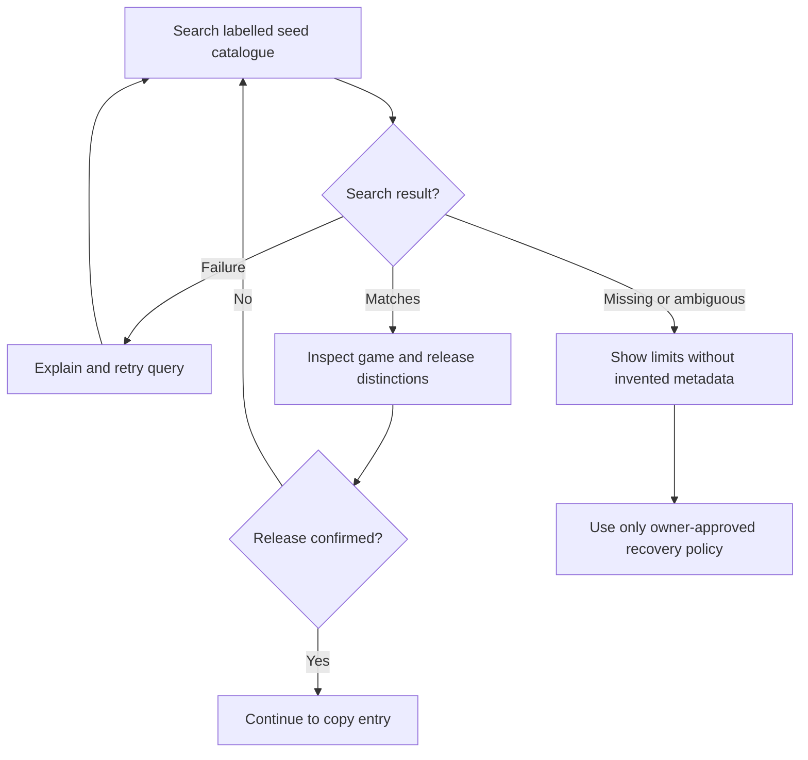
```mermaid
flowchart TD
    A[Search labelled seed catalogue] --> B{Search result?}
    B -->|Failure| C[Explain and retry query]
    C --> A
    B -->|Matches| D[Inspect game and release distinctions]
    D --> E{Release confirmed?}
    E -->|Yes| F[Continue to copy entry]
    E -->|No| A
    B -->|Missing or ambiguous| G[Show limits without invented metadata]
    G --> H[Use only owner-approved recovery policy]
```

### F-04 — Individual physical-copy CRUD and ownership lifecycle

- **Story/outcome:** As a collector, I want to record and manage each owned physical copy independently, including duplicate copies of one release (R1; AC-01, AC-02, AC-05).
- **Intended behavior:** Create, view, edit, and remove or change ownership status according to the approved lifecycle policy. Keep copy-specific records distinct from shared catalogue metadata; removal/status meaning, confirmations, reversibility, and linked media handling require review, not invented status enums.
- **Normal workflow:** Select a release, create a copy, inspect its details, add a second copy of the same release, edit one, then perform an approved lifecycle action on the chosen copy.
- **Failure workflow:** Invalid input, permission denial, interrupted persistence, or conflicting/stale edits do not claim success or alter the wrong copy. Preserve safe draft input for correction/retry. A cancelled destructive action changes nothing; uncertain completion requires reconciliation before retry can create duplicates.
- **Acceptance/evidence:** Two same-release copies have distinct identities; editing/removing one leaves the other and catalogue record unchanged. Reopening a successfully saved copy shows the approved values. Invalid, cancelled, and denied mutations leave persisted state unchanged; retry/interruption scenarios do not produce unexplained extra copies. Evidence: domain/persistence tests, duplicate-copy/lifecycle and interruption scenarios, direct cross-owner denial tests, accessible confirmation review.
- **Privacy/accessibility:** Each copy action is owner-authorized, including direct identifiers. Destructive effects must be explained in text, not colour alone; focus returns to a meaningful destination.
- **Traceability/disposition:** First slice; GC-I-001/002 lifecycle review, GC-I-012 model, GC-I-016 implementation, GC-I-021/022 evidence. Manual entry and collection grouping remain separate pending Gate 1 decisions.

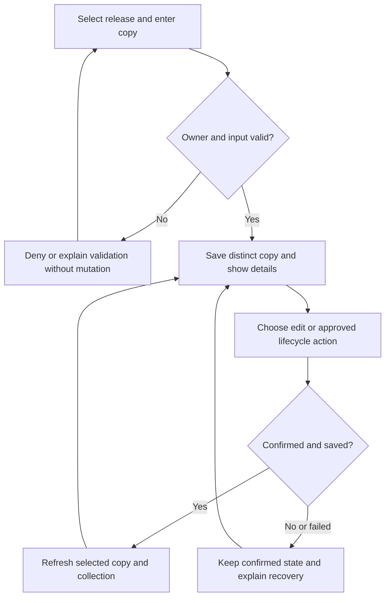
```mermaid
flowchart TD
    A[Select release and enter copy] --> B{Owner and input valid?}
    B -->|No| C[Deny or explain validation without mutation]
    C --> A
    B -->|Yes| D[Save distinct copy and show details]
    D --> E[Choose edit or approved lifecycle action]
    E --> F{Confirmed and saved?}
    F -->|Yes| G[Refresh selected copy and collection]
    F -->|No or failed| H[Keep confirmed state and explain recovery]
    G --> D
    H --> D
```

### F-05 — Copy attributes and optional transaction price

- **Story/outcome:** As a collector, I want to describe edition, region, condition, completeness/components, acquisition date, optional paid price/currency, notes, and ownership status without having my purchase mistaken for market value (R2; AC-03).
- **Intended behavior:** Separate release facts from copy observations, clarifying their relationship without overwriting catalogue data. Preserve unknown/omitted values distinctly from explicit observations. Exact required/optional fields, vocabularies, date/price validation, and currency representation need Gate 1 approval; no valuation is inferred.
- **Normal workflow:** Open copy entry/edit, complete applicable approved fields, optionally enter price paid with currency, review labels, save, and read the same values on copy detail and export.
- **Failure workflow:** Invalid combinations or malformed input identify the relevant field and correction path. Omitted optional price remains absent, not zero or an estimate. Failed save does not replace the last confirmed record; safe input is retained for retry.
- **Acceptance/evidence:** Approved fixtures cover complete, partially known, no-price, and multiple-copy records. Entered values survive save/reopen and approved export mapping without being shown as valuation. Invalid input does not persist; a copy edit does not change another copy/release. Evidence: field-validation matrix, persistence/export mapping checks, price-label review, keyboard/error walkthrough.
- **Privacy/accessibility:** Acquisition and price are private owner context, not public defaults. Inputs need instructions and accessible error association; obscure or inexpensive games must be equally recordable with unknown metadata.
- **Traceability/disposition:** First slice with staged fields; GC-I-001/004 field/design approval, GC-I-017 implementation, GC-I-020 export mapping, GC-I-022 acceptance.

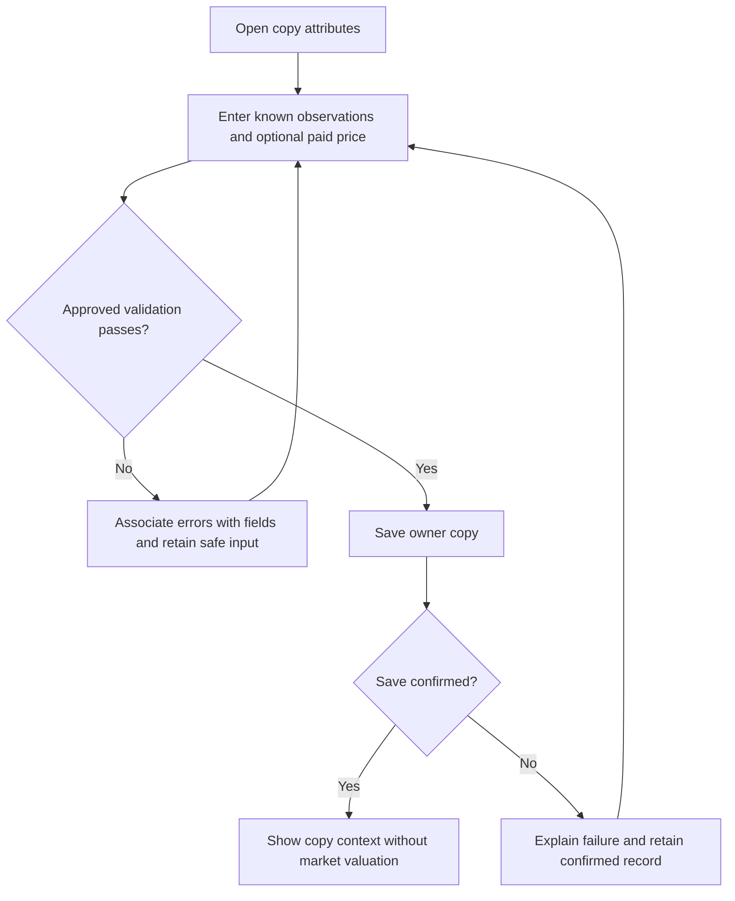
```mermaid
flowchart TD
    A[Open copy attributes] --> B[Enter known observations and optional paid price]
    B --> C{Approved validation passes?}
    C -->|No| D[Associate errors with fields and retain safe input]
    D --> B
    C -->|Yes| E[Save owner copy]
    E --> F{Save confirmed?}
    F -->|Yes| G[Show copy context without market valuation]
    F -->|No| H[Explain failure and retain confirmed record]
    H --> B
```

### F-06 — Validated private personal photographs

- **Story/outcome:** As a collector, I want private photographs of my own physical copies so I can preserve their personal context without publishing them or replacing them with community artwork (R4; AC-10).
- **Intended behavior:** Attach validated personal images to owner copies under an approved media lifecycle. File constraints, metadata treatment, storage, replacement/removal, retention, and recovery are subject to policy and spike evidence. Personal media stays separate from catalogue, generated, and community artwork; a local/mock upload is not completion.
- **Normal workflow:** Owner chooses a copy and image, reviews applicable privacy/validation information, uploads, sees confirmation and a private preview, then views or removes it under the approved policy.
- **Failure workflow:** Unsupported/unsafe file, interrupted upload, failed processing, storage failure, or permission denial shows an accessible result without exposing media or leaving an untracked usable attachment. Retry/remove and cleanup behavior require evidence, including abandoned uploads and partial deletion.
- **Acceptance/evidence:** Approved valid-file fixtures attach to the correct owner copy; rejected fixtures produce no accessible attachment. Owner B and unauthenticated requests cannot retrieve owner A's image or derivatives, including direct media references. Removal/replacement and interrupted operations follow the approved lifecycle, including orphan cleanup. Evidence: GC-I-006 spike, file-validation/access/lifecycle tests, cost/recovery review, accessible preview/upload results.
- **Privacy/accessibility:** Approve metadata and incidental sensitive-content handling; do not infer public rights from uploading. Give previews meaningful accessible descriptions without making sensitive content public, and provide non-drag-and-drop file selection.
- **Traceability/disposition:** Candidate follow-on only; GC-I-002/003 policies, GC-I-006 spike, GC-I-023 implementation, GC-I-027 lifecycle alignment, GC-I-028 evidence.

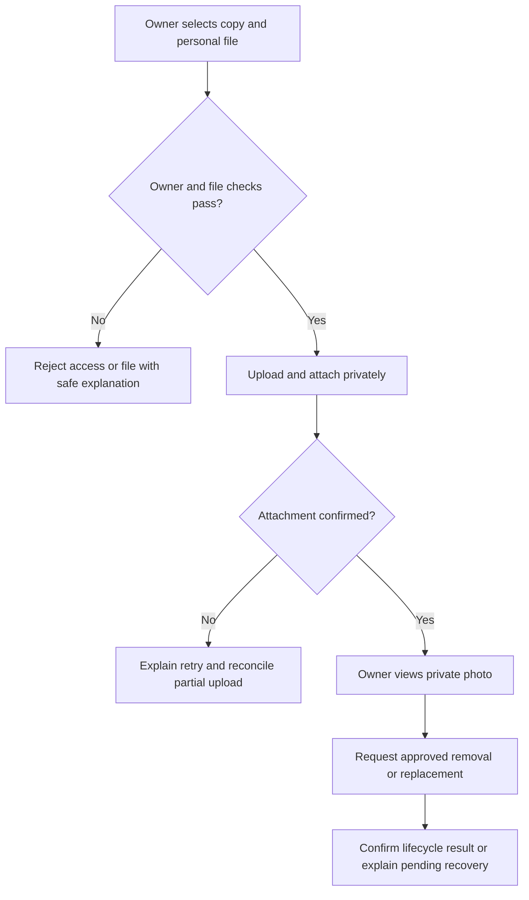
```mermaid
flowchart TD
    A[Owner selects copy and personal file] --> B{Owner and file checks pass?}
    B -->|No| C[Reject access or file with safe explanation]
    B -->|Yes| D[Upload and attach privately]
    D --> E{Attachment confirmed?}
    E -->|No| F[Explain retry and reconcile partial upload]
    E -->|Yes| G[Owner views private photo]
    G --> H[Request approved removal or replacement]
    H --> I[Confirm lifecycle result or explain pending recovery]
```

### F-07 — Responsive collection cards and distinct details

- **Story/outcome:** As a collector, I want an attractive, accessible collection view that makes clear which information describes a game/release and which describes my copy (R3; AC-01, AC-06).
- **Intended behavior:** Present responsive editorial cards/list and distinct game/release versus owned-copy detail. Approved artwork enriches the view but is not needed to identify or operate a record. Multiple copies must remain distinguishable; unknown art or metadata uses honest text/fallbacks.
- **Normal workflow:** Open collection, identify a copy, open its detail, follow game/release context, and return to the collection with a meaningful navigation position.
- **Failure workflow:** Missing art uses a non-misleading fallback; metadata/loading failures identify what failed without losing accessible copy identity. Unauthorized detail reveals no private fields; deleted/unavailable records offer an appropriate return path.
- **Acceptance/evidence:** A same-game multi-release/multi-copy fixture distinguishes each item and detail type in visible and accessible names. At approved narrow/wide and zoom settings all core actions remain usable; broken-image/no-art fixtures preserve tasks. Evidence: GC-I-008 feasibility, responsive/keyboard/screen-reader walkthrough, detail-boundary scenarios, error and denial fixtures.
- **Privacy/accessibility:** Private price, notes, and personal images must not leak through catalogue detail or unauthorized views. Use semantic navigation, readable text, visible focus, reduced-motion behavior, and non-colour identification; monetary value is not the visual hierarchy.
- **Traceability/disposition:** First slice; GC-I-004 design, GC-I-008 spike, GC-I-018 implementation, GC-I-022 evidence.

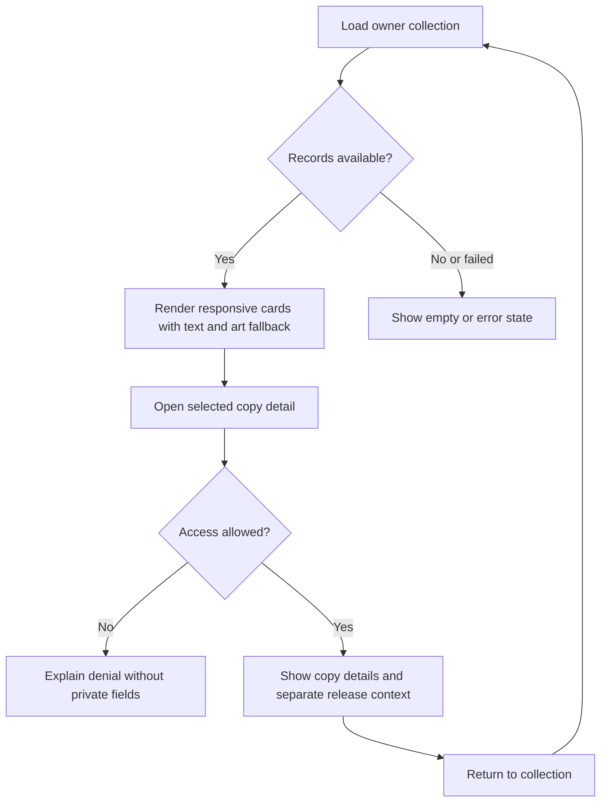
```mermaid
flowchart TD
    A[Load owner collection] --> B{Records available?}
    B -->|Yes| C[Render responsive cards with text and art fallback]
    B -->|No or failed| D[Show empty or error state]
    C --> E[Open selected copy detail]
    E --> F{Access allowed?}
    F -->|No| G[Explain denial without private fields]
    F -->|Yes| H[Show copy details and separate release context]
    H --> I[Return to collection]
    I --> A
```

### F-08 — Private collection search, refinement, and counts

- **Story/outcome:** As a collector, I want to find my copies and, when approved, refine and understand my collection without wealth-based achievement framing (R3; AC-08, AC-14).
- **Intended behavior:** Distinguish catalogue search (F-03) from owner-only collection search. First slice includes private collection search; follow-on adds approved filters, sorting, and basic counts. Define searchable fields, sorting/ties, filter combinations, and count meanings before implementation, particularly games versus releases versus copies.
- **Normal workflow:** Search private records, open a result, and clear the query. In approved follow-on scope, apply refinements/sort, inspect labelled counts, and reset them.
- **Failure workflow:** Zero matches is distinct from no owned copies or a failed query. Incompatible/invalid refinements and retrieval failure offer correction/reset/retry; partial or stale results are not presented as authoritative totals.
- **Acceptance/evidence:** Fixture queries return only the expected owner's records; known no-match and reset scenarios behave distinctly. For each approved follow-on combination/order, expected identifiers, order, and labelled counts match the fixture, including duplicate copies and unknown metadata. No count or success measure prioritises market/paid value. Evidence: search-isolation tests, refinement/count expectation matrix, keyboard/result-announcement walkthrough.
- **Privacy/accessibility:** Search does not enumerate another owner's collection; queries and results remain private. Controls, selected states, changed results, and reset are operable and understandable without colour or pointer input.
- **Traceability/disposition:** Search first slice (GC-I-019/021/022); filters/sort/counts follow-on (GC-I-024/028). GC-I-004 approves design and definitions; AC-08 catalogue selection remains covered by F-03.

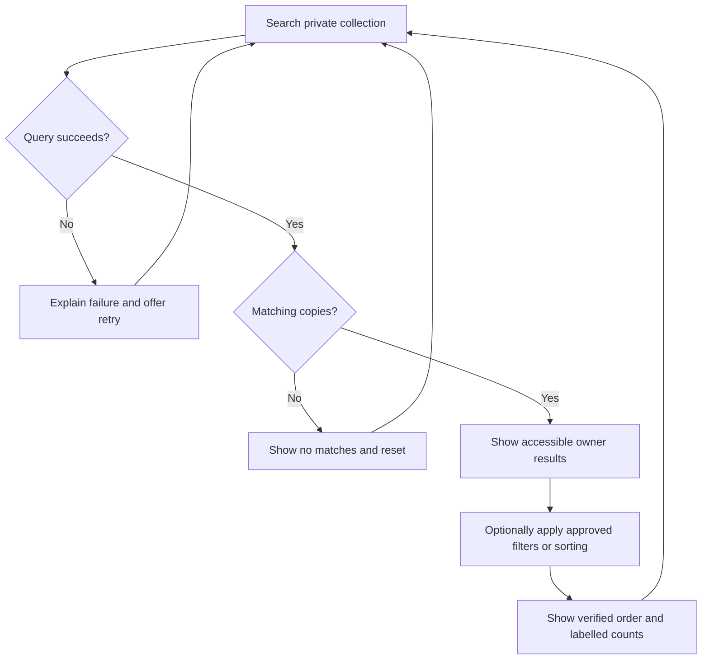
```mermaid
flowchart TD
    A[Search private collection] --> B{Query succeeds?}
    B -->|No| C[Explain failure and offer retry]
    C --> A
    B -->|Yes| D{Matching copies?}
    D -->|No| E[Show no matches and reset]
    D -->|Yes| F[Show accessible owner results]
    F --> G[Optionally apply approved filters or sorting]
    G --> H[Show verified order and labelled counts]
    E --> A
    H --> A
```

### F-09 — Sourced historical exhibit and correction path

- **Story/outcome:** As a visitor, I want to read a sample historical exhibit with sources, chronological context, and uncertainty so I can distinguish supported facts from interpretation and request a correction (R5; AC-11).
- **Intended behavior:** Publish a structured, reviewed exhibit with traceable citations/references, timeline, uncertainty/disagreement, and a correction route. Source and artwork rights are independently assessed. AI output alone is not evidence; no automatic historical prose publication is assumed.
- **Normal workflow:** Visitor reads the exhibit, navigates timeline and citations, checks available references, and follows the approved correction route; a reviewer evaluates corrections and records editorial disposition.
- **Failure workflow:** Broken/inaccessible references retain citation identity and known limitations. Unsupported/disputed claims require review and correction/withholding rather than fabricated evidence. Correction submission failure must not claim receipt; route details and reviewer responsibilities require approval.
- **Acceptance/evidence:** In the sample exhibit, every factual claim can be traced to reviewed source evidence; timeline entries align with supported dates or explicitly stated uncertainty. Citation navigation and the correction route work with keyboard and approved narrow layout. An unsupported-claim/correction fixture demonstrates review, recorded disposition, and update history. Evidence: claim/source matrix, artwork provenance, editorial review record, reading/timeline/correction scenarios.
- **Privacy/accessibility:** Do not expose reporter personal data in public corrections; approve collection/retention of correction information. Provide a textual chronological alternative and clear source links; inexpensive/obscure games require equal evidentiary care.
- **Traceability/disposition:** Separate editorial follow-on; GC-I-003 policy, GC-I-025 model/review, GC-I-026 reading/timeline/correction, GC-I-028 evidence. Public community submissions remain F-14, not a prerequisite for a sample editorial correction route.

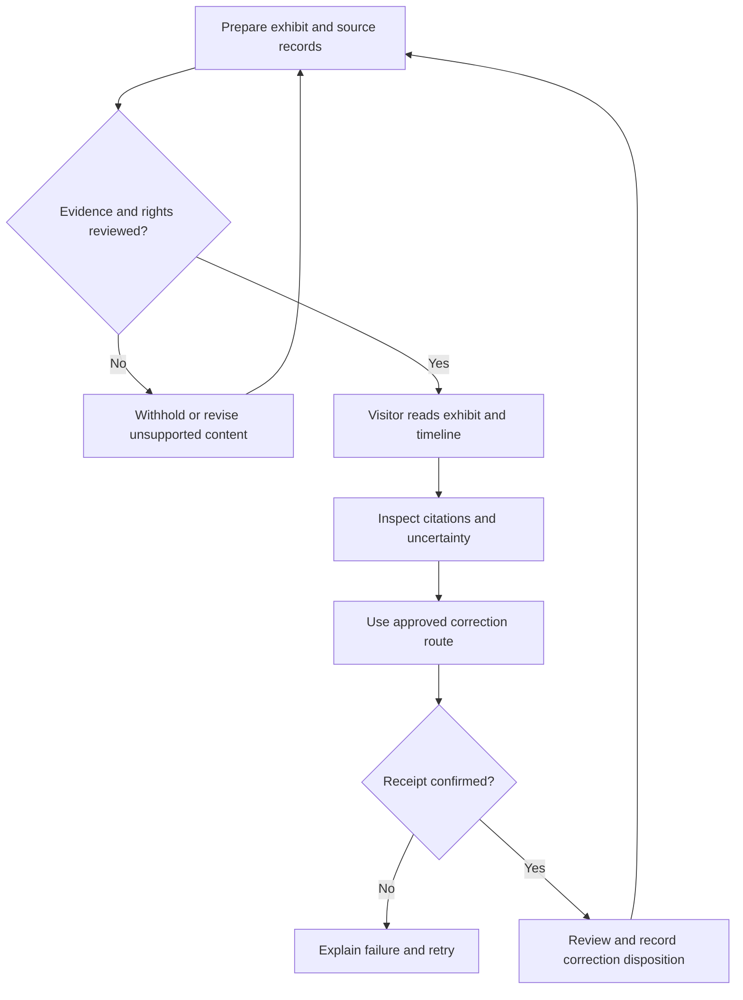
```mermaid
flowchart TD
    A[Prepare exhibit and source records] --> B{Evidence and rights reviewed?}
    B -->|No| C[Withhold or revise unsupported content]
    C --> A
    B -->|Yes| D[Visitor reads exhibit and timeline]
    D --> E[Inspect citations and uncertainty]
    E --> F[Use approved correction route]
    F --> G{Receipt confirmed?}
    G -->|No| H[Explain failure and retry]
    G -->|Yes| I[Review and record correction disposition]
    I --> A
```

### F-10 — Accessible loading, empty, error, and denial states

- **Story/outcome:** As a collector, including when using assistive technology or a narrow screen, I want to understand the state of a task and recover safely rather than guessing whether it worked (R1, R3; AC-06).
- **Intended behavior:** Every implemented journey defines initial/loading, success, empty/no-match, validation/system error, and permission states where applicable. Explain confirmed versus pending changes, preserve safe input, and offer a usable next action; visual-only spinners or raw technical errors are insufficient.
- **Normal workflow:** Start an action, receive accessible progress feedback, and reach a confirmed result with sensible focus and navigation.
- **Failure workflow:** Interrupted/unavailable service, validation error, expired session, or denied record access provides a non-leaking explanation and approved retry/correction/sign-in/return path. Recovery must not create duplicate mutations or silently discard safe input.
- **Acceptance/evidence:** A state inventory exists for every delivered F journey. Each applicable state has a fixture/injection scenario verifying visible explanation, assistive announcement, keyboard-reachable recovery, and accurate persisted outcome. Loading is never asserted as empty; denial includes no private content. Evidence: state matrix, failure-injection results, keyboard/screen-reader/narrow-viewport walkthrough, retry-integrity tests.
- **Privacy/accessibility:** Redact secrets and other owners' information from errors. Associate field errors, manage focus without traps, avoid colour-only status, and honour the approved reduced-motion and announcement guidance.
- **Traceability/disposition:** Required for all implemented scope; GC-I-004 design, GC-I-014–020 first-slice journeys, GC-I-021/022 evidence; GC-I-023–033 inherit the same obligations if included.

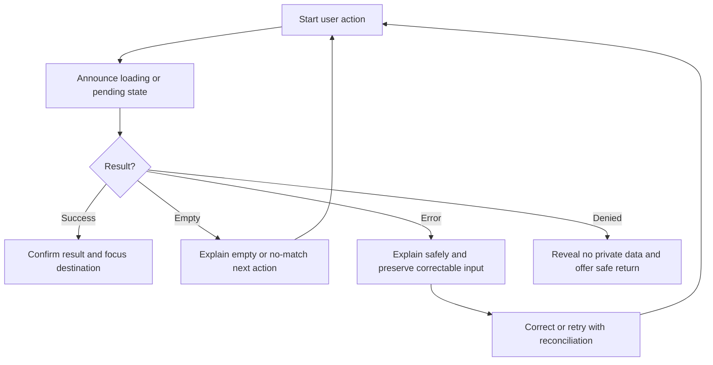
```mermaid
flowchart TD
    A[Start user action] --> B[Announce loading or pending state]
    B --> C{Result?}
    C -->|Success| D[Confirm result and focus destination]
    C -->|Empty| E[Explain empty or no-match next action]
    C -->|Error| F[Explain safely and preserve correctable input]
    C -->|Denied| G[Reveal no private data and offer safe return]
    F --> H[Correct or retry with reconciliation]
    H --> A
    E --> A
```

### F-11 — Automated checks and reproducible CI

- **Story/outcome:** As a collector relying on the product, I want changes to be checked reproducibly so ownership, privacy, and critical journeys do not depend on undocumented manual confidence (R1–R7; AC-07).
- **Intended behavior:** After stack approval, establish documented local tooling and CI that test domain rules, persistence, authorization, and delivered critical journeys. Map checks to requirement/acceptance IDs. Deferred features have no fabricated passing coverage; approved changes need updated evidence.
- **Normal workflow:** Contributor follows approved setup, runs the documented checks, submits a change, and obtains recorded CI and independent acceptance/review evidence for the exact revision.
- **Failure workflow:** Failed setup, unavailable dependency, flaky check, or failed rule is reported honestly; failed/incomplete checks cannot be treated as acceptance. Reproduce, fix, rerun, and record limitations; do not weaken access tests to obtain success.
- **Acceptance/evidence:** Approved setup/check instructions can be followed in a clean environment; local and CI checks exercise the same documented rules. Positive and negative ownership/duplicate-copy/price/critical-journey fixtures have recorded results linked to the candidate revision. Evidence includes commands, environment, revision, CI results, requirement coverage and independent review; gate decisions distinguish failed, unrun, and passed.
- **Privacy/accessibility:** Use non-sensitive test fixtures, protect CI secrets, and retain no production private data in logs/artifacts. Automated accessibility checks complement rather than replace manual evaluation.
- **Traceability/disposition:** Required delivery foundation; GC-I-011 tooling/CI, GC-I-021 authorization regression, GC-I-022/028/033 acceptance and GC-I-035 release checks. This documentation task adds no stack or test execution.

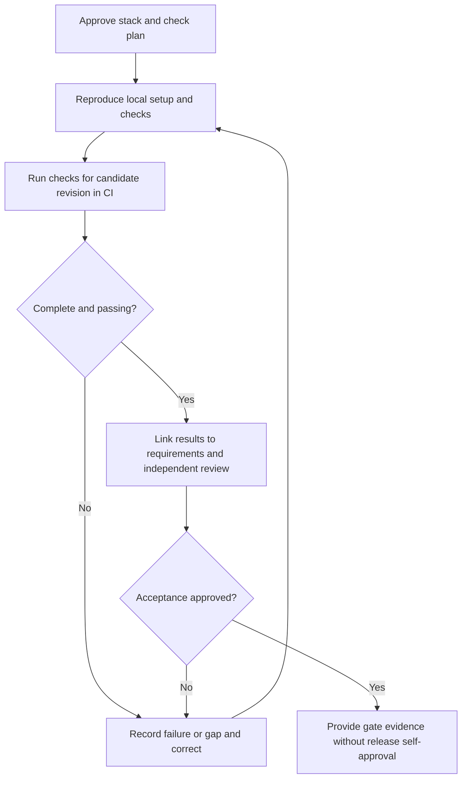
```mermaid
flowchart TD
    A[Approve stack and check plan] --> B[Reproduce local setup and checks]
    B --> C[Run checks for candidate revision in CI]
    C --> D{Complete and passing?}
    D -->|No| E[Record failure or gap and correct]
    E --> B
    D -->|Yes| F[Link results to requirements and independent review]
    F --> G{Acceptance approved?}
    G -->|No| E
    G -->|Yes| H[Provide gate evidence without release self-approval]
```

### F-12 — Explicit opt-in public profile/collection

- **Story/outcome:** As a collector, I want to choose whether and what to share, understand the public view, and withdraw sharing without accidentally exposing private context (R6; AC-12).
- **Intended behavior:** Keep records private until an explicit approved sharing action. Before enabling public profile/collection, approve visibility rules for each data category, including price/acquisition details and personal photos, plus indexing, revocation, and abuse considerations. Preview the intended public projection; do not assume an all-fields-public model.
- **Normal workflow:** Owner reviews visibility information and preview, explicitly enables approved sharing, checks the public view, and later changes or withdraws it.
- **Failure workflow:** Cancelled or failed opt-in leaves privacy unchanged; failed visibility updates are not presented as completed. Unauthorized changes are denied. Withdrawal revokes consent and blocks new public requests immediately; if controlled-cache cleanup cannot complete, report it as pending and retry without restoring public access. Explain limits on externally copied/indexed information without promising its removal.
- **Acceptance/evidence:** Fresh private fixtures expose no public collection; cancelled consent changes nothing. Explicit opt-in exposes only approved fields, including direct public retrieval, and never unapproved price/acquisition/media. Withdrawal immediately blocks new product-controlled public requests, including while controlled-cache cleanup is pending. Evidence: consent/visibility/revocation matrix, public/private field tests, direct access and abuse cases, cleanup-pending tests, keyboard/assistive preview walkthrough, security approval.
- **Privacy/accessibility:** Consent must be understandable and not coerced by a default-on setting or a reward. Public and owner views need distinct names/state; visibility changes and consequences must be accessible.
- **Traceability/disposition:** Deferred; optional Gate 3c only. GC-I-029 approval and GC-I-030 implementation, GC-I-032 public safety dependencies, GC-I-033 evidence. Not required for private-first release.

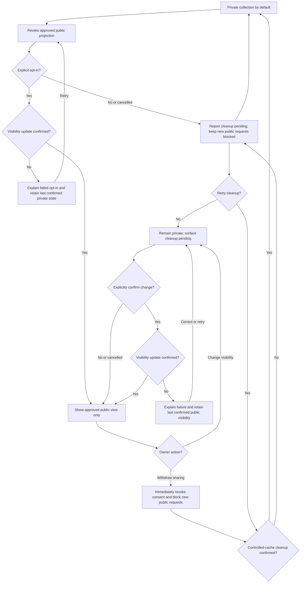
```mermaid
flowchart TD
    A[Private collection by default] --> B[Review approved public projection]
    B --> C{Explicit opt-in?}
    C -->|No or cancelled| J[Keep last confirmed private state unchanged]
    J --> A
    C -->|Yes| D{Visibility update confirmed?}
    D -->|No| E[Explain failed opt-in and retain last confirmed private state]
    E -->|Retry| B
    D -->|Yes| F[Show approved public view only]
    F --> G{Owner action?}
    G -->|Change visibility| K[Review proposed visibility change]
    K --> L{Explicitly confirm change?}
    L -->|No or cancelled| F
    L -->|Yes| M{Visibility update confirmed?}
    M -->|Yes| F
    M -->|No| N[Explain failure and retain last confirmed public visibility]
    N -->|Correct or retry| K
    G -->|Withdraw sharing| H[Immediately revoke consent and block new public requests]
    H --> I{Controlled-cache cleanup confirmed?}
    I -->|Yes| A
    I -->|No| J[Report cleanup pending; keep new public requests blocked]
    J --> O{Retry cleanup?}
    O -->|Yes| I
    O -->|No| K[Remain private; surface cleanup pending]
```

### F-13 — Owner-only portable collection export

- **Story/outcome:** As a collector, I want to retain my collection records outside the product without exporting another collector's private information (R4; AC-09).
- **Intended behavior:** Provide an owner-authorized export in a documented portable format, with approved fields and clear distinctions among game/release/copy and transaction context. Format, metadata/provenance representation, media inclusion/exclusion, and scope remain Gate 1 decisions; export is not a promised importer, backup replacement, or account-deletion mechanism.
- **Normal workflow:** Owner requests export, reviews what it includes, obtains the confirmed result, and reads it using the documented format guidance. Empty collection has a documented usable outcome.
- **Failure workflow:** Expired identity, unauthorized request, preparation/download failure, or incomplete result is explained without distributing other owners' records or asserting success. Retry must respect ownership again; any temporary export artifact needs approved access and lifecycle behavior.
- **Acceptance/evidence:** A two-owner fixture export contains all and only the requesting owner's records and approved fields, preserving duplicate-copy identity, unknown values, and price-paid meaning. An empty fixture follows documented behavior. Independent parsing/inspection confirms the approved format; failed and direct unauthorized requests expose no other-owner records. Evidence: field/format documentation, export fixture comparison, parsing and denial tests, accessible download/error walkthrough.
- **Privacy/accessibility:** Explain sensitive fields before download and secure any generated artifact; exports must not contain credentials/session data. The request and result path must work by keyboard and convey completion/failure without relying on a download icon.
- **Traceability/disposition:** First slice; GC-I-001/002 export approval, GC-I-020 implementation, GC-I-021/022 evidence. NFR-05 owns portability and GC-I-027 links later deletion/retention obligations.

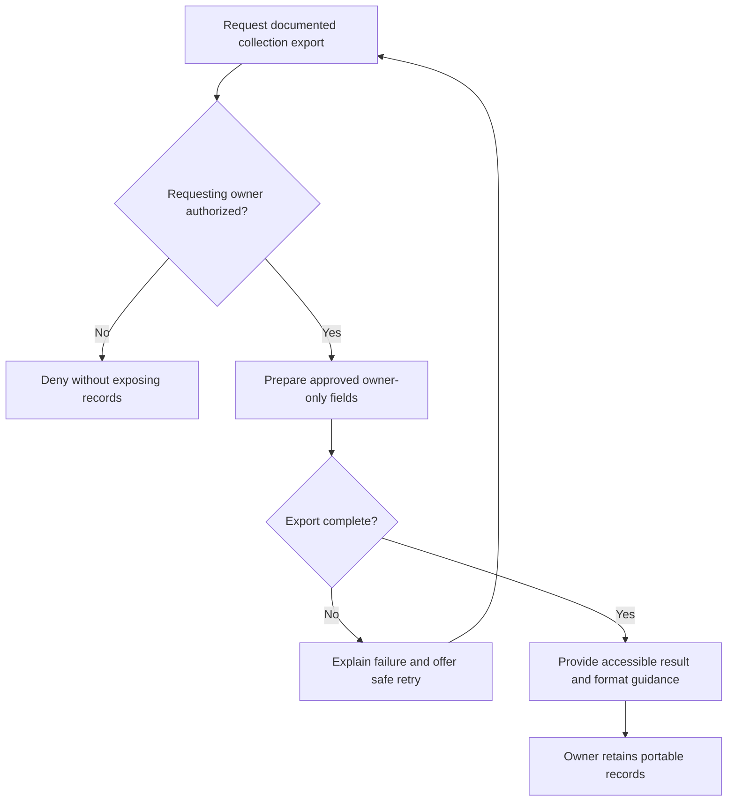
```mermaid
flowchart TD
    A[Request documented collection export] --> B{Requesting owner authorized?}
    B -->|No| C[Deny without exposing records]
    B -->|Yes| D[Prepare approved owner-only fields]
    D --> E{Export complete?}
    E -->|No| F[Explain failure and offer safe retry]
    F --> A
    E -->|Yes| G[Provide accessible result and format guidance]
    G --> H[Owner retains portable records]
```

### F-14 — Rights-attested community submissions and safety lifecycle

- **Story/outcome:** As a contributor or affected rights holder, I want artwork/correction submissions reviewed with rights evidence and a usable reporting/takedown process before they reach public distribution (R7; AC-13).
- **Intended behavior:** Approve submission rights attestations, reviewer responsibilities, moderation, reporting, appeals/disputes, and takedown procedures before enabling public submissions. Availability/upload is not proof of rights; a correction's factual evidence and an artwork's distribution permission require separate review. No voting scheme is assumed or permitted to overwrite personal photos.
- **Normal workflow:** Contributor submits under approved terms with necessary rights/source context; authorised reviewer evaluates, records disposition, and permits publication only when required checks pass. A visitor/rights holder can report published content for review and approved restriction/removal.
- **Failure workflow:** Missing/disputed rights, unsupported facts, abuse, failed submission, or unavailable moderation prevents unreviewed distribution. Report/takedown failures give honest receipt/recovery information; pending/disputed material follows the approved restriction policy rather than automatic publication.
- **Acceptance/evidence:** Missing-attestation and unreviewed fixtures cannot publish. Approved publication has linked rights/evidence and review disposition; unauthorised actors cannot approve it. A published-item report/takedown scenario demonstrates receipt, reviewer handling, controlled-access outcome, and audit trail without exposing reporter data. Evidence: moderation/rights checklist, permission/publication tests, dispute/report/takedown scenarios and accessible contributor/reporter walkthrough.
- **Privacy/accessibility:** Protect contributor/reporter identity as approved; avoid requesting unnecessary personal information. Provide text-based submission/reporting options and clear status/reasons, with reviewable equitable treatment independent of title popularity or price.
- **Traceability/disposition:** Deferred; optional Gate 3c only. GC-I-003 rights policy, GC-I-029 privacy approval, GC-I-031 submissions, GC-I-032 moderation/report/takedown, GC-I-033 evidence. F-09's editorial correction route does not imply community publication is approved.

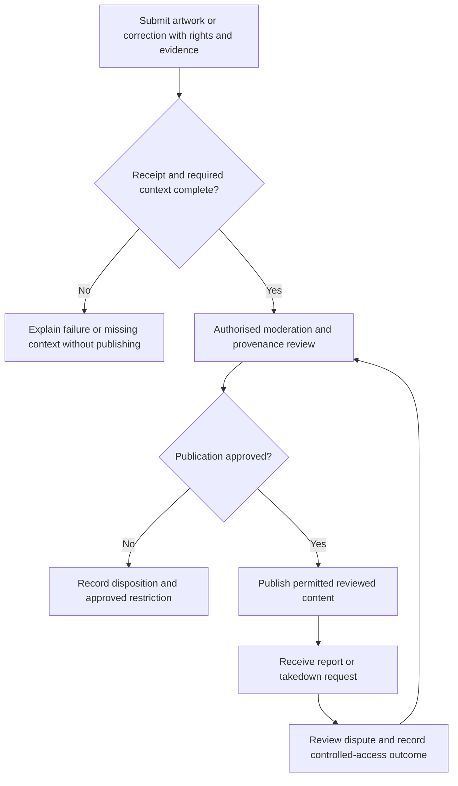
```mermaid
flowchart TD
    A[Submit artwork or correction with rights and evidence] --> B{Receipt and required context complete?}
    B -->|No| C[Explain failure or missing context without publishing]
    B -->|Yes| D[Authorised moderation and provenance review]
    D --> E{Publication approved?}
    E -->|No| F[Record disposition and approved restriction]
    E -->|Yes| G[Publish permitted reviewed content]
    G --> H[Receive report or takedown request]
    H --> I[Review dispute and record controlled-access outcome]
    I --> D
```

## Detailed non-functional requirements

These requirements apply to delivered scope, not to speculative implementation of deferred features. First-slice evidence is collected at Gate 3a; optional-slice evidence at its acceptance gate; production readiness at Gate 4 and human release approval at Gate 5. Each NFR remains a Gate 0 proposal.

### NFR-01 — Accessibility

- **Story:** As a collector or visitor using keyboard, assistive technology, magnification, or a narrow screen, I want equivalent access to reading and collecting tasks.
- **Intended behavior:** Semantic controls, visible focus, sufficient contrast, readable responsive text/layout, reduced-motion support, and accessible progress/errors apply to every delivered journey. Approve the accessibility target, device/assistive-technology evaluation matrix, and exception process at Gate 1; no WCAG level or target is asserted as approved.
- **Normal/failure workflow:** Complete a task with the chosen access mode; if evaluation identifies an inaccessible control, state, or content alternative, record impact, fix and reevaluate, or escalate an explicit release exception rather than declaring conformance.
- **Acceptance/evidence:** Every agreed journey/state in the approved matrix has a recorded keyboard, focus, responsive/zoom and assistive-technology result as applicable. Artwork/timelines have task-equivalent textual context; failure recovery remains operable; automated findings are manually assessed. Unresolved task-blocking barriers go to the gate reviewer, not an implicit pass. Evidence: evaluation matrix, manual observations, automated results, defects/retest and owner decisions.
- **Privacy/equity/traceability:** Use safe fixtures in recordings; inexpensive/obscure titles have equally readable alternatives. GC-I-004/008 design/feasibility, GC-I-022/028/033 acceptance, GC-I-035 release; R1–R7, AC-06/07/14, design and quality references.

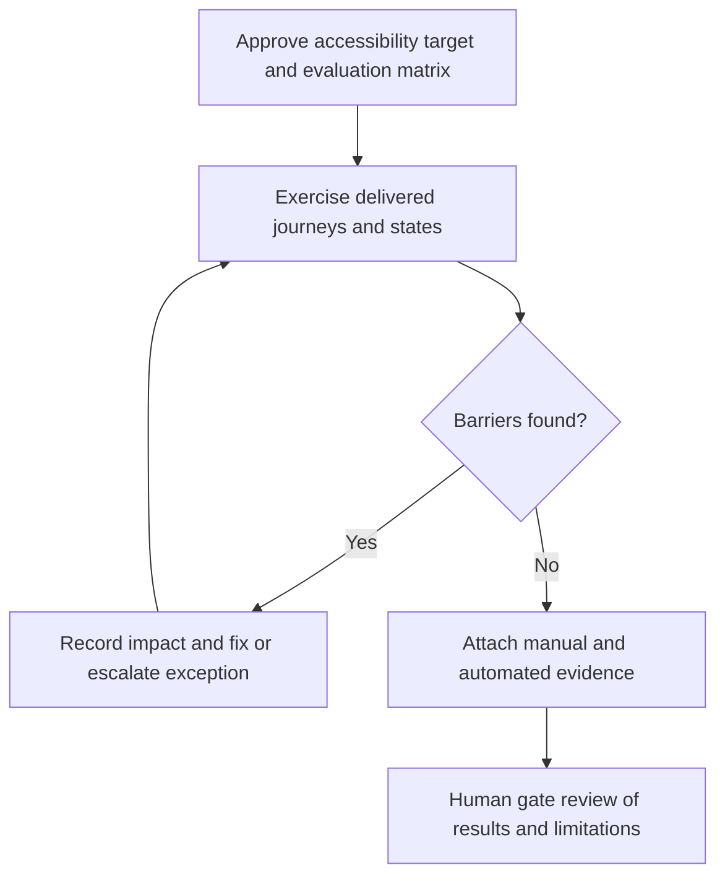
```mermaid
flowchart TD
    A[Approve accessibility target and evaluation matrix] --> B[Exercise delivered journeys and states]
    B --> C{Barriers found?}
    C -->|Yes| D[Record impact and fix or escalate exception]
    D --> B
    C -->|No| E[Attach manual and automated evidence]
    E --> F[Human gate review of results and limitations]
```

### NFR-02 — Privacy and security

- **Story:** As a collector, I want private records/media, least-privilege access, and understandable export/deletion choices so I control my personal context.
- **Intended behavior:** Private-by-default records/media, validated trust boundaries, owner checks, protected secrets, safe logs, and approved abuse controls for any public scope. Define account deletion and retention across records, media, export artifacts, logs, and backups, including recovery limits and any justified exceptions, before launch. Retention durations, identity fields, and deletion completion rules remain approval decisions.
- **Normal/failure workflow:** Owner uses private data or requests export/deletion under the approved policy; unauthorised requests are denied. Interrupted deletion or uncertain completion is tracked, communicated, and reconciled under policy, not silently called complete.
- **Acceptance/evidence:** A two-owner and unauthenticated test matrix denies every relevant private read/write/export/media route. No secrets/private payloads appear in sampled logs/artifacts. Deletion scenarios account for every approved data category and communicate confirmed versus outstanding effects; restored data cannot silently reintroduce access contrary to policy. Evidence: reviewed data inventory/threat model, authorization/validation results, secret-handling review, deletion/retention and recovery demonstration.
- **Accessibility/traceability:** Privacy controls, consequences and denial/recovery must be understandable and keyboard operable. GC-I-002/005/006/013/021/027/029/032/034/035; AC-05/09/10/12/13 and privacy/risks references. **GC-I-027 deletion/retention must be accepted before production personal data is accepted, regardless of whether optional Gate 3b photos/editorial or Gate 3c public features are selected.** GC-I-035 depends on GC-I-027, GC-I-034 and acceptance of the approved release scope, not completion of every optional phase.

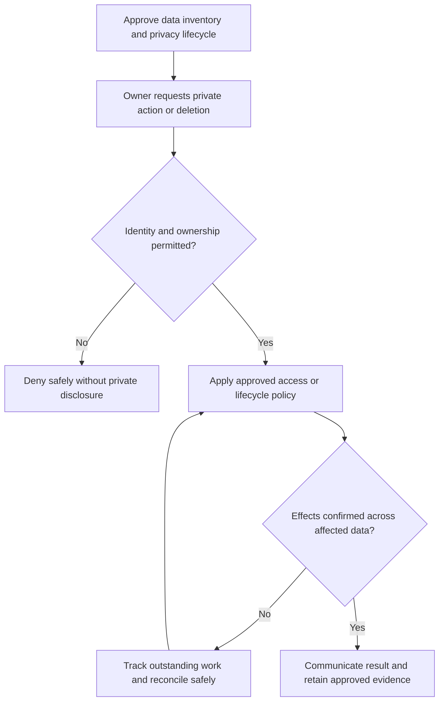
```mermaid
flowchart TD
    A[Approve data inventory and privacy lifecycle] --> B[Owner requests private action or deletion]
    B --> C{Identity and ownership permitted?}
    C -->|No| D[Deny safely without private disclosure]
    C -->|Yes| E[Apply approved access or lifecycle policy]
    E --> F{Effects confirmed across affected data?}
    F -->|No| G[Track outstanding work and reconcile safely]
    G --> E
    F -->|Yes| H[Communicate result and retain approved evidence]
```

### NFR-03 — Data integrity

- **Story:** As a collector, I want trustworthy copy records that survive edits and migrations without confusing purchases, releases, or valuations.
- **Intended behavior:** Preserve game/platform/release/copy distinctions, independent duplicate copies, known/unknown facts, and price-paid semantics. Define validation, constraints, migration and concurrency behavior after approval; incomplete metadata is not invented. Mutation recovery must distinguish confirmed state from uncertainty.
- **Normal/failure workflow:** Validate and save an owner change, reopen it, and preserve it through an approved migration. Reject invalid changes or reconcile interrupted/stale operations without changing unrelated records; failed migrations use the approved recovery path.
- **Acceptance/evidence:** Approved domain fixtures preserve identifiers, relationships and values through CRUD, export and migration. Invalid/denied changes leave confirmed data unchanged; duplicate-copy and interruption/stale-edit scenarios have documented expected outcomes. Migration comparisons identify no unexplained record loss or cross-owner changes. Evidence: domain/constraint/persistence tests, fixture comparisons, migration/recovery rehearsal and defects.
- **Privacy/accessibility/traceability:** Integrity checks must also preserve ownership and avoid leaking conflict details; unknown values and errors have clear text labels. GC-I-002/012/016/017/020/021/034/035; AC-01–05/09, domain/ADR/quality references. Missing catalogue resolution policy remains open under GC-I-001/003.

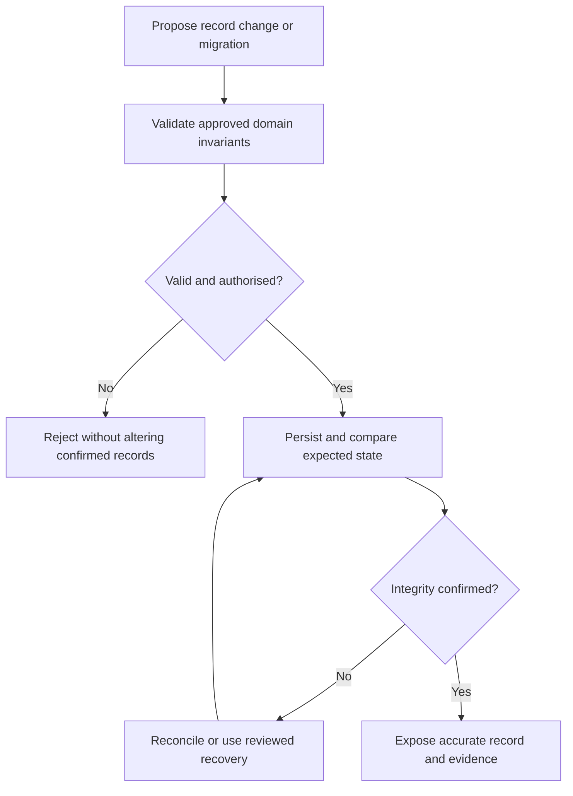
```mermaid
flowchart TD
    A[Propose record change or migration] --> B[Validate approved domain invariants]
    B --> C{Valid and authorised?}
    C -->|No| D[Reject without altering confirmed records]
    C -->|Yes| E[Persist and compare expected state]
    E --> F{Integrity confirmed?}
    F -->|No| G[Reconcile or use reviewed recovery]
    G --> E
    F -->|Yes| H[Expose accurate record and evidence]
```

### NFR-04 — Maintainability

- **Story:** As a maintainer serving collectors, I want domain behavior and provider dependencies to be understandable and testable so fixes do not silently break ownership or portability.
- **Intended behavior:** Follow reviewed architecture and engineering conventions, including explicit domain types, trust-boundary validation, independent business rules, modular boundaries and replaceable provider interfaces. Preserve existing strict-TypeScript guidance for approved implementation without claiming that a stack or modular-monolith proposal has been implemented or approved.
- **Normal/failure workflow:** Map an approved change to requirements, update affected behavior/checks/docs/diagrams, and obtain independent review. Ambiguous domain responsibility, unsupported coupling, failed checks, or documentation drift returns for correction or a recorded architecture decision.
- **Acceptance/evidence:** Each delivered change links requirement IDs and affected modules, automated business-rule/access checks, and current documentation. A clean setup reproduces documented checks; provider-dependent behavior has an identified boundary and test approach. Review records explain deviations rather than silently asserting compliance. Evidence: approved ADRs, traceability/check results, setup reproduction and independent review.
- **Privacy/accessibility/traceability:** Logs/test fixtures must remain safe; accessibility and ownership regressions belong in relevant checks. GC-I-002/011/012/021/022/034/035; AC-07, architecture/ADR/quality references. Product acceptance does not select technology.

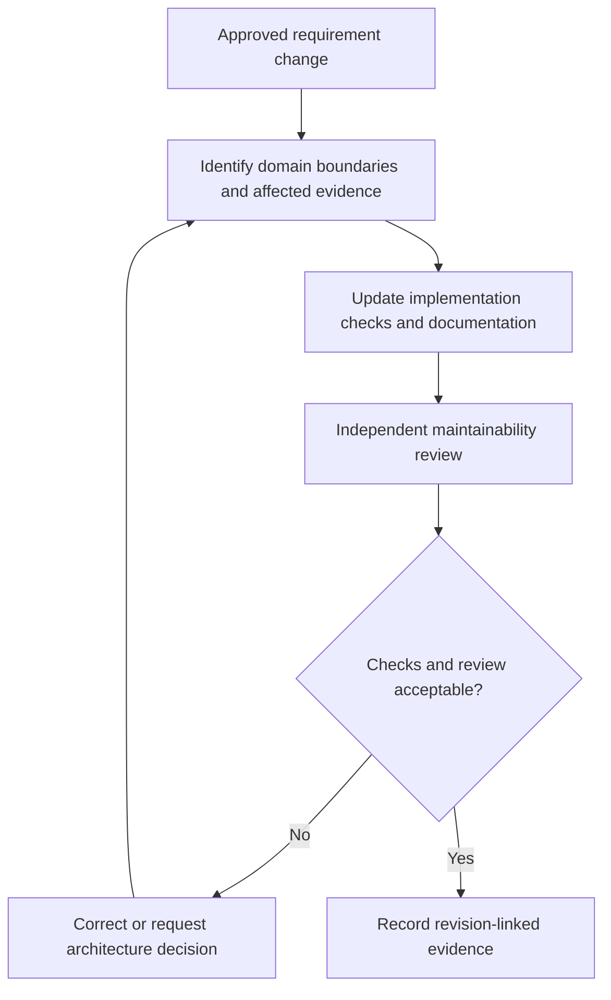
```mermaid
flowchart TD
    A[Approved requirement change] --> B[Identify domain boundaries and affected evidence]
    B --> C[Update implementation checks and documentation]
    C --> D[Independent maintainability review]
    D --> E{Checks and review acceptable?}
    E -->|No| F[Correct or request architecture decision]
    F --> B
    E -->|Yes| G[Record revision-linked evidence]
```

### NFR-05 — Portability

- **Story:** As a collector, I want usable records outside the product and a clear exit path rather than being dependent on a particular client or service.
- **Intended behavior:** Document an approved portable export format and field meaning; preserve copy identity, unknown facts and transaction context. Avoid unnecessary provider/client lock-in at reviewed boundaries without promising native apps, offline sync, imports or media export. Coordinate export with deletion/retention information before launch.
- **Normal/failure workflow:** Owner reads export scope, obtains the export, and interprets it independently; if incomplete/unreadable, explain failure and retry safely. Account exit follows the separately approved deletion process, not export alone.
- **Acceptance/evidence:** An independent format consumer/inspection reads approved fixture exports with the documented schema/field meaning; comparison accounts for every included record and excluded category. Empty and failed exports have documented outcomes; another owner's data is absent. Before release, export/deletion guidance and lifecycle evidence are complete. Evidence: format/field guide, fixture comparison/parsing, authorization results, exit-policy review.
- **Privacy/accessibility/traceability:** Export may itself be sensitive; secure delivery and accessible scope explanations are required. GC-I-001/002/020/021/027/035; AC-09, privacy/domain references. Account deletion/retention must be ready before production personal data is accepted, even when delivered after Gate 3a; format and retention numbers are not decided here.

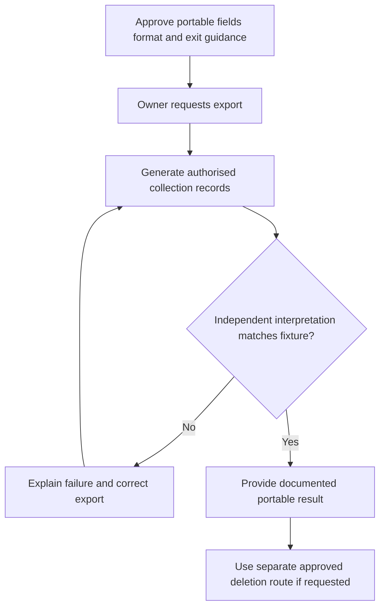
```mermaid
flowchart TD
    A[Approve portable fields format and exit guidance] --> B[Owner requests export]
    B --> C[Generate authorised collection records]
    C --> D{Independent interpretation matches fixture?}
    D -->|No| E[Explain failure and correct export]
    E --> C
    D -->|Yes| F[Provide documented portable result]
    F --> G[Use separate approved deletion route if requested]
```

### NFR-06 — Reliability and operations

- **Story:** As a collector, I want failures and operational changes handled honestly so my records can be recovered and I know whether an action completed.
- **Intended behavior:** Before production, document and demonstrate migration, backup/restore, monitoring, incident/error handling and rollback, including private media and deletion policy where applicable. Approve recovery objectives, monitoring thresholds and operating responsibilities from spike evidence; no uptime SLA or recovery duration is set here.
- **Normal/failure workflow:** Perform a reviewed operational change, verify integrity/access, and monitor results. Simulated outage, failed migration or restore triggers the documented response/recovery; users receive safe understandable state rather than false success.
- **Acceptance/evidence:** Each approved failure/change scenario has a recorded rehearsal and result against approved objectives. Restored fixtures preserve copy/owner boundaries and respect deletion policy; rollback and alert ownership are demonstrated. Unrehearsed procedures or unmet objectives remain release gaps. Evidence: GC-I-009 spike, runbook/rehearsal records, data comparisons, monitoring/rollback demonstration and limitations.
- **Privacy/accessibility/traceability:** Protect backups/logs and redact incident messages; maintenance and recovery states remain accessible. GC-I-009/034/035/036; AC-05/06/07, operations risks/privacy/quality references. Human release decision is separate from a successful rehearsal.

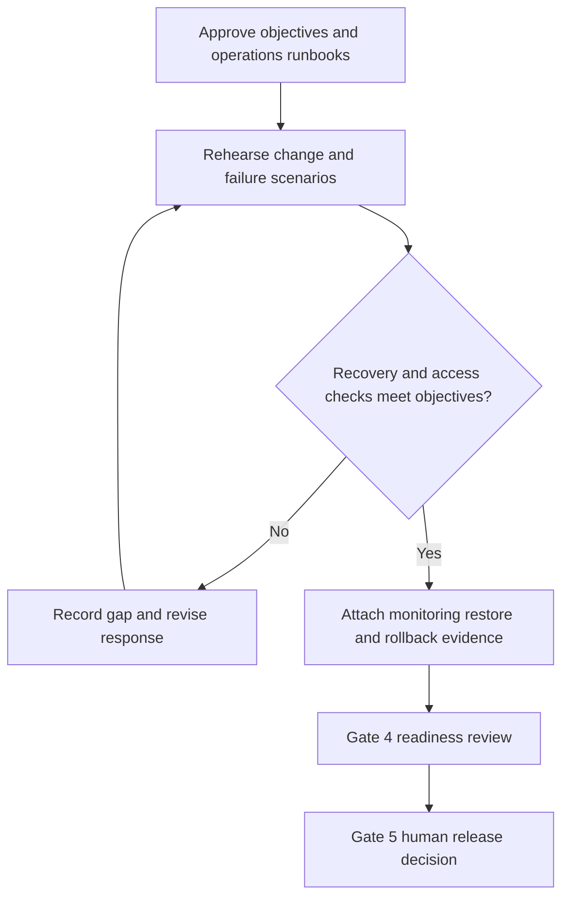
```mermaid
flowchart TD
    A[Approve objectives and operations runbooks] --> B[Rehearse change and failure scenarios]
    B --> C{Recovery and access checks meet objectives?}
    C -->|No| D[Record gap and revise response]
    D --> B
    C -->|Yes| E[Attach monitoring restore and rollback evidence]
    E --> F[Gate 4 readiness review]
    F --> G[Gate 5 human release decision]
```

### NFR-07 — Cost sustainability

- **Story:** As a collector and product owner, I want a viable small private-first product without a compulsory costly catalogue or generation service.
- **Intended behavior:** Identify storage, bandwidth, authentication, provider, backup and operational cost drivers before adoption. Record assumptions, usage scenarios, licensing constraints and alternatives; define approved budget/usage controls and reassessment triggers through human review, not invented numerical caps or commercial commitments.
- **Normal/failure workflow:** Assess approved-scope usage scenarios, compare costs and permitted alternatives, obtain owner approval, and monitor actual usage when implemented. Missing prices, unexpectedly high usage, or disputed licensing triggers review rather than silently charging or disabling portability.
- **Acceptance/evidence:** Every proposed mandatory service has documented necessity, cost assumptions and owner decision; the MVP proposal requires no large paid catalogue or image-generation service. Estimates distinguish measured spike results from assumptions and include backup/media/export where applicable. Approved controls and breach-response scenarios have evidence before release. Evidence: GC-I-009 cost scenarios, licensing inputs, approval record and operational controls review.
- **Privacy/accessibility/equity/traceability:** Monitoring minimises personal information; cost-saving choices must not quietly remove accessibility or exclude inexpensive/obscure games. GC-I-003/007/009/034/035; commercial sustainability/licensing/risks references. GC-I-040 is future decision-only, not approved monetisation.

```mermaid
flowchart TD
    A[Identify scope and cost drivers] --> B[Estimate permitted usage scenarios and alternatives]
    B --> C{Evidence and owner cost approval sufficient?}
    C -->|No| D[Revise assumptions or scope proposal]
    D --> B
    C -->|Yes| E[Implement approved cost controls when authorised]
    E --> F{Usage within approved assumptions?}
    F -->|No| G[Escalate for human reassessment]
    G --> B
    F -->|Yes| H[Record operating evidence]
```

### NFR-08 — Content integrity

- **Story:** As a visitor or collector, I want catalogue, artwork and historical content to state its provenance and limits so I am not misled by fabricated facts or unclear rights.
- **Intended behavior:** Trace factual historical claims to reviewed sources (GC-DATA-001); AI output alone is not evidence (GC-AI-001). Identify seed data and uncertainty; separate catalogue art, personal photos, generated art and community art with their own rights/lifecycle rules. Content review must not privilege expensive/popular titles.
- **Normal/failure workflow:** Collect source/rights context, review claim/artwork, publish only permitted supported content and retain traceability. Unsupported/disputed claims, missing rights or a correction request trigger withholding/review/update under policy rather than invented detail.
- **Acceptance/evidence:** Each delivered seed/exhibit/artwork fixture has provenance and permitted-use disposition appropriate to its category. Factual claims map to sources, uncertain dates/claims are labelled, and missing catalogue details remain unknown. A dispute/correction fixture shows traceable review and revision/restriction. Evidence: source/rights inventory, claim matrix, editorial decisions, correction/takedown scenarios and label review.
- **Privacy/accessibility/traceability:** Provenance cannot expose private contributors or personal media without approved permission; citation/uncertainty labels and artwork alternatives are accessible. GC-I-003/007/012/015/025/026/031/032/035; AC-04/10/11/13, catalogue/artwork/history references. GC-I-041 is investigation only, not authorisation to generate or publish.

```mermaid
flowchart TD
    A[Collect source and artwork provenance] --> B[Review factual support and permitted use]
    B --> C{Supported and permitted?}
    C -->|No| D[Withhold or label uncertainty and resolve policy gap]
    D --> B
    C -->|Yes| E[Publish reviewed content with traceability]
    E --> F[Receive correction rights dispute or new evidence]
    F --> G[Review and record revision or restriction]
    G --> B
```

## Approval decisions and evidence boundaries

- GC-I-001: first-slice approval, copy lifecycle, exact attribute requirements/vocabularies, export fields/format, and **manual entry / collection grouping disposition pending Gate 1**. Neither is silently included or permanently rejected.
- GC-I-001/003: an **approved missing-catalogue handling policy is still open at Gate 1**, including manual entry or provisional release creation. Honest unknown/no-match presentation and safe cancellation do not resolve whether and how missing titles/releases may be added.
- GC-I-002/004: identity/session, privacy/deletion/retention, accessibility target/evaluation, and destructive-action/consent design need review. No signup fields, retention durations, status enums, export format, SLA, or approved WCAG target are invented here.
- GC-I-003/006/009: permitted catalogue/artwork use, media constraints/lifecycle, editorial review/correction route, operating objectives and cost controls require evidence and owner decisions.
- GC-I-029–033: public sharing/community remain optional and deferred until privacy, rights, moderation, reporting/takedown and abuse safeguards are approved. First-slice acceptance is not full R1–R7 delivery.
- Future GC-I-037–044 are decision-only investigations, not additional committed F requirements. No paid service or stack selection follows from this document.

## Cross-cutting acceptance expectations

For relevant features, acceptance must cover: loading/empty/error/permission states; mobile and keyboard usage; ownership boundaries; uncertain or missing metadata; multiple copies/releases; privacy defaults; test evidence; and updates to directly affected documentation/diagrams. Product owner approves exact feature acceptance before implementation.
