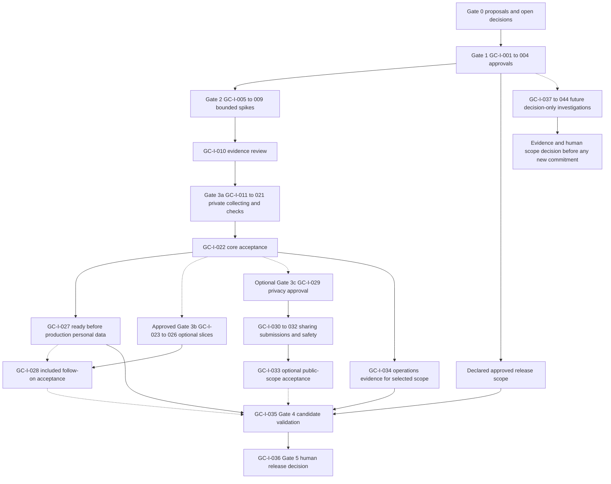

# Prioritised roadmap proposal

**Status:** Gate 0 sequencing proposal; not a delivery commitment.

All requirements and release options are proposed, with owner approval pending. No stack is implemented; dates, costs, scope inclusion and gate passage are not promised. [Requirements](requirements.md) owns acceptance, [MVP scope](mvp-scope.md) owns capability disposition, and the [canonical backlog index](../operations/proposed-backlog.md) owns issue specifications. GC-I identifiers are canonical draft planning references; no real GitHub issues have been created.

**Label distinction:** Roadmap P0–P7 are sequencing labels only. Legacy backlog P1–P5 umbrella aliases remain backlog aliases, not these roadmap phases or substitutes for GC-I identifiers. Use gate names and GC-I references for cross-document traceability.

## Phase sequencing and exit evidence

| Roadmap order | Outcome / gate | Canonical issue range | Dependencies and proposed exit evidence |
| --- | --- | --- | --- |
| P0 | Gate 0 — Foundation | Planning prerequisites, not a new issue range | Product/architecture/security/research/quality proposals, risks and open decisions. Documentation only; owner approval is still pending. |
| P1 | Gate 1 — Product and architecture approval | GC-I-001–004 | Product MVP, acceptance, journeys/design/accessibility target, architecture/security and catalogue/art/history policy reviewed by the human owner. Resolve or explicitly record blockers, including missing-catalogue handling and manual entry/grouping disposition. |
| P2 | Gate 2 — Technical proof of concept | GC-I-005–010 | Approved bounded spikes for auth/owner isolation, private-media lifecycle, permitted catalogue/search, responsive/device feasibility, deployment/recovery/cost. GC-I-010 reviews actual evidence, limitations and scope recommendations; spikes are not delivered features. |
| P3 | Gate 3a — Private collecting loop | GC-I-011–022 | Approved scaffold/tooling/CI, schema/migrations/seed, auth/session, empty/onboarding, seed release selection, copy lifecycle/attributes, responsive distinct detail, private collection search, owner-only export and authorization regression. GC-I-022 independently reviews first-slice acceptance against requirements. |
| P4 | Gate 3b — Preserve and discover | GC-I-023–028 | If approved, separate photo, refinement and sourced editorial slices with privacy/rights/operations evidence. GC-I-027 account deletion/retention is a launch obligation even if other follow-on features are excluded. GC-I-028 reviews the included follow-on work, not an automatic requirement to ship every candidate. |
| P5 | Gate 3c — Optional sharing/community | GC-I-029–033 | Only for explicitly selected public scope: approved privacy/visibility design, opt-in sharing, rights-attested submissions and moderation/report/takedown. GC-I-033 reviews that optional scope. This phase is not required for private-first release. |
| P6 | Gate 4 — Release candidate | GC-I-034–035 | Selected release scope accepted; operational migrations/backup/restore/monitoring/rollback demonstrated; applicable accessibility/security/checks and deletion/retention/portability evidence complete. GC-I-035 records readiness, limitations and unresolved release blockers. |
| P7 | Gate 5 — Human release decision | GC-I-036 | GC-I-035 readiness report and explicit human release decision. A passing check or recommendation is not release authorization. |

## Canonical issue sequence within phases

This index is intentionally short: implementation detail and issue dependency specifications belong in the backlog; detailed pass/fail criteria belong in requirements.

### Gate 1 — GC-I-001–004

| ID | Approval subject |
| --- | --- |
| GC-I-001 | Product MVP approval |
| GC-I-002 | Architecture/security approval |
| GC-I-003 | Catalogue/art/history policy approval |
| GC-I-004 | UX/accessibility design |

Review these together before implementation. GC-I-001 and GC-I-003 must explicitly address missing seed entry handling, including manual entry or provisional release creation; these and collection grouping remain pending Gate 1 product disposition. The safe fallback explains the gap, permits query correction/cancellation and invents no metadata or unconfirmed copy association. GC-I-002/004 supply security, accessibility and interaction constraints rather than assumed technology choices.

### Gate 2 — GC-I-005–010

| ID | Evidence sequence |
| --- | --- |
| GC-I-005 | Auth/owner isolation spike |
| GC-I-006 | Private media lifecycle spike |
| GC-I-007 | Permitted catalogue/search spike |
| GC-I-008 | Responsive/device feasibility spike |
| GC-I-009 | Deployment/recovery/cost spike |
| GC-I-010 | Gate2 evidence review |

Approved independent spikes can run in parallel; GC-I-010 consumes their actual evidence and unresolved limitations. Media investigation does not make photo delivery mandatory. GC-I-008 is responsive/device feasibility, not a commitment to native/offline/camera/barcode features; that investigation is GC-I-039.

### Gate 3a — GC-I-011–022

| ID | Private collecting work |
| --- | --- |
| GC-I-011 | Approved scaffold/local tooling/CI |
| GC-I-012 | Schema/migrations/seed |
| GC-I-013 | Auth/session |
| GC-I-014 | Empty/onboarding |
| GC-I-015 | Seed catalogue search/release selection |
| GC-I-016 | Copy CRUD/lifecycle |
| GC-I-017 | Copy attributes/price |
| GC-I-018 | Responsive cards/game vs copy detail |
| GC-I-019 | Private collection search |
| GC-I-020 | Owner-only export |
| GC-I-021 | Authorization regression suite |
| GC-I-022 | Gate3a acceptance |

Establish approved tooling/model/identity foundations before claiming persistent collecting behavior. Seed selection feeds copy creation; attributes, presentation, private search and export operate on independently owned copies. Build regression checks alongside relevant features rather than deferring privacy assurance until the end; GC-I-022 reviews the complete collecting loop. F-10 accessible loading/empty/error/denial states and applicable NFRs accompany each issue.

### Gate 3b — GC-I-023–028

| ID | Follow-on work / obligation |
| --- | --- |
| GC-I-023 | Private photo lifecycle |
| GC-I-024 | Filters/sort/counts |
| GC-I-025 | Sourced editorial model/review |
| GC-I-026 | Exhibit reading/timeline/correction |
| GC-I-027 | Account deletion/retention |
| GC-I-028 | Gate3b acceptance |

Photo delivery depends on accepted GC-I-006 findings and policy; refinement depends on approved definitions; GC-I-026 follows GC-I-025's provenance/review foundation. These are separable candidate slices, not a requirement to release them together. GC-I-027 must cover all data categories in the selected scope and feed Gate 4 privacy/portability readiness, even if photos/editorial/refinements are deferred. If only GC-I-027 is brought forward for private-first launch, record that resequencing and its acceptance explicitly; do not falsely claim completion of the whole Gate 3b feature phase.

### Optional Gate 3c — GC-I-029–033

| ID | Optional public-scope work |
| --- | --- |
| GC-I-029 | Sharing/privacy design approval |
| GC-I-030 | Opt-in public profile/collection |
| GC-I-031 | Rights-attested community submissions |
| GC-I-032 | Moderation/reports/takedown |
| GC-I-033 | Gate3c acceptance |

GC-I-029 precedes public implementation. Rights-attested submissions cannot be publicly distributed before GC-I-032 safeguards are implemented and accepted; public sharing also needs the applicable safety controls. GC-I-033 reviews the selected public scope before it may enter a release candidate. A private-first release can omit GC-I-029–033 entirely.

### Gates 4 and 5 — GC-I-034–036

| ID | Release sequence |
| --- | --- |
| GC-I-034 | Operational migration/backup/restore/monitoring/rollback |
| GC-I-035 | Gate4 release candidate validation |
| GC-I-036 | Gate5 human release decision |

Prepare operations early where useful, but validate them against the actual candidate scope. **GC-I-027 deletion/retention must be accepted before production personal data is accepted, regardless of whether optional Gate 3b photos/editorial or public Gate 3c are selected. GC-I-035 depends on GC-I-027, GC-I-034 and acceptance of the approved release scope, not every optional phase.** Included optional features supply their applicable acceptance evidence; excluded optional features remain disabled. Use the [quality evidence contract](../quality/testing-and-delivery.md#evidence-and-agent-handoff-record) and [security boundary matrix](../security/privacy.md#implementation-and-evidence-ownership) for the candidate's handoff. Known limitations require an explicit disposition; GC-I-036 retains human decision authority.

## Mermaid dependency overview

Solid paths describe the minimal private-first readiness dependencies or dependencies internal to a chosen branch. Dashed branches are conditional on scope selection; they are not compulsory release phases. GC-I-027 is a solid launch dependency even though canonically grouped in Gate 3b. The future branch neither blocks private-first release nor authorises implementation.

## Future decision-only investigations — GC-I-037–044

| ID | Investigation only |
| --- | --- |
| GC-I-037 | Licensed catalogue/provider expansion investigation |
| GC-I-038 | Valuation methodology investigation |
| GC-I-039 | Native/offline/camera/barcode investigation |
| GC-I-040 | Commercial sustainability/subscription/affiliate investigation |
| GC-I-041 | Generated artwork/AI-assistance investigation |
| GC-I-042 | Equitable achievements investigation |
| GC-I-043 | Marketplace investigation |
| GC-I-044 | Insurance reporting investigation |

Investigations produce evidence, alternatives, risks and a recommendation for a human decision. They are not committed F requirements, paid-provider purchases, a monetisation decision, or a promised release. Any approved resulting product scope must be specified and reviewed separately before implementation.

## Sequencing rules

- Keep the first implementation issue bounded to the approved first vertical slice; split photo upload and editorial exhibit if their prerequisites are not ready.
- No native app, paid provider, large catalogue, valuation service, or expensive generation pipeline before documented recommendation and human approval.
- Roadmap order is a dependency hypothesis, not a schedule. Reprioritize only with product-owner review and recorded rationale.
- Do not gate private-first release on completion of candidate photo/refinement/editorial or optional public/community phases. Do gate it on account deletion/retention, portability, accessibility, owner isolation and operations evidence applicable to its actual scope.
- Do not invent signup fields, lifecycle enums, retention durations, export format, SLA, approved WCAG target, or mandatory paid services to close a gate. Record missing decisions and escalate them.
- Acceptance and evidence detail stays in [requirements](requirements.md); canonical issue specifications stay in the backlog. Changes to scope/dependencies need coordinated review with design, architecture, security, research and QA before owner approval.
