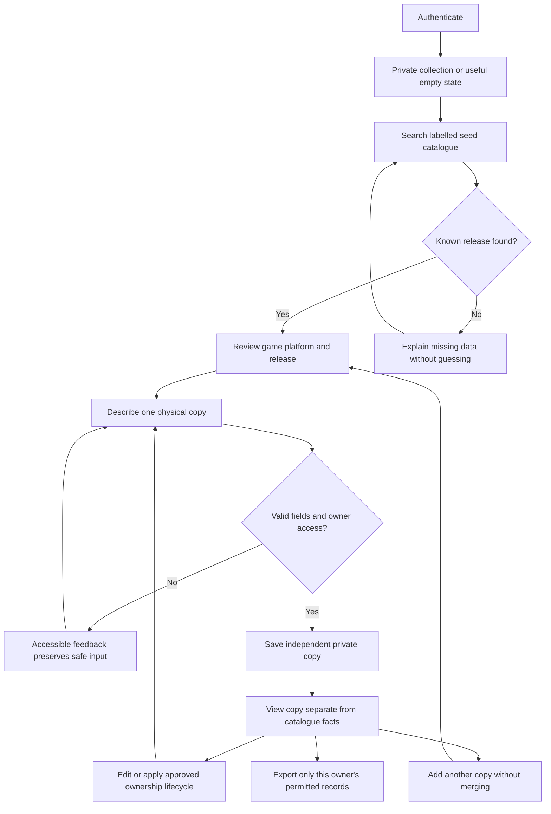
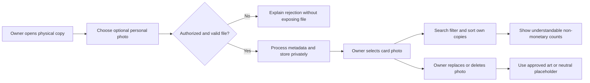
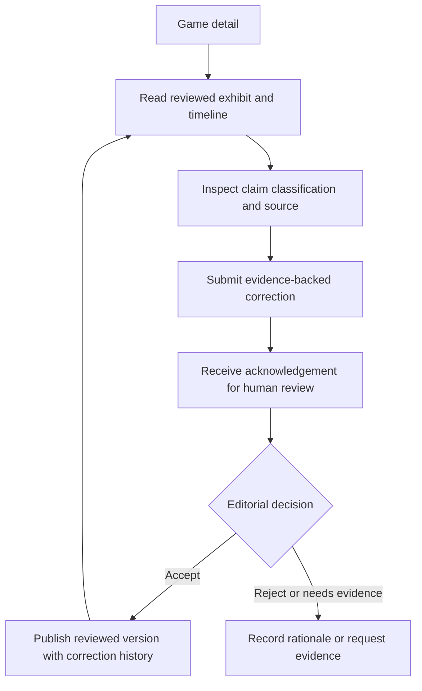
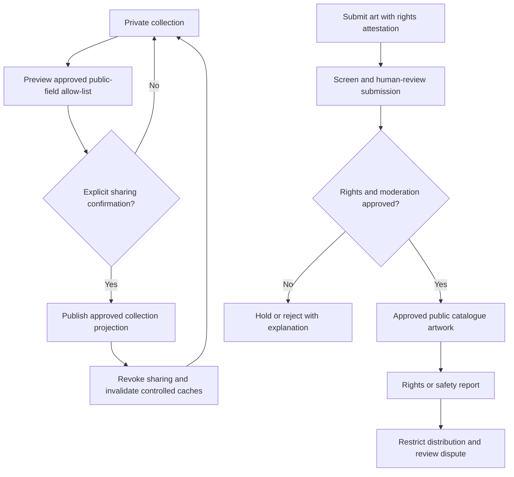
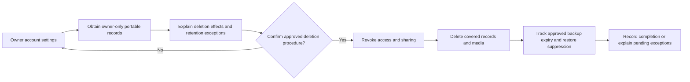

# Initial user journeys and navigation proposal

**Status:** Gate 0 concept; validate with product and design review.

## Collector journey: first copy

1. Arrive at a useful, private empty collection state that explains what can be recorded.
2. Start “Add a physical copy”; search the small seed catalogue or identify that an entry is not present.
3. Select a Game and, when known, a specific Release/Edition and Platform. Unknown/incomplete details remain explicit.
4. Record copy-specific condition, components/completeness, acquisition date, optional price paid/currency, and private notes.
5. Save and review an individual copy card/detail page; add another copy of the same release without merging records.
6. Find the collection item later through search/filter; edit copy details or update ownership status.
7. Before any future sharing action, review what fields and images are visible and confirm explicitly.

## Researcher/visitor journey: exhibit (follow-on)

1. Browse from a Game detail page to a structured historical exhibit.
2. Read sections and timeline events with visible source references and clear claim status.
3. Inspect source context; distinguish verified fact, attributed report, interpretation, and disputed claim.
4. Propose a correction with supporting evidence through a reviewed workflow; no proposal silently changes published history.

## Proposed navigation

- **My Collection** — private default landing after sign-in; empty state, search, filters, sort, collection groups.
- **Catalogue** — searchable seed title/platform/release exploration, with clear missing-data status.
- **Game Detail** — underlying title and its known releases, exhibits, and artwork attribution; no conflation with a personal copy.
- **Physical Copy Detail/Edit** — one owned object, its components/condition/acquisition and private media.
- **Exhibits** — sourced historical narratives and correction/report path when implemented.
- **Profile/Settings** — account, export/deletion, privacy/visibility settings; public profile only after explicit approval.

Navigation labels, IA, and route structure are proposals. No implemented screens or user-tested flow exists.

## Workflow and issue traceability

These journeys summarize the detailed [requirements](requirements.md), not additional scope. Work-item specifications and prerequisites are in the [backlog](../operations/proposed-backlog.md).

### Private first-copy loop — F-01–F-05, F-07, F-08, F-10, F-13

Delivery: GC-I-013–GC-I-020; ownership regression evidence: GC-I-021.

A catalogue miss must not create invented facts. Whether a collector can create a provisional release/manual entry is a Gate 1 decision; until approved, the safe fallback is to explain the gap and allow a different search. Export format and removal/archive semantics also remain open.

### Preserve and find — F-06, F-08

Delivery: GC-I-023–GC-I-024, after the applicable media and UX spikes.

Unknown condition/completeness remains distinguishable from a known value. Counts must explain whether they count games, releases, or copies; no value-based ranking. A photo failing processing must not leave a public or selectable object.

### Read and correct history — F-09

Delivery: GC-I-025–GC-I-026, subject to GC-I-003 content approval.

An unauthenticated correction path, if desired, needs a separate abuse-control decision; reading history does not grant publication privileges. Source failures and disputed claims remain visible as uncertainty rather than being replaced with AI text.

### Share and contribute — F-12, F-14, optional only

Delivery: GC-I-029–GC-I-033; never enabled by the private collection slice.

Collection sharing cannot implicitly publish a personal photo. Attestation and screening do not prove rights. Public artwork selection/voting cannot replace a collector's selected personal photo.

### Export and leave — F-13, NFR-02, NFR-05, NFR-06

Delivery: GC-I-020 and GC-I-027, with operational evidence in GC-I-034.

No retention duration or recovery promise is approved. Deletion must be resolved before accepting production personal data, even if the optional photo or public-sharing slices are omitted.
