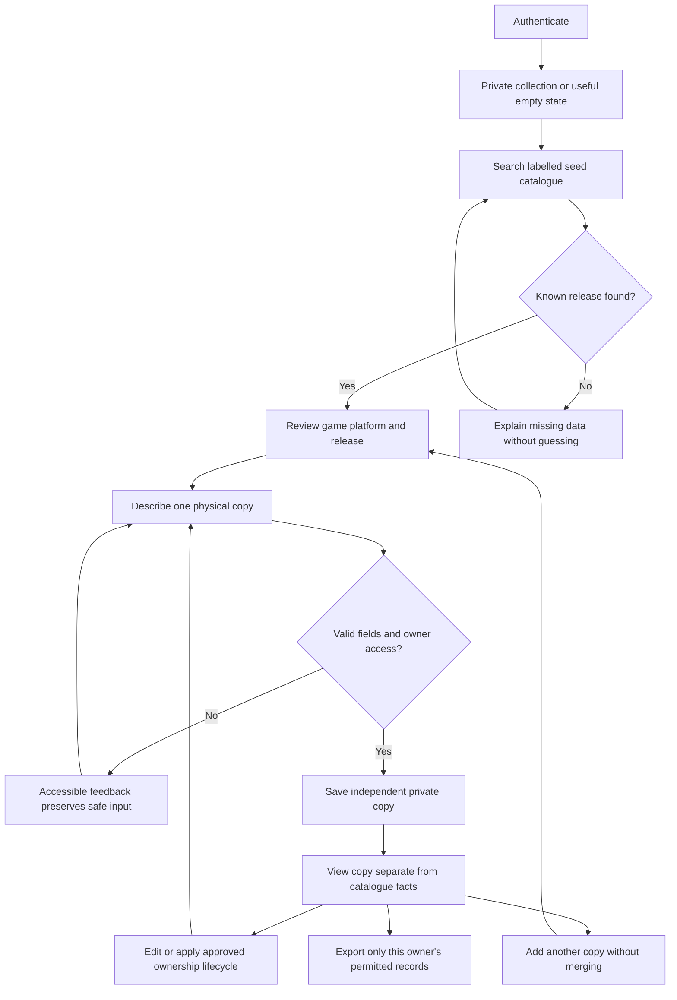
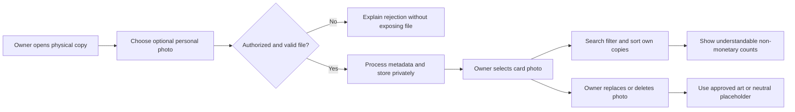
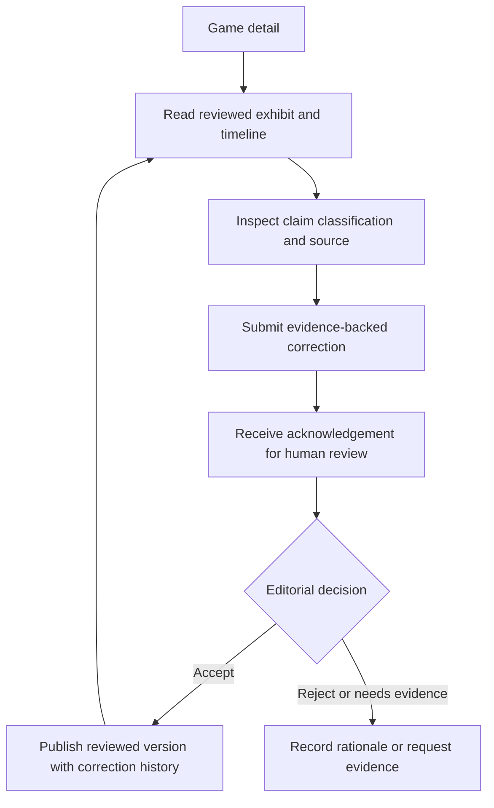
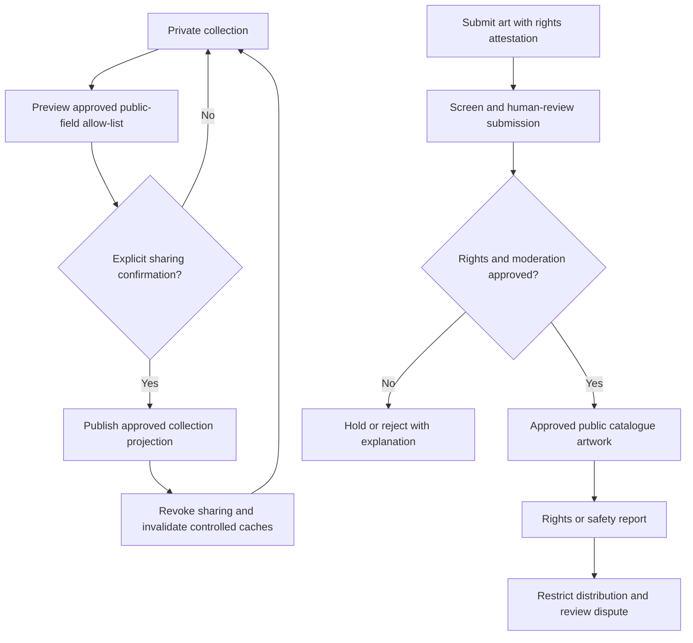
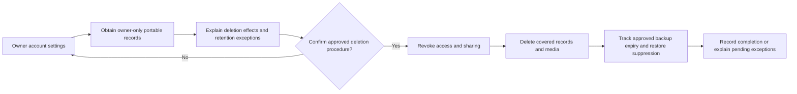

# Initial user journeys and navigation proposal

**Status:** Gate 0 concept; validate with product and design review.

## Collector journey: first copy

1. Arrive at a useful, private empty collection state that explains what can be recorded.
2. Start “Add a physical copy”; search the small seed catalogue or identify that an entry is not present.
3. Select a known seed Game/Release/Platform under the current proposal. Saving an unmatched copy or creating a provisional release requires the separate Gate 1 decision below; unknown fields on a known release remain explicit.
4. Record copy-specific condition, components/completeness, acquisition date, optional price paid/currency, and private notes.
5. Save and review an individual copy card/detail page; add another copy of the same release without merging records.
6. Find the collection item later through private search; filters/sort are follow-on. Edit copy details or apply the approved ownership lifecycle.
7. Before any future sharing action, review what fields and images are visible and confirm explicitly.

## Researcher/visitor journey: exhibit (follow-on)

1. Browse from a Game detail page to a structured historical exhibit.
2. Read sections and timeline events with visible source references and clear claim status.
3. Inspect source context; distinguish verified fact, attributed report, interpretation, and disputed claim.
4. Propose a correction with supporting evidence through a reviewed workflow; no proposal silently changes published history.

## Proposed navigation

- **My Collection** — first-slice private landing after sign-in, empty state and search; filters/sort are follow-on (GC-I-024), and collection grouping remains an unresolved Gate 1 choice.
- **Catalogue** — searchable seed title/platform/release exploration, with clear missing-data status.
- **Game Detail** — first-slice underlying title and known releases, with attribution for any permitted art; exhibits are a separate follow-on (GC-I-025–026), never conflated with a personal copy.
- **Physical Copy Detail/Edit** — first-slice owned-object attributes; private media controls only if the photo follow-on is approved (GC-I-023).
- **Exhibits** — follow-on navigation only when sourced narratives and correction/report paths are implemented and accepted.
- **Profile/Settings** — first-slice account and owner export; deletion/retention must be ready before production personal data (GC-I-027), though a self-service UI is not mandatory. Public profile/visibility controls are optional Gate 3c, not first-slice navigation.

Navigation labels, IA, and route structure are proposals. No implemented screens or user-tested flow exists.

## Workflow and issue traceability

These journeys summarize the detailed [requirements](requirements.md), not additional scope. Work-item specifications and prerequisites are in the [backlog](../operations/proposed-backlog.md).

### Private first-copy loop — F-01–F-05, F-07, F-08, F-10, F-13

Delivery: GC-I-013–GC-I-020; ownership regression evidence: GC-I-021.

A catalogue miss must not create invented facts. Whether a collector can create a provisional release/manual entry is a Gate 1 decision; until approved, the safe fallback is to explain the gap and allow a different search. Export format and removal/archive semantics also remain open.

### Preserve and find — F-06, F-08

Delivery: GC-I-023–GC-I-024, after the applicable media and UX spikes.

Unknown condition/completeness remains distinguishable from a known value. Counts must explain whether they count games, releases, or copies; no value-based ranking. A photo failing processing must not leave a public or selectable object.

### Read and correct history — F-09

Delivery: GC-I-025–GC-I-026, subject to GC-I-003 content approval.

An unauthenticated correction path, if desired, needs a separate abuse-control decision; reading history does not grant publication privileges. Source failures and disputed claims remain visible as uncertainty rather than being replaced with AI text.

### Share and contribute — F-12, F-14, optional only

Delivery: GC-I-029–GC-I-033; never enabled by the private collection slice.

Collection sharing cannot implicitly publish a personal photo. Attestation and screening do not prove rights. Public artwork selection/voting cannot replace a collector's selected personal photo.

### Export and leave — F-13, NFR-02, NFR-05, NFR-06

Delivery: GC-I-020 and GC-I-027, with operational evidence in GC-I-034.

No retention duration or recovery promise is approved. Deletion must be resolved before accepting production personal data, even if the optional photo or public-sharing slices are omitted.

## Gate 1 synthetic collecting scenario

**Status:** Documentary acceptance example for GC-I-001–004, not a seed import, approved field schema, executed test, or validated customer story. Names and identifiers are invented for this review; they assert no real game history. Use neutral image placeholders and synthetic owners without credentials or contact details.

### Fixture and field decisions

| Concept | Synthetic example | Proposed meaning / decision still needed |
| --- | --- | --- |
| Owners | A and B | Distinct private owners; authentication provider and identity fields remain open. |
| Game / Platform | G-A: “Paper Comet”; P-A: “Sample Console” | Separate catalogue identities; sample labels visible. |
| Release | R-A references G-A/P-A; edition “Sample standard”; region/date unknown | Known seed release with explicitly unknown facts, not a fabricated real edition. |
| First copy | C-A1 belongs to A and R-A; manual present; condition unknown; price paid unknown | Unknown completeness is not complete; exact component vocabulary is pending. |
| Second copy | C-A2 belongs to A and R-A; completeness unknown; paid amount 0, currency USD | Different copy identity; zero is not absent price and is not valuation. Currency/precision policy needs approval. |
| Other owner's copy | C-B1 belongs to B and R-A; attributes unknown | Must never appear in A's collection, search or export. |
| Unmatched item | A reports “Uncatalogued object U-A”; no confirmed game/platform/release | Private reported description only if that option is approved; no shared catalogue fact or global “unknown release” is invented. |

For review, propose a known release selection as required for the matched-copy path and condition/components/acquisition date/price/notes as optional. Decide minimum unmatched description, any required copy fields, date precision, controlled vocabularies, unknown states and price/currency pairing under F-04/05. Grouping, archive/removal behavior and export format are not selected by these examples.

### Observable scenario and branches

| Step | Proposed expected outcome | Acceptance / evidence |
| --- | --- | --- |
| A signs in to an empty collection. | No seed entry is shown as owned; loading failure is not empty success. | F-01/02/10; AC-05/06; session and empty/error fixtures. |
| A searches “Paper Comet” and selects R-A. | Sample label, G-A/P-A/R-A and unknown region/date are understandable. | F-03; AC-01/04/08; catalogue selection walkthrough. |
| A adds C-A1, then deliberately adds C-A2. | Two independent copies remain visible; repeated title/release does not merge them. | F-04/05/07; AC-01–03; persistence/domain assertions after reload. |
| A changes only C-A1's private note to “Review fixture note”. | C-A2 and catalogue facts are unchanged; failed or stale save does not claim success. | F-04/05/10; NFR-03; mutation and recovery cases. |
| A searches their collection for “Paper Comet”. | C-A1 and C-A2 are findable; C-B1 is absent, including counts/joins. | F-08 search; AC-05/06; GC-I-019/021 owner-scoped evidence. |
| A searches the catalogue for U-A with no match. | Explain the coverage gap, preserve safe input, permit refinement/cancel. No copy is silently associated with R-A. | F-03/10; AC-04/06; missing-catalogue walkthrough and owner decision. |
| A exports their records. | Separate copy IDs, release relationships, unknown values and zero price remain distinguishable; C-B1 is excluded. | F-13; AC-09; export field review and owner-isolation assertions. |
| B or an anonymous caller directly requests A's copies, mutations or export. | Denied without private contents/existence leakage; no mutation. UI hiding alone is insufficient. | AC-05/09; NFR-02; server and persistence negative cases. |

The unmatched-item branch must receive one explicit human disposition, comparing the [domain options](../architecture/domain-model.md#unknown-release-unresolved-gate-1-policy):

1. **Known-release-only:** no U-A copy is saved; explain the limitation and record the unmet collector need in synthetic review evidence. Assess whether that prevents proving the first outcome.
2. **Private unmatched copy:** if approved, save an independent owner-only copy with no confirmed release and the approved minimum description. Define private search/export and reversible later matching while preserving its copy identity.
3. **Provisional release:** if approved, keep the proposal labelled and segregated under the approved visibility/review policy. No unreviewed draft becomes verified shared catalogue data.

No branch is approved here. Record the choice and update F-03/04, MVP, domain constraints and GC-I-012/015/016 before implementing it. Until then the no-match/cancel fallback remains the only specified safe behavior.

### Lifecycle and export review checklist

- Choose remove versus archive/status behavior and confirmation/recovery; distinguish removal of a group from removal of copies and account deletion. No status enum is selected.
- Decide whether grouping is omitted, a default group exists, or multiple memberships are supported. The scenario must still show two independent physical copies, never two memberships counted as copies.
- Approve an export field list: proposed internal copy/release relationships, explicitly reported versus catalogue values, optional attributes, date precision and exact paid amount/currency. Decide catalogue redistribution restrictions and unmatched-copy treatment.
- Define format/version, encoding, empty export, size/failure handling and any temporary artifact expiry/access. Do not export credentials, foreign-owner records, privileged object links or imply that record export backs up photos.
- Independently review keyboard/narrow-screen, cancel/error/denied and unknown-versus-zero cases. Expected outcomes above are future evidence requirements, not passing results.
- Deletion/retention and restore suppression remain required before production personal data, even if the scenario excludes photos and public features.

Human review must record approved scenario/fields/branch, artifact revision, unresolved blockers and required evidence in the [Gate 1 package](../operations/open-decisions.md#gate-1-review-package). Application acceptance follows GC-I-022; approving this example does not approve production release.
