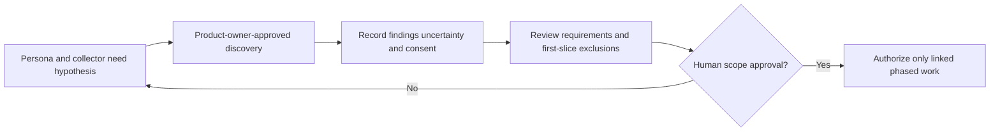

# Product vision and personas

**Status:** Gate 0 proposal for product-owner review.

## Vision

GameCurator is a community-powered digital museum for physical video-game collecting. It helps people catalogue the copies they actually own, discover the stories behind games and releases, and present their collections with care.

**Emotional promise:** Celebrate physical ownership, discover the stories behind games, and share the collection you have built.

The product is not primarily an inventory spreadsheet, marketplace, conventional game database, valuation scoreboard, or virtual room. It treats ownership, provenance, history, and presentation as connected but distinct experiences.

## Product principles

1. Modern, sophisticated, editorial, and visually memorable; usability and accessibility come first.
2. Artwork and storytelling are central, without letting decorative presentation obscure collection tasks.
3. Use considered typography, rich imagery, responsive cards, and restrained motion/material effects—not fake shelves or skeuomorphic cabinets as the primary metaphor.
4. Distinguish a game, platform, specific physical release, and individual owned copy in data and language.
5. Respect ownership, privacy, copyright, licensing, data portability, and community trust.
6. Give inexpensive and obscure titles the same dignity as rare and expensive titles.
7. Never make collection value the primary measure of collector achievement.
8. Serve casual collectors while supporting historians, preservationists, and serious collectors.

## Personas (hypotheses to validate)

| Persona | Need | Product implication |
| --- | --- | --- |
| The casual collector | Quickly remember what is owned and avoid duplicate purchases. | Low-friction add/edit flow, forgiving catalogue search, clear empty state. |
| The archivist | Describe exact edition, region, condition, components, and acquisition context. | Individual copy records, extensible completeness/condition data, exportability, uncertainty. |
| The preservation-minded historian | Discover reliable context and identify where claims came from. | Structured, cited exhibits; claim status and correction path. |
| The visual curator | Present a coherent collection and personal identity. | Art-forward cards and curation that never overrides personal media or privacy. |
| The privacy-conscious owner | Keep ownership and purchase details private unless explicitly shared. | Private-by-default records/photos, understandable per-collection sharing controls. |

These are design hypotheses, not evidence of completed user research. Validate them through product-owner-approved research before committing to complex features.

## Success signals to validate

Proposed early signals are successful completion of first-copy entry, ability to find and distinguish an owned copy later, user comprehension of privacy visibility, and collection-card readability across device sizes. Define measurement and consent before adding analytics. Do not treat collection monetary value as a success metric.

## Requirements and research handoff

| Persona hypothesis | Proposed outcome / requirements | Validation and delivery references |
| --- | --- | --- |
| Casual collector | R1, R3 / F-01–F-04, F-07–F-08, F-10 | GC-I-001 outcome review; GC-I-004/008 interaction evidence; GC-I-013–GC-I-019 private collecting loop. |
| Archivist | R2, R4 / F-05, F-13 | GC-I-001 controlled vocabularies and uncertainty; GC-I-017 copy attributes; GC-I-020 export. |
| Preservation-minded historian | R5 / F-09, NFR-08 | GC-I-003 evidence policy; GC-I-025–GC-I-026 separate editorial slice. |
| Visual curator | R3, R4, optional R6 / F-06–F-08, F-12 | GC-I-018 cards; GC-I-023 private photos; GC-I-029–GC-I-030 sharing only if approved. |
| Privacy-conscious owner | R1, R4, optional R6 / F-01, F-04, F-06, F-12–F-13, NFR-02 | GC-I-005/021 isolation evidence; GC-I-020 export; GC-I-027 deletion; separate sharing approval. |

GC-I-001 must decide which research is needed and what first-copy success means before implementation. This traceability table does not turn personas into validated findings or make public sharing, paid providers, valuation, or native capture mandatory.
