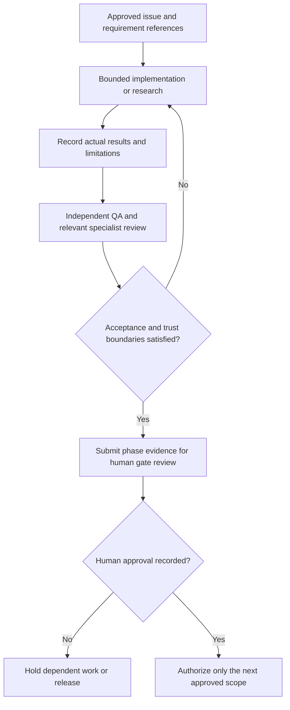

# Testing, quality gates, and delivery strategy

**Status:** Gate 0 policy. Tool choices are provisional in `docs/architecture/technology-evaluation.md`; no test/build/lint workflow currently exists.

## Quality principles

Test outcomes and trust boundaries, not merely happy paths. Keep domain rules testable independently of UI/persistence. Maintain strict typing, runtime validation at trust boundaries, consistent errors, accessibility, security checks, migrations, and actual documentation. Do not weaken tests/gates or remove functionality to obtain a pass.

## Test layers after stack approval

| Layer | Focus | Candidate evidence |
| --- | --- | --- |
| Unit/domain | Game/release/copy distinction, multiple copies, completeness/condition rules, price-vs-valuation distinction, uncertainty, validation | Vitest candidate; deterministic business-rule tests |
| Component | Forms, responsive cards, empty/loading/error/denied states, keyboard behavior, accessible names/feedback | React Testing Library candidate |
| Integration | Persistence, migrations, owner scoping, database policies, private storage lifecycle, export/delete boundaries | Isolated test database/storage or controlled test environment |
| End-to-end | Sign-in, search seed catalogue, add/edit copy, view private collection, permission denial, correction journey when implemented | Playwright candidate |
| Non-functional | Keyboard and screen-reader checks, contrast/reduced motion, responsive viewport, dependency/security checks, performance/cost bounds | Explicit checklist and recorded tools/results |

Test negative cases including a second user's attempts to read/update/delete records and objects; unknown/incomplete catalogue data; multiple copies of one release; malformed and oversized uploads; revoked photo visibility; migration compatibility; and failures/timeouts.

## Pull request quality gate

Every implementation PR should have issue/acceptance linkage, focused diff, automated tests and exact results, independent review, security/privacy considerations, documentation/diagram updates, known limitations, and migration/rollback notes. Required checks should include formatting/lint/type checking, tests, dependency/security scan, and build once the actual stack exists. Do not claim any check passed unless observed on the candidate commit.

## Gate-aware validation

- Gate 0: cross-check documents and templates; no application tests expected.
- Gate 1: approval of requirements, architecture/security/design direction and bounded investigation contracts. Record direction approval separately from application-stack/provider adoption; ADR-0001 remains proposed pending Gate 2 evidence.
- Gate 2: repeatable spike evidence for the highest-risk assumptions; GC-I-010 reconciles results and the ADR, with a recorded human adoption/go-no-go decision before GC-I-011.
- Gate 3: per-slice tests/review/docs with passing mandatory checks.
- Gate 4: release candidate test suite, accessibility/security/dependency review, production config, migration, backup/restore, monitoring, and rollback evidence.
- Gate 5: human approval after a release-readiness report; do not deploy to production or release before approval. Separately approved disposable, synthetic/seed-data experiments and isolated candidate rehearsals may use non-production deployments at earlier gates.

## Reporting

Record commit/PR, command, environment, result, and known omissions. Mark each validation as passed, failed, not run, or blocked. Distinguish static review from executed tests and design review from accessibility conformance testing.

## Acceptance evidence by delivery phase

Use the [requirements](../product/requirements.md) for acceptance semantics and the [issue specifications](../operations/proposed-backlog.md) for bounded work. This matrix assigns evidence; it does not report executed checks.

| Phase / work items | Evidence required before closure |
| --- | --- |
| Gate 1 / GC-I-001–GC-I-004 | Product-owner decisions; approved field/lifecycle/privacy scope; architecture/security direction and content-rights review; design/accessibility contract and bounded investigation authorization. Record deferred choices and blocking decisions; direction approval is not final technology adoption. |
| Gate 2 / GC-I-005–GC-I-010 | Reproducible experiments with environment, steps, actual results, negative cases, cleanup, current terms/cost sources, limitations, revised ADR and human adoption/go-no-go review before GC-I-011. A mock cannot establish provider integration. |
| Gate 3a / GC-I-011–GC-I-022 | AC-01–AC-09: domain fixtures for multiple releases/copies and unknown data; session and owner-isolation integration checks; catalogue/add/view/edit/export journeys; keyboard/narrow viewport evidence; reproducible CI on the candidate commit; independent review. |
| Gate 3b / GC-I-023–GC-I-028 | AC-10, AC-11, AC-14 for selected features: upload rejection/private lifecycle; photo fallback; filter/count semantics; claim/source/correction review and version history. Deletion/retention must be evidenced before production personal data, even if other follow-ons are omitted. |
| Gate 3c, optional / GC-I-029–GC-I-033 | AC-12–AC-13: explicit sharing and separate media consent, anonymous/public field allow-list, revocation/cache handling, moderation/report/takedown, abuse and rights escalation. |
| Gate 4 / GC-I-034–GC-I-035 | Declared release scope and all applicable acceptance references; migration rehearsal; access/secret/dependency/security review; accessibility review; backup/restore and deletion suppression; monitoring/alert/rollback evidence. Omitted optional phases remain disabled. |
| Gate 5 / GC-I-036 | Readiness evidence, residual-risk acceptance, human release approval for the exact candidate/configuration, rollout owner and rollback triggers. Passing tests alone does not grant release permission. |
| Future / GC-I-037–GC-I-044 | Research or feasibility evidence and a decision recommendation only. Investigation closure never authorizes purchase or feature implementation. |

### Required negative and boundary cases

- **Identity:** Expired/revoked session, recovery abuse, direct unauthenticated request, forged owner identifier, protected state-changing request failure.
- **Ownership:** Account B cannot list, read, edit, remove, export, attach membership to, or access media for account A; test at server and persistence/storage layers, including guessed identifiers.
- **Integrity:** Same title on multiple platforms, multiple releases, multiple independent copies of one release, unknown metadata, invalid controlled vocabulary, absent optional price versus zero paid, missing/mismatched currency, and failed atomic save.
- **Concurrency:** Duplicate create retry does not silently merge physical copies; stale edits cannot unknowingly overwrite newer data under the approved conflict policy.
- **Export/deletion:** Stable documented field semantics; no foreign-owner records or privileged object links; failed/partial jobs are explained; deletion cannot be undone by restore without applying the approved suppression process.
- **Media:** Forged type, corrupt/oversized image, unsafe dimensions, metadata leakage, failed processing, expired private access link, replacement cleanup and delete/revocation; no public object on failure.
- **Content/public surfaces:** Missing/disputed evidence, broken source, correction awaiting review, unauthorized publication, rights-restricted artwork, rejected submission, revoked sharing, and public-field exclusions.
- **UX:** Distinguish no results from failure/denial; keyboard and assistive-technology feedback, image fallback, zoom/reflow, reduced motion, and non-monetary statistics.

## Evidence and agent handoff record

For each issue record:

1. Draft `GC-I-*` identifier, real GitHub URL when available, requirement/AC references, phase, approved decisions, and candidate commit.
2. Expected behavior and evidence for every criterion, including failures; identify fixtures as seeds/synthetic data and providers as real, emulated, or mocked.
3. Actual validation command or manual procedure, environment, result, and artefact location. Never place credentials, user records, photos, signed URLs, or private logs in issue evidence.
4. Developer handoff, independent QA result, code-review result where code exists, security/content review as applicable, unresolved limitations, and product-owner gate decision.

Documentation-only work is reviewed for link/ID consistency, proposal labels, domain/privacy invariants and Mermaid workflow correspondence. No application lint/build/test result is expected until the approved toolchain exists.
