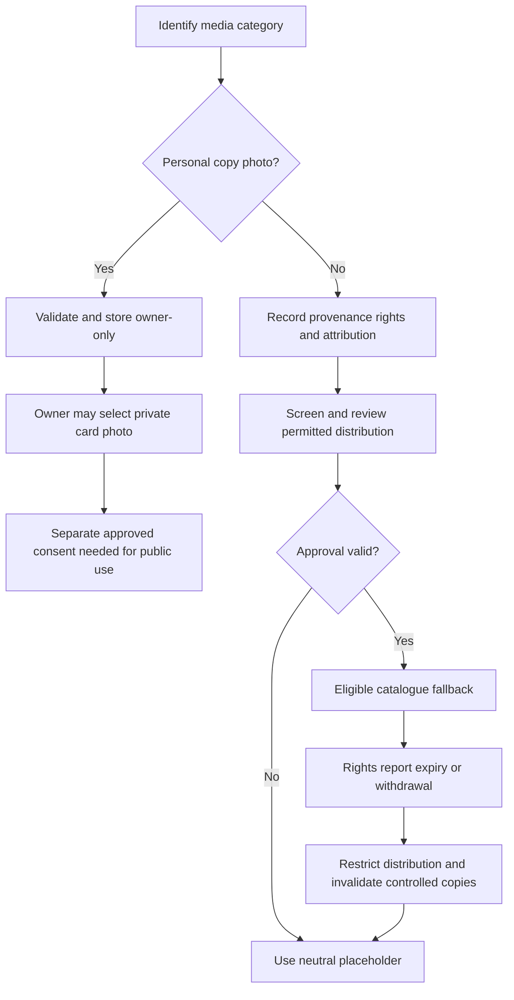

# Artwork categories, precedence, and moderation policy

**Status:** Proposed content/IP policy; no artwork provider or community submission workflow exists.

## Separate media categories

1. **Personal photographs** document a collector's actual physical copy. Private by default; public use requires an explicit, separate user action and clear visibility explanation.
2. **Catalogue default artwork** is an approved image with documented source/rights and attribution.
3. **GameCurator-generated interpretation** is original artwork inspired by verified metadata/themes/genres/descriptions. It must not deliberately reproduce covers, logos, distinctive characters, or promotional artwork as a substitute for licensed images. Cache approved output; generation is not mandatory for MVP.
4. **Community-submitted artwork** is not publicly distributed until rights attestation, screening, human moderation where needed, and approval are complete.

Do not treat user uploads or an automated similarity/screening result as proof of copyright ownership. Provide reporting, takedown, review queues, rate limits, audit history, and a human escalation path for uncertainty/disputes. Obtain legal guidance for repeat infringement and takedown policy.

## First-slice catalogue fallback proposal

For the proposed private collecting slice (GC-I-018), use:

1. Licensed/otherwise authorized catalogue default artwork only if its applicable source, permission, attribution and intended use have been reviewed.
2. A neutral branded placeholder when no permitted image exists or an image is unavailable, restricted or revoked.

No artwork source is selected here. Community favourites, voting, generated defaults and personal-photo selection are not first-slice dependencies. Placeholder-only designs are valid review inputs and do not claim image rights. See the [Gate 1 concepts](../design/design-principles.md#gate-1-collection-and-detail-concepts).

## Conditional future catalogue-view precedence

Only after separate feature, rights, cost and moderation approvals, consider this proposed order for a public/catalogue game or release card; this is not approval of public access or a voting system:

1. Approved community favourite, only while approval and rights status remain valid.
2. Approved GameCurator-generated default.
3. Licensed/otherwise authorized catalogue default artwork, if an applicable source/permission is documented.
4. Neutral branded placeholder while the catalogue entry is incomplete.

Personal photos are never a catalogue fallback. If no approved source exists, use the neutral placeholder rather than an unlicensed cover.

## Personal collection-card precedence

The first slice uses the first-slice catalogue fallback above. The following personal selection behavior applies only after the photo follow-on is approved and accepted:

1. The collector's explicitly selected personal photo for that specific copy, while the photo remains available and the collector has not withdrawn it.
2. The eligible catalogue fallback for its linked game/release. Community/generated options participate only after their separate approvals; otherwise use documented permitted catalogue art, then placeholder.

A vote cannot change or replace the personal selection. A missing/unavailable photo falls through without deleting the collector's preference/record; offer a clear replacement action. Never publish the personal photo merely because the collection or a catalogue artwork entry is public.

## Provider boundary and lifecycle

Keep generation and external image retrieval behind replaceable interfaces. Record source/creator, rights attestation/permission basis, attribution, moderation status, visibility, version, dates, and takedown state. Cache only where rights permit. Do not make expensive generation or catalogue imagery a mandatory MVP dependency.

## Delivery boundaries and lifecycle evidence

GC-I-003 reviews rights policy; GC-I-006/GC-I-023 establish private personal-photo processing; GC-I-029/GC-I-030 govern any separately consented public use; GC-I-031/GC-I-032 govern community distribution. GC-I-041 is only an investigation of generated artwork/AI assistance. Voting rules and generated defaults are not approved or required by the first slice.

For each implemented category, test unavailable/deleted assets, expired permission, rejected/held submissions and fallback behavior. Removing catalogue art cannot delete an owner's private photo selection; an unavailable personal photo offers replacement and a lawful fallback without quietly publishing another private asset.

The moderator's decision records the reviewed basis, permitted scope, rationale, reviewer and timestamp; automated screening and popularity do not establish ownership. Takedown must address stored assets, derivatives, references and controlled caches, while explaining that already downloaded third-party copies cannot be recalled. Rights disputes require human escalation rather than majority voting.
