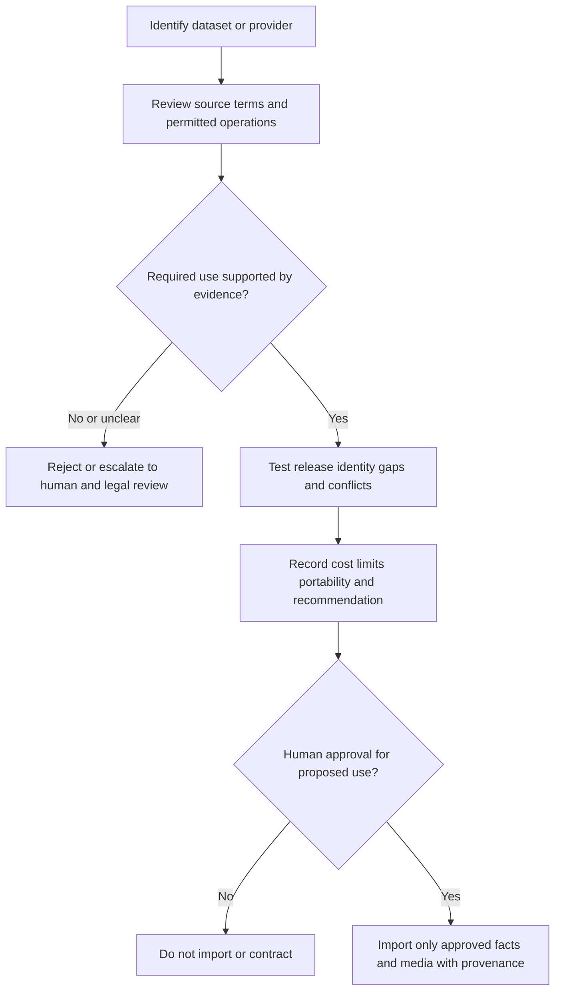

# Catalogue, artwork, and provider research requirements

**Status:** Research plan and safeguards; no provider has been selected or licensed.

## Catalogue strategy

The MVP must function using a small, clearly identified seed dataset plus collector-entered metadata. Avoid dependence on purchasing a comprehensive proprietary catalogue. Separate Game, Platform, Release/Edition, and Copy; keep provider identifiers namespaced and source provenance for imported facts. Mark unknown/incomplete/conflicting values rather than silently inferring them.

Collector-entered copy attributes do not automatically become shared catalogue facts. Whether to support a provisional manually identified release when search finds no match is a Gate 1 decision in GC-I-001–GC-I-003; the unapproved fallback is an honest missing-data explanation, not fabricated catalogue data.

Before any catalogue provider or dataset is used, evaluate:

- Coverage for platforms/regions/editions and multi-release identity quality.
- Source lineage, correction mechanisms, update cadence, duplicates, and confidence.
- API/data terms for storage, caching, attribution, display, export, and deletion.
- Copyright/database rights, commercial use, derivative works, and whether redistribution is allowed.
- Rate limits, uptime, auth/security, portability, lock-in, service limits, support, current cost and expected usage.
- Whether identifiers/barcodes are licensed and reliably mapped to physical editions.

Do not scrape or redistribute proprietary databases contrary to terms. No legal conclusion is established by this document; uncertain rights require human/legal review.

## Artwork rights review

For each external artwork source, record asset provenance, license/permission, attribution, permitted display/derivative/cache/commercial use, geographic/term restrictions, takedown route, and rights-holder contact where available. Availability online is not permission. User uploads are not automatically authorized for public redistribution.

## Provider research protocol

Create a dated comparison with source URLs, relevant terms, methods, cost assumptions, confidence, unanswered questions, and an explicit no-go/conditional recommendation. Verify current published terms directly before contracting. No paid service or commercial commitment without a documented recommendation and human approval.

## Required evidence handoff

GC-I-003 approves policy, GC-I-007 tests permitted seed search, GC-I-012 delivers approved seed fixtures, and GC-I-037 investigates any future provider expansion. Each candidate dataset/provider assessment must include:

| Evidence field | Required content |
| --- | --- |
| Source identity | Dataset/provider, author/publisher, stable URL/reference, publication/version and access date where available. |
| Permitted operations | Reviewed basis for import, storage, cache, display, attribution, transformation, export and deletion; explicitly unknown or prohibited operations. |
| Identity quality | Game/platform/release mapping, regions/editions, provider namespace, duplicate/conflict handling, coverage gaps and correction mechanism. |
| Seed provenance | Which records/media are synthetic, owned or permitted; origin and attribution per asset/fact; no production personal data. |
| Technical behavior | Documented limits, authentication boundary, failure/timeout behavior, caching restrictions and provider replacement/export path. |
| Commercial exposure | Current sourced terms/pricing, stated usage assumptions, restrictions and human approval needed; no uncited cost number. |
| Recommendation | Go/no-go/conditional recommendation, confidence, unresolved rights questions, responsible reviewer and approval status. |

This is an evidence template, not a provider evaluation. There are no verified source terms, selected licences or licensed external catalogue integrations in this repository.
