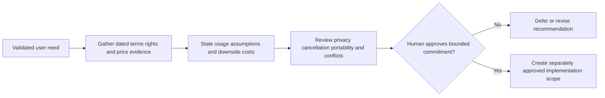

# Commercial sustainability and unit-economics questions

**Status:** Options to evaluate only. No pricing, subscription, affiliate, or vendor decision is approved.

## Potential models

- Free core collection experience and essential record export, with an optional future paid Collector plan for capacity, backup/synchronization, advanced analytics, valuation history, additional art options, public museum customization, enhanced reports/insurance reports, or insights.
- Optional affiliate links may be assessed only as a secondary revenue source with disclosure and no distortion of collection recommendations.
- Grants, sponsorship, or partnerships are future research questions, not current commitments.

No paid feature may compromise access to essential collection records. Before subscription enforcement, define cancellation behavior and an archive/read-only/export policy.

## Cost model to validate before vendor adoption

Estimate for low/typical/high usage and identify pricing source/date:

- database compute, storage, backups, and query load;
- authentication and email/session delivery;
- object storage volume, image transformations, egress/bandwidth, and retained/deleted copies;
- catalogue API/licensing, attribution/display restrictions, request limits, and minimum commitments;
- optional generation cost per approved asset, review labor, caching, and regeneration;
- observability, security, support, abuse handling, payment fees, taxes, and customer support;
- deployment, restore testing, compliance/legal review, and operational staff effort.

Use actual expected user/storage/request assumptions and current published price tiers; none have been verified for this project. Include vendor lock-in, free-tier limits, data egress, and migration costs.

## Valuation integrity

Clearly distinguish asking prices, completed-sale observations, and estimated values. Store source/method, date, region, currency, condition, and completeness. Display ranges when evidence does not support precision; disclose stale or sparse data. Never imply price paid is current value or make valuation the measure of collector achievement.

## Approval gate

Research must provide a sourced cost comparison, licensing/security review, usage assumptions, downside exposure, and exit/export path. Human product-owner approval is required before paid provider adoption, subscriptions, affiliate commitments, or other commercial commitments.

## Research issue handoffs

| Investigation | Draft issue | Evidence and scope boundary |
| --- | --- | --- |
| Core deployment/storage/recovery cost | GC-I-009 | Dated vendor sources and low/typical/high usage assumptions; compare managed/self-managed trade-offs before adopting services. |
| Licensed catalogue expansion | GC-I-037 | Rights/coverage/cache/export constraints and total cost; no paid catalogue is needed by the private-first slice. |
| Valuation methodology | GC-I-038 | Distinguish asking price/sale/estimate, disclose sparse/stale evidence and preserve condition/currency/date/provenance; not financial certainty. |
| Subscription/affiliate sustainability | GC-I-040 | Model operating and support costs, disclosures, cancellation/read-only/export behavior and essential-record access; no approved price/paywall. |
| Generated artwork/AI support | GC-I-041 | Cost per approved asset including review, rights, caching, deletion and provider replacement; AI cannot supply historical evidence. |
| Achievements, marketplace, insurance | GC-I-042–GC-I-044 | Independent product-value/abuse/liability/privacy research; no MVP ranking, trading or insurance guarantee. |

Core owner-only record export remains in F-13 and cannot become an optional paid entitlement by implication. Any proposal for enhanced reports or commercial extras must preserve access to essential records and receive explicit product-owner approval.
