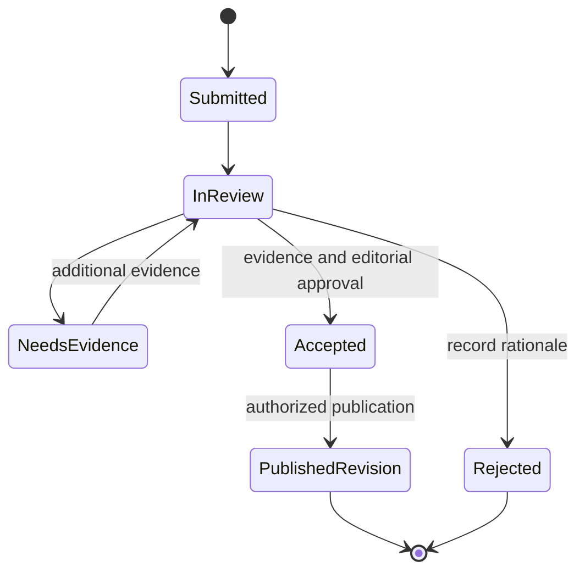

# Historical content provenance and editorial workflow

**Status:** Mandatory content policy proposal; sample content is not included.

## Evidence rules

- **GC-DATA-001:** Every historical claim presented as fact must have traceable source provenance.
- **GC-AI-001:** Generative AI output must never, by itself, constitute authoritative game-history evidence.
- Prefer primary evidence: original interviews, manuals, contemporary records, publisher materials, developer commentary, and first-hand archives. Use reputable journalism/books as secondary evidence. Community research may identify leads and should be corroborated where appropriate.
- Never fabricate citations. Flag unavailable, missing, contradictory, or disputed evidence explicitly.
- Record only excerpts that may lawfully be stored and displayed; link and attribute sources appropriately.

## Claim and source record

Where applicable, each structured claim/section records: text; classification (verified fact, attributed report, interpretation, disputed claim); source reference and URL; publication/access date; legally permissible supporting excerpt; verification status; confidence/dispute state; reviewer and review timestamp; and correction/version history.

Each source should identify creator/publisher, title, source type, URL or stable reference, publication date if known, access date, rights/usage notes, and reliability context. A source existing does not automatically prove every claim attached to it.

## Editorial lifecycle

```mermaid
flowchart LR
  research[Research brief] --> discover[Source discovery]
  discover --> evidence[Evidence extraction]
  evidence --> verify[Claim verification]
  verify --> draft[Narrative drafting]
  draft --> citations[Citation validation]
  citations --> editorial[Editorial review]
  editorial --> publish[Publication]
  publish --> correction[Correction proposal]
  correction --> review[Evidence and editorial review]
  review --> history[Version/correction history]
  history --> publish
```

AI may help find leads, organize notes, or draft text for review, but an AI response is not a source and cannot satisfy verification. A human editor is accountable for publication.

## Corrections and conflict handling

Provide a user path to report an error or propose a correction with supporting sources. Preserve the original version and reviewer decision; publish corrected text only after review. Conflicting primary sources or meaningful uncertainty should be presented as attributed/disputed rather than resolved by unsupported confidence. Escalate sensitive, rights-sensitive, or unresolved factual disputes to editorial/human review.

## Build and editorial handoff

F-09 and NFR-08 own acceptance; GC-I-003 reviews this policy, GC-I-025 defines the structured editorial model/reviewer authority, and GC-I-026 delivers the approved reading/timeline/correction journey. The [technical design](../architecture/overview.md) and [domain dictionary](../architecture/domain-model.md) must preserve evidence relationships rather than storing source-free prose.

| Record | Minimum reviewable information |
| --- | --- |
| Claim | Stable identity, text, classification, linked source evidence, dispute/verification state and reviewer decision. A factual assertion cannot be published without traceable evidence. |
| Source | Creator/publisher, title, URL or stable offline reference, source type, available publication date, access date, reliability context and rights notes. |
| Claim-source link | What this source actually supports or contradicts; locator/page/timestamp where applicable; lawful excerpt only if permitted. |
| Timeline event | Event/date or explicit date uncertainty, linked claims/sources and display ordering rule. Unknown dates are not made exact. |
| Exhibit version | Reviewed sections, claims and timeline, editor/reviewer, publication state, version and correction history. |
| Correction | Target claim/version, proposed change, supporting source, private submitter information where applicable, acknowledgement, review state and rationale. |

### Proposed correction states

Exact reviewer permissions and whether anonymous corrections are allowed remain decisions. Rate limiting and safe handling of untrusted links/text are required before enabling submission; pending/rejected corrections cannot mutate published claims. Retain version history under an approved policy while minimizing submitter personal data.

### Publication evidence checklist

- Every factual claim has source lineage; source locators and relevance are reviewed, not just the presence of a URL.
- Report, interpretation, dispute and unknown states are visible; dates and confidence do not imply false precision.
- Citations/excerpts and accompanying media have permissible use and attribution; unavailable evidence is flagged.
- Human editorial approval and correction rationale are recorded; AI leads/drafts are not citations.
- Reader keyboard/mobile paths and failed/missing sources have understandable behavior.

No historical claims or sample exhibit are supplied by this checklist; sourced content still requires separate research and review.
