# Historical content provenance and editorial workflow

**Status:** Mandatory content policy proposal; sample content is not included.

## Evidence rules

- **GC-DATA-001:** Every historical claim presented as fact must have traceable source provenance.
- **GC-AI-001:** Generative AI output must never, by itself, constitute authoritative game-history evidence.
- Prefer primary evidence: original interviews, manuals, contemporary records, publisher materials, developer commentary, and first-hand archives. Use reputable journalism/books as secondary evidence. Community research may identify leads and should be corroborated where appropriate.
- Never fabricate citations. Flag unavailable, missing, contradictory, or disputed evidence explicitly.
- Record only excerpts that may lawfully be stored and displayed; link and attribute sources appropriately.

## Claim and source record

Where applicable, each structured claim/section records: text; classification (verified fact, attributed report, interpretation, disputed claim); source reference and URL; publication/access date; legally permissible supporting excerpt; verification status; confidence/dispute state; reviewer and review timestamp; and correction/version history.

Each source should identify creator/publisher, title, source type, URL or stable reference, publication date if known, access date, rights/usage notes, and reliability context. A source existing does not automatically prove every claim attached to it.

## Editorial lifecycle

```mermaid
flowchart LR
  research[Research brief] --> discover[Source discovery]
  discover --> evidence[Evidence extraction]
  evidence --> verify[Claim verification]
  verify --> draft[Narrative drafting]
  draft --> citations[Citation validation]
  citations --> editorial[Editorial review]
  editorial --> publish[Publication]
  publish --> correction[Correction proposal]
  correction --> review[Evidence and editorial review]
  review --> history[Version/correction history]
  history --> publish
```

AI may help find leads, organize notes, or draft text for review, but an AI response is not a source and cannot satisfy verification. A human editor is accountable for publication.

## Corrections and conflict handling

Provide a user path to report an error or propose a correction with supporting sources. Preserve the original version and reviewer decision; publish corrected text only after review. Conflicting primary sources or meaningful uncertainty should be presented as attributed/disputed rather than resolved by unsupported confidence. Escalate sensitive, rights-sensitive, or unresolved factual disputes to editorial/human review.
