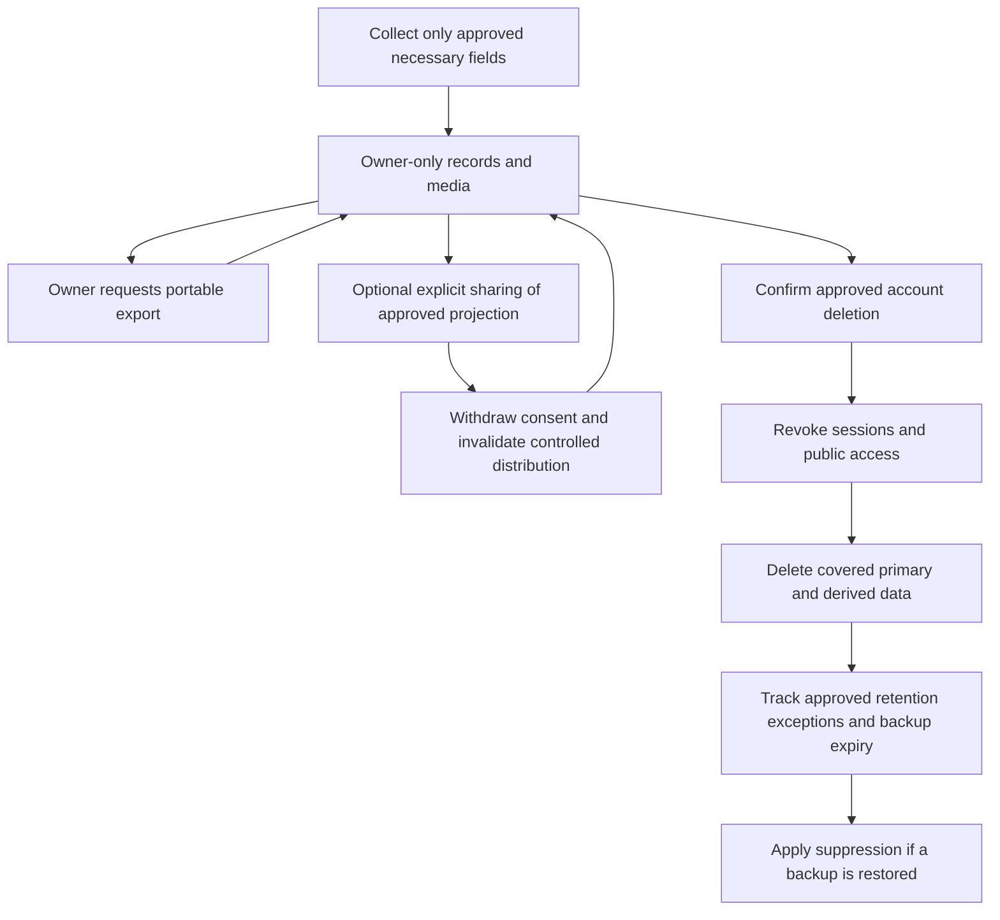

# Security, privacy, and trust requirements

**Status:** Threat-control outline; no authentication, database, storage, or deployment exists.

## Data classification and defaults

- **Private personal data:** account identity, collection membership, owned-copy details, paid prices, private notes, acquisition context, and personal photos.
- **Catalogue/editorial data:** game/release facts, sourced claims, approved public exhibits and rights-cleared media.
- **Community submissions (future):** submitted art, rights attestation, reports, moderation decisions, and audit history.

Collection records and personal photographs are private by default. Public collection sharing and public use of an individual photograph require explicit, understandable, revocable consent and separate visibility controls. Public views must allow-list fields and never expose private prices, notes, account identifiers, storage keys, or metadata by accident.

## Required controls before implementation/release

| Area | Requirement / evidence |
| --- | --- |
| Authentication/session | Choose secure identity/session approach; protect state-changing actions; plan revocation, session expiry, recovery, and account deletion. Verify with tests. |
| Authorization | Enforce owner scope at server and persistence/storage boundaries; test cross-user read, write, list, and object access denial—not only signed-in success. |
| Database RLS | If supported by chosen service, enable least-privilege policies for every user-owned table and verify privileged/server keys cannot bypass into browser code. |
| Private storage | Non-public buckets/objects by default; short-lived access mechanism if needed; bind every object to owner/copy; authorize upload/read/delete and test guessed identifiers. |
| Upload safety | Allow-list needed formats, size/dimension limits, MIME/signature checks, safe decoding/re-encoding where appropriate, malware/scanning decision, metadata handling, rate limits, and abuse path. |
| Privacy choices | Explain exactly which collection fields/media are public, default private, require explicit action, allow revocation, and test public response allow-list. |
| Export/deletion | Define portable data export and account deletion, object deletion, retention exceptions, backups, and deletion propagation before launch. |
| Secrets | Store server secrets in environment/managed secret service; no privileged keys in source, browser bundles, issue logs, or error messages. Rotate and audit access. |
| Abuse prevention | Rate-limit auth, search, upload, report, and submission paths; anti-automation and account recovery policies need threat review. |
| Audit/logging | Log security-relevant actions with minimum necessary data; never log passwords, tokens, private notes, paid price, signed URLs, or image contents. |
| Dependency handling | Track vulnerabilities, supported versions, update ownership, and severity response. Use dependency/security checks in CI after stack selection. |
| Backup/recovery | Define encryption, access, retention, RPO/RTO targets and test restore; do not claim backup safety from provider availability alone. |
| Moderation | Future public artwork needs reporting, rate limits, review queue, rights attestation, takedown, audit trail, and human handling of uncertainty. |

## Threat scenarios for Gate 1/2

Cross-account record/object enumeration; insecure direct object reference; overly permissive RLS or service-role exposure; public storage/cache leakage; malicious/oversized uploads; EXIF/location disclosure; forged file type; private fields included in public API; account takeover; abuse of correction/art forms; accidental secret exposure; data loss or incomplete deletion from backups.

## Escalation

Stop and escalate any suspected private-data exposure, privileged-key leak, rights dispute, high-impact vulnerability, or untested access boundary. No claim of legal compliance or security certification is made.

## Implementation and evidence ownership

NFR-02 is the cross-cutting security/privacy requirement. The [technical design](../architecture/overview.md) describes proposed enforcement; the [backlog](../operations/proposed-backlog.md) assigns work. Security controls cannot be satisfied by hiding UI elements or by trusting a client-supplied owner ID.

| Control / boundary | Proposed implementation behavior | Issue evidence |
| --- | --- | --- |
| Identity to server | Derive actor from validated session; reject absent/expired/revoked sessions; protect state changes under the approved session/CSRF model. | GC-I-002, GC-I-005, GC-I-013 |
| Server to persistence | Authorize each operation and scope reads/writes to owner; enforce corresponding database policies/constraints, including collection membership. Privileged maintenance access requires a separate controlled path. | GC-I-012, GC-I-016, GC-I-021 |
| Export | Recheck identity and ownership; allow-list documented fields; protect temporary artefacts/downloads; avoid cross-user joins or public export caches. | GC-I-020, GC-I-021 |
| Private media | Bind upload intent and object to owner/copy; process only permitted files; publish no personal object by default; reauthorize reads/replacements/deletes and minimize URL lifetime. | GC-I-006, GC-I-023 |
| Public projection, future | Read only explicitly shared collections through an approved projection; exclude identity, paid price, notes and private metadata; personal photo consent is separate; revoke future access and controlled caches. | GC-I-029–GC-I-030 |
| Editorial and community, future | Separate reader, submitter and reviewer capabilities; submissions cannot publish themselves; rights/safety reports can restrict distribution pending human review. | GC-I-025–GC-I-026, GC-I-031–GC-I-032 |
| Deletion and recovery | Explain approved retention exceptions; revoke sessions/sharing, delete covered rows/objects/derived media, reconcile partial failures, expire backups and apply deletion suppression on restore. | GC-I-027, GC-I-034 |
| Delivery and operations | Environment separation, least-privilege secret access, dependency checks, minimal redacted logs, access-controlled backups, incident and rollback ownership. | GC-I-009, GC-I-011, GC-I-034–GC-I-035 |

## Proposed personal-data lifecycle

Account deletion must be ready before production personal data is accepted, regardless of whether the photo/community phases are included. The product owner must decide confirmation/recovery behavior, retention periods and any lawful exceptions; no duration or legal compliance is promised by this proposal.

Short-lived media URLs reduce future exposure but cannot retract files already downloaded. Sharing consent must explain that limitation. Avoid private response caching across sessions; public revocation must address application/CDN/search-index caches under the selected topology without promising deletion of third-party copies.

### Agent security handoff

The solution architect supplies trust boundaries and approved policies; the developer supplies enforcement and negative-test evidence; the security engineer reviews controls; QA independently exercises account A/account B and anonymous cases; DevOps verifies secret, storage, restore and logging configuration. Unresolved access-control, deletion, or rights risks block the relevant gate and cannot be accepted by the implementing agent alone.
